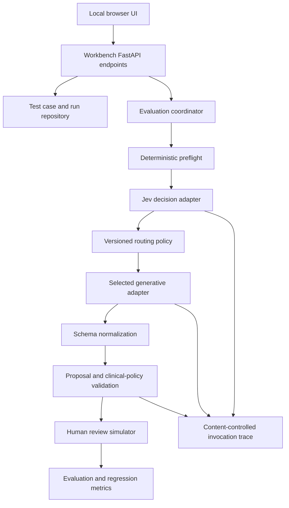

# MedTrack AI Testing Workbench

Status: WB-01 + WB-02 implemented; WB-03 live-synthetic scaffold ready (needs OPENROUTER_API_KEY for provider calls); WB-04+ not claimed  
Date: 2026-09-22  
Location: All workbench-specific specifications, code, fixtures, results and documentation live under `AI Testing workbench/`

## 1. Purpose

The MedTrack AI Testing Workbench is a local browser application for developing and evaluating the Jev and generative-model workflow before enabling it in the Android app.

It lets a developer or clinical evaluator submit synthetic doctor messages, nurse conversations and report attachments; observe how Jev classifies them; see which model route is selected; inspect the structured proposal produced by the generative model; run deterministic validation; and simulate doctor review. It never writes to the Android clinical database.

The workbench answers five questions:

1. Did Jev correctly identify every intent and required capability?
2. Did backend policy select an approved model route?
3. Did the generative model extract the correct structured information without inventing facts?
4. Did validation catch ambiguity, unsupported actions and unsafe proposals?
5. Is the result useful enough for a doctor to review quickly?

The workbench is an evaluation environment, not a clinical product, patient-record system or substitute for Android device testing.

## 2. Design decisions

- Run locally and open in a desktop browser.
- Use the existing Python/FastAPI gateway, Jev adapter, proposal contracts and validators where possible. Workbench code may import those modules read-only; it must not fork a second incompatible clinical schema.
- Keep all workbench-owned code, configuration, prompts, fixtures, local state, results and documentation inside this folder.
- Support mock, live-synthetic and batch-evaluation modes.
- Permit synthetic data only by default. Real patient information is prohibited in the initial workbench.
- Keep the OpenRouter key in the local backend process or retrieve it from Google Secret Manager. The browser must never receive or persist it.
- Jev identifies intents and capabilities. Generative models extract fields, analyze documents or answer clinical questions. Deterministic policy selects models and controls execution.
- Models only produce proposals and answers. Approval in the workbench is a simulation and never invokes Android `CareWritePath` or modifies patient records.
- The same versioned proposal contract accepted by Android is used in the workbench so successful experiments can transfer to the app.
- Pin evaluated model IDs. Do not use a moving alias or `openrouter/auto` for release evaluation.

## 3. Scope

### Included

- Text input resembling doctor notes, nurse messages, referrals and handovers.
- Synthetic patient/admission context selection.
- JPEG and PDF attachment testing with synthetic documents.
- Jev typed decisions and probability inspection.
- Deterministic route selection.
- Generative structured extraction and reasoning.
- Proposal-schema and clinical-policy validation.
- Human review simulation with accept, reject and edit annotations.
- Single-case comparison across approved models.
- Labelled batch evaluation, regression comparison, latency and cost reporting.
- Replay of sanitized provider responses.
- Failure simulations for timeout, rate limit, malformed response, unavailable model and stale context.

### Excluded

- Real patient data during initial development.
- Writes to Android Room, local clinical records or cloud patient records.
- Native reminders, notifications, background work or device authentication.
- WhatsApp account integration or background message collection.
- Autonomous diagnosis, prescribing or treatment approval.
- Production user-profile, subscription or payment flows.
- Multi-device synchronization.
- Training or fine-tuning models.

## 4. Users

| User | Needs |
| --- | --- |
| Developer | Inspect raw and normalized model responses, schemas, errors, versions, latency and cost |
| Clinical evaluator | Read the original message and patient context, inspect proposed clinical meaning, correct errors and explain why |
| Product evaluator | Compare workflows, review burden, clarification frequency and readiness metrics |
| Administrator | Configure approved routes, model IDs, budgets and test modes; cannot bypass safety validation |

The initial clinical evaluator is Ankita. Her corrections become labelled evaluation records only after being reviewed and saved as synthetic or sufficiently de-identified test material under the applicable data policy.

## 5. Logical architecture



The browser talks only to the local workbench server. Provider credentials and raw authorization headers remain server-side. Model calls go through the existing backend adapters or workbench adapters implementing the same interfaces.

## 6. Execution modes

### 6.1 Mock mode

- Default startup mode.
- Requires no network or API key.
- Uses deterministic fixtures for Jev, extraction, clarification and provider failures.
- Suitable for UI development, schema validation, routing logic and automated tests.
- Clearly display `MOCK — NO PROVIDER CALLS`.

### 6.2 Live synthetic mode

- Calls OpenRouter using the server-held development key.
- Accepts only cases explicitly marked `SYNTHETIC`.
- Rejects empty provenance classification or cases marked real/unknown.
- Displays `LIVE PROVIDER — SYNTHETIC DATA ONLY` persistently.
- Records model, provider where returned, policy versions, token use, cost where returned and latency.
- Does not automatically retry with an unapproved model or provider.

### 6.3 Replay mode

- Re-runs normalization, routing policy and validation against a previously stored sanitized provider response.
- Makes no provider request and incurs no model cost.
- Used to reproduce regressions after application-code changes.

### 6.4 Batch-evaluation mode

- Runs a selected labelled dataset through one named experiment configuration.
- Supports mock or live-synthetic execution.
- Enforces concurrency, request and cost ceilings.
- Can stop on a configured budget, excessive provider errors or a safety invariant failure.
- Produces immutable run results and a comparison report.

### 6.5 Shadow comparison mode

- Sends the same synthetic case to multiple approved model configurations.
- Results remain separate and blinded by model label during optional human scoring.
- Never merges outputs or chooses a winner automatically for clinical use.
- Used to select a route model based on measured quality, latency, privacy eligibility and cost.

## 7. End-to-end processing pipeline

1. User selects or creates a synthetic test case.
2. Workbench validates data classification, input size, attachment type and context consistency.
3. Deterministic preflight identifies cases that need no LLM, obvious document routes and missing mandatory context.
4. Jev receives minimized structured state and the pinned question set.
5. Jev returns typed answers; the adapter normalizes them into a `DecisionEnvelope`.
6. Deterministic policy maps all relevant decisions to one or more capability routes.
7. Each route selects an approved, pinned model configuration from the registry.
8. The generative model receives a route-specific prompt, selected context and strict output schema.
9. The response is parsed, normalized and validated. No repair operation may invent a clinical value.
10. The review screen presents original evidence, decisions, route, proposal and validation findings.
11. The evaluator accepts, rejects or annotates each proposal operation. This records evaluation ground truth only.
12. Metrics are calculated and the immutable experiment result is saved.

## 8. Routing design

Model routing is configuration and deterministic policy, not text embedded in the doctor's prompt.

### 8.1 Capability routes

| Route | Purpose | Typical output |
| --- | --- | --- |
| `DETERMINISTIC` | Direct local parsing or validation that requires no model | Validation/clarification result |
| `ADMINISTRATIVE_EXTRACTION` | Locations, transfers, people, referrals and ordinary tasks | Typed proposal bundle |
| `CLINICAL_EXTRACTION` | Problems, observations, treatment and medication statements | Typed proposal bundle |
| `DOCUMENT_EXTRACTION` | Read written lab/radiology documents and propose structured fields | Report extraction bundle |
| `CLINICAL_REASONING` | Source-linked explanation or question requiring stronger reasoning | Clinical answer with citations to supplied sources |
| `HANDOVER_SUMMARY` | Summarize selected confirmed events and outstanding work | Source-linked summary |
| `CLARIFICATION` | Insufficient patient identity, time, attribution or intent | One focused question; no clinical operations |

A message may activate several routes. Results retain separate evidence and validation even when displayed in one review bundle.

### 8.2 Jev question sets

Store versioned Jev question sets under the workbench configuration. Initial domains include:

- patient identity unresolved;
- multiple patients present;
- administrative/location update;
- completed clinical care versus future request;
- medication or treatment change;
- investigation/report content;
- timed follow-up;
- referral or specialist advice;
- nurse/patient question;
- summarization request;
- clinical reasoning required;
- ambiguity or insufficient support in a generated proposal.

Jev supplies decisions and probabilities. It does not supply patient IDs, medication names, doses, report values or clinical orders.

### 8.3 Model registry

Each model configuration has:

```yaml
route_id: clinical-extraction-v1
capability: CLINICAL_EXTRACTION
model_id: approved/versioned-model-id
provider_policy: medtrack-synthetic-zdr-v1
prompt_version: clinical-extraction-v1
schema_version: proposal-bundle-v1
temperature: 0
max_output_tokens: 4000
timeout_seconds: 45
retry_policy: transient-once
enabled: true
```

The initial generative model value currently present in backend configuration is a development placeholder. No generative model becomes approved merely because it returns valid JSON.

### 8.4 Provider routing

For every live configuration define:

- allowed providers;
- required data-retention policy;
- required parameters such as structured output support;
- provider order, if any;
- whether fallback is allowed;
- explicit fallback model list, if any;
- maximum request cost and timeout.

OpenRouter auto-routing is excluded from the first evaluated policy. A provider/model change creates a new experiment configuration and reruns the relevant suite.

## 9. Prompt management

Prompts live as versioned files, separated by route. Each prompt contains:

- role and task boundary;
- allowed input context;
- meaning of reported, verified, ordered, performed and completed states;
- explicit unknown/ambiguity behaviour;
- source-evidence requirements;
- prohibition on claiming a write occurred;
- output-schema instructions;
- concise examples using synthetic data.

Prompts do not contain API keys, runtime model selection, subscription decisions or authorization rules. Updating prompt content creates a new prompt version. Runs store the prompt digest so an old result remains reproducible.

The full prompt and model response may be displayed only in synthetic mode. Routine logs record digests and operational metadata rather than content.

## 10. Workbench information model

| Object | Important fields |
| --- | --- |
| `TestCase` | ID, title, data classification, source type, input text, attachment references, context snapshot ID, labels, expected outcome ID, status, version |
| `SyntheticPatientContext` | Synthetic patient/admission IDs, identity labels, location, active problems, relevant medicines, tasks, selected event versions |
| `ContextSnapshot` | Selected records, record versions, generated time, digest, explicitly omitted information |
| `ExpectedOutcome` | Expected intents, required route(s), identity resolution, proposals, clarifications, prohibited inferences, reviewer notes |
| `QuestionSet` | Version, Jev state description, typed questions, enabled status and digest |
| `RoutingPolicy` | Version, thresholds, deterministic rules, route mappings, fallback policy and enabled status |
| `ModelConfiguration` | Route, pinned model, provider policy, prompt/schema versions, parameters, limits and enabled status |
| `ExperimentConfiguration` | Immutable references to question, routing, model, prompt and schema versions plus execution mode and ceilings |
| `ExperimentRun` | ID, dataset/configuration, start/end, status, aggregate usage/cost and environment versions |
| `CaseRun` | Run/case, normalized decisions, selected routes, invocations, proposal, validation and timing |
| `ModelInvocation` | Stage, model/provider returned, request/response digests, usage, cost, latency, retry/error metadata and sanitized response reference |
| `ValidationFinding` | Code, severity, affected operation/field, explanation and blocking state |
| `HumanReview` | Reviewer, blinded model label if applicable, operation decisions, corrected expected values, comments and time |
| `MetricResult` | Metric/version, scope, numerator/denominator/value and pass/fail threshold where configured |
| `TestArtifact` | MIME type, hash, synthetic classification, local protected path, page count and source case |

IDs and content hashes are stable within the workbench. Experiment results are append-only. Editing a case or expected outcome creates a new version and does not rewrite completed runs.

## 11. Proposed folder structure

All new workbench-owned material follows this layout:

```text
AI Testing workbench/
├── SPEC.md
├── README.md
├── pyproject.toml
├── workbench/
│   ├── app.py
│   ├── coordinator/
│   ├── routing/
│   ├── evaluation/
│   ├── repository/
│   └── web/
├── config/
│   ├── question-sets/
│   ├── routing-policies/
│   ├── model-registry/
│   └── experiment-configs/
├── prompts/
├── schemas/
├── datasets/
│   ├── synthetic/
│   └── expected/
├── artifacts/
│   └── synthetic/
├── tests/
├── scripts/
└── .workbench/
    ├── state.sqlite
    ├── cache/
    └── results/
```

`.workbench/`, local secrets, raw live responses and generated result exports must be excluded from version control. Sanitized, deliberately checked-in regression fixtures live under `datasets/` or `tests/fixtures/`.

Shared production schemas are loaded from `../contracts/v1` when running within the MedTrack repository. Workbench-specific presentation/evaluation schemas may live here. A compatibility test must detect divergence rather than silently copying production schemas.

## 12. Local application interface

Use one local FastAPI process with server-rendered HTML and focused browser JavaScript for the initial version. Avoid requiring a separate frontend deployment or Node build until the interface proves it needs one. Bind to `127.0.0.1` by default.

### 12.1 Case runner

- Mode and data-classification banner.
- Test-case selector and editable input.
- Synthetic patient/admission context selector.
- Attachment picker and source preview.
- Run, cancel and replay controls.
- Explicit experiment configuration and projected call count.

### 12.2 Trace view

Display stages in order:

1. Preflight result.
2. Minimized Jev state and question-set version.
3. Jev normalized answers/probabilities.
4. Routing-policy decision and reasons.
5. Selected model configuration.
6. Generative request context and prompt version.
7. Raw/sanitized response and normalized object.
8. Schema/clinical validation findings.

Secrets, authorization headers and internal cloud credentials never appear.

### 12.3 Proposal review

Show:

- resolved patient/admission;
- original supporting source spans/pages;
- each proposed action;
- old/new value where applicable;
- effective time and precision;
- deciding/reporting/performing person where known;
- unresolved fields;
- expected-version target;
- atomic group and dependencies;
- validation warnings and blockers.

Actions are `Correct`, `Incorrect`, `Partially correct`, `Should clarify`, and `Unsupported by source`. An evaluator may enter a corrected expected value. “Approve” is visually labelled `Simulate approval`; it records an evaluation decision only.

### 12.4 Model comparison

- Select two or more approved configurations.
- Run against the same immutable case/context snapshot.
- Optionally hide model names during human scoring.
- Compare proposal fields, missing/extra claims, clarification quality, latency, usage and cost.
- No combined/fused clinical answer in the initial version.

### 12.5 Dataset and run dashboard

- Dataset version and case distribution.
- Run status and bounded progress.
- Results by intent, route, source type and model configuration.
- Regression comparison with the selected baseline.
- Drill-down to every error.
- Export sanitized JSON/CSV summary; detailed artifacts remain local unless explicitly selected.

## 13. Local APIs

Suggested workbench-only endpoints:

| Endpoint | Purpose |
| --- | --- |
| `GET /workbench` | Browser application |
| `GET /workbench/api/status` | Mode, provider availability and active configuration without secrets |
| `GET/POST /workbench/api/cases` | List/create versioned synthetic cases |
| `POST /workbench/api/cases/{id}/run` | Execute one case under a named configuration |
| `POST /workbench/api/runs/{id}/cancel` | Cancel pending provider calls |
| `GET /workbench/api/runs/{id}` | Retrieve trace and results |
| `POST /workbench/api/case-runs/{id}/review` | Save human evaluation |
| `POST /workbench/api/evaluations` | Start a bounded batch run |
| `GET /workbench/api/evaluations/{id}` | Progress and aggregate metrics |
| `POST /workbench/api/replay` | Replay a sanitized stored response |

Existing gateway provider adapters are called internally, not exposed directly to the browser. Workbench endpoints reject non-loopback clients unless an explicit future remote mode is designed.

## 14. Evaluation dataset

Build the first dataset from synthetic cases patterned on the business interview. Target broad coverage before volume. Categories include:

- patient creation and duplicate identity;
- bed, room, ward and department changes;
- completed round versus request to review;
- observation and evolving symptom;
- start/change/hold/resume/stop medication;
- order versus administration;
- investigation requested, performed, reported and reviewed;
- referral request, patient seen, advice received and advice acted upon;
- nurse question, response, acknowledgement and actual completion;
- absolute and relative reminder times;
- handover and hospital-course summary;
- report JPEG/PDF extraction;
- multiple patients in one input;
- ambiguous name, bed or pronoun;
- quoted, forwarded, edited and duplicate messages;
- contradictions, missing units and impossible dates;
- prompt-injection text inside an attachment or quoted message.

Each safety-critical pattern has positive, negative and ambiguous examples. Dataset splits prevent prompt examples and release-evaluation cases from being identical.

## 15. Metrics and release gates

### Routing

- Per-intent precision, recall and F1 for multi-label decisions.
- Capability-route accuracy.
- Clarification-required precision/recall.
- Multiple-patient detection rate.
- Route stability across paraphrases.

### Extraction

- Strict schema-valid response rate.
- Field-level exact/normalized accuracy.
- Missing required field rate.
- Unsupported extra claim rate.
- Correct unknown/absent distinction.
- Patient/admission target accuracy.
- Time and unit accuracy.

### Safety invariants

The curated safety suite requires zero accepted wrong-patient targets, zero model-authorized writes, zero label-only mutation targets, zero silent invented medication administrations and zero bypasses of blocking validation. Any violation fails the experiment regardless of aggregate score.

### Usefulness and operation

- Reviewer acceptance/correction/clarification rates.
- Median review time per operation.
- P50/P95 latency per stage and complete case.
- Input/output tokens and estimated cost per case/route.
- Timeout, rate-limit and malformed-output rates.

Initial aggregate thresholds are established after a baseline run and clinical review. Thresholds are versioned by route; changing them creates a new policy version. Safety invariants are not weakened to improve throughput.

## 16. Security, privacy and secrets

- Default to mock mode when no explicit live flag is supplied.
- Require `dataClassification=SYNTHETIC` for every live request.
- Keep OpenRouter key exclusively in the backend environment or obtain it through an approved Secret Manager flow.
- Never expose credentials through browser APIs, HTML, logs, result exports or exception text.
- Do not store raw audio by default.
- Reject unsupported file types and enforce file size/page limits.
- Treat attachment contents as untrusted data, not system instructions.
- Disable framework/model tracing that uploads content unless a separately approved synthetic-only trace configuration is active.
- Store local workbench state under `.workbench/`; provide a deliberate purge command targeting only that directory.
- Bind to loopback and use same-site request protection for mutating browser calls.
- Record content-free operational logs by default. Full synthetic trace viewing is an intentional UI action, not routine logging.
- Live mode must verify the OpenRouter privacy/guardrail configuration before an evaluation run where the API supports that check; otherwise require a recorded configuration assertion.

The Google Cloud temporary bucket is not required for the initial local workbench. Local synthetic attachments may remain inside this folder. Cloud Storage is exercised later through an explicit integration configuration.

## 17. Failure behaviour

| Failure | Required behaviour |
| --- | --- |
| Missing key | Live mode unavailable; mock/replay remain usable |
| Jev timeout/error | Show route unresolved or approved deterministic fallback; never auto-approve |
| Generative timeout/error | Preserve case and Jev result; permit retry under the same configuration |
| Rate limit/budget exhausted | Stop bounded run and record incomplete status |
| Invalid Jev response | Reject/record adapter error; do not infer missing answers |
| Invalid generative JSON | Record malformed output; do not fabricate a proposal through loose parsing |
| Schema-valid but unsafe proposal | Show blocking deterministic findings |
| Context changed during run | Preserve immutable snapshot; label result against that snapshot |
| User cancels | Stop further scheduled calls; preserve completed invocations and partial run state |
| Application restart | Recover saved cases and completed/partial run metadata without replaying provider calls automatically |

One constrained retry is allowed only for configured transient provider failures. A retry retains the same case/configuration ID and records a separate invocation attempt.

## 18. Implementation phases

### Phase WB-01 — Local shell and mock case runner — Done

- Create folder structure, local packaging, loopback server and browser shell.
- Load shared contracts and mock gateway fixtures.
- Implement case editor, context selector, trace and simulated review.
- No provider key required.

### Phase WB-02 — Configuration and routing inspector

- Add versioned Jev question sets, routing policies, model registry and prompts.
- Expose deterministic reasons for every selected route.
- Validate dependency and configuration references at startup.

### Phase WB-03 — Live synthetic execution

- Connect the existing OpenRouter Jev and generative adapters.
- Add live-mode guard, bounded calls, cancellation, usage/cost capture and sanitized traces.
- Run small contract tests using the pinned key/model configuration.

### Phase WB-04 — Dataset and batch evaluation

- Add versioned test cases/expected outcomes.
- Implement batch runner, metrics, error drill-down and immutable result storage.
- Generate the first synthetic workflow dataset.

### Phase WB-05 — Model comparison and clinical review

- Add blinded comparison and correction capture.
- Review representative cases with Ankita.
- Establish initial per-route thresholds and select candidate models.

### Phase WB-06 — Android compatibility gate

- Verify proposal bundles against shared Android contracts.
- Export sanitized approved regression fixtures.
- Run the same cases through Android mock integration and compare normalization/validation outcomes.
- Android notification, offline and clinical-write tests remain in the Android test suite.

## 19. Acceptance criteria

- A developer can start the workbench locally and use mock mode without cloud credentials.
- Live mode cannot run a case unless it is explicitly classified synthetic.
- The browser never receives the OpenRouter key.
- A case trace shows Jev state/questions, normalized decisions, deterministic routing reason, model configuration, proposal and validation findings.
- Multi-intent cases retain all applicable routes and operations.
- No displayed simulation state claims that Android or a clinical database was updated.
- Mock/replay outputs are clearly distinguishable from live provider outputs.
- A malformed/unsafe provider response becomes a failed or blocked case rather than a permissive proposal.
- A batch run is reproducible from dataset and experiment configuration versions, apart from documented model nondeterminism.
- Model comparison uses identical immutable input/context snapshots.
- Safety invariant violations fail the run even when aggregate metrics are high.
- Completed results include model, provider where available, prompt, schema, question-set and routing-policy versions plus latency/usage/cost.
- Shared proposal-contract compatibility tests detect divergence from Android contracts.
- All workbench-created files remain inside `AI Testing workbench/`, except read-only imports from existing backend/contracts and outbound provider calls.

## 20. Decisions deferred until evidence exists

- Which generative model is selected for each route.
- Whether one model can serve several routes without unacceptable quality loss.
- Final probability thresholds for Jev decisions.
- Final aggregate release thresholds beyond hard safety invariants.
- Whether a separate frontend framework is justified.
- Whether remote/team access to the workbench is needed.
- Whether sanitized workbench evaluation results should be uploaded to cloud storage.
- Whether any real clinical data can be admitted under a later governed evaluation process.

None of these decisions blocks mock-mode implementation or construction of the synthetic evaluation dataset.
