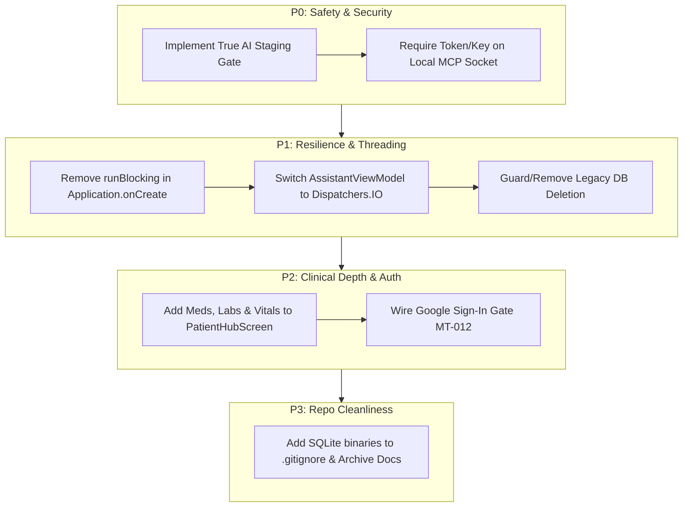

# MedTrack: Updated Codebase Review & Executive Judgment Call

**Date:** September 20, 2026  
**Subject:** Architectural Evolution, Gap Analysis, and Remaining Roadblocks  
**Target Repository:** `MedTrack` (Android / Kotlin / Jetpack Compose / Room v12 / SQLCipher)

---

## Executive Summary

The codebase has undergone a profound transformation. **The architectural chasm and "split-personality" identified in earlier reviews has been eliminated.** The legacy prototype tables, duplicate models, and standalone CRUD repositories have been completely excised. The 71-entity enterprise Care Model is now the sole foundation powering the database, active Compose UI, and MCP transport layers.

However, **clinical safety gaps, a critical network loopback authentication bypass, and missing clinical depth in the patient hub** remain active risks that must be remediated before the application can be deemed ready for real-world clinical evaluation.

---

## 1. What Has Changed & Drastically Improved

### A. Resolution of the "Split-Personality" Architecture
* **Schema Purge (Database v12)**: In `AppDatabase.kt` and `CareMigrations.kt` (`MIGRATION_11_12`), all legacy prototype tables (`patients`, `visits`, `medicines`, `tasks`, `reports`, `follow_ups`) were cleanly dropped.
* **Consolidated Care Model**: All data access is now routed through three specialized, strongly-typed DAOs:
  1. `CareDao`: Core master data, identity, episodes, encounters, observations, problems, and clinical events.
  2. `CareTherapyDao`: Medication definitions, orders, administrations, procedures, investigations, specimens, and diagnostic reports.
  3. `CareWorkDao`: Tasks, assignments, responses, reminder schedules, and notification attempts.
* **Delivery Spine Verification**: Milestones `PM-001` through `PM-013` in `task/README.md` are marked complete, with 100% test pass rates (`SafeguardRegressionTest`, `CareModelFoundationTest`, `CareClinicalAssessmentTest`, `CareTherapyCommandTest`, `CareWorkAndAcceptanceTest`, `CareProvenanceTest`).

### B. Inpatient Rounding UI Aligned with Clinician Workflows
The UI was overhauled to reflect Dr. Ankita's real-world rounding dynamics:
* **`CensusScreen.kt`**: Ward/floor-grouped census tracking active admissions, bed locations, primary problem summaries, and open task count badges.
* **`RoundsScreen.kt`**: Floor-by-floor rounds work queue with fast inline completion and +2-hour task snooze capabilities.
* **`PatientHubScreen.kt`**: Unified longitudinal patient dossier providing structured bed transfers and non-destructive discharge dialogues.
* **`InboxScreen.kt`**: Unassigned intake queue designed specifically for informal referrals, telephone consults, and incoming ER requests.
* **`HandoverScreen.kt`**: Shift handover summary generator categorizing unstable/high-attention patients versus stable patients for cross-shift signouts.
* **Google Native Theming**: Integrated `#FFFFFF` surfaces on `#F8F9FA` backgrounds with authentic Google accent tones (`#1A73E8` Blue, `#D93025` Red, `#188038` Green, `#F9AB00` Amber) in `Color.kt` and `Theme.kt`.

### C. Unified Mutation Path & Safeguards
* **Single Write-Path**: `MedTrackMcpService.kt` and all UI mutations funnel exclusively into `CareWritePath` (`CareCommandService`), guaranteeing cryptographic request hashing and idempotent execution.
* **Safeguard Enforcement**: The previous automatic 7-day data deletion bug was permanently neutralized; compile-time regression tests guarantee purge queries are prohibited from the command and DAO layers.

---

## 2. What is Yet to Be Done (Remaining Defects & Gaps)

```
+-----------------------------------------------------------------------------------+
|                              REMAINING GAPS MATRIX                                |
+-----------------------------------------------------------------------------------+
|  Component            | Severity | Issue Description                              |
+-----------------------+----------+------------------------------------------------+
|  AI Staging Gate      | P0       | Faux gate: executes DB writes before review    |
|  Local MCP Server     | P0       | Missing Origin header bypasses auth on 8765    |
|  AppDatabaseFactory   | P1       | Drops legacy DB unconditionally on cold-start  |
|  App Startup / ANR    | P1       | runBlocking on main thread during onCreate()   |
|  AssistantViewModel   | P1       | 60s blocking network I/O on Dispatchers.Default|
|  Patient Hub UI       | P2       | Missing meds, labs, vitals, and allergy cards  |
|  Authentication       | P2       | MT-012 Google Sign-In not enforced in UI       |
|  Repository Hygiene   | P3       | SQLite binaries and scratch files in git root  |
+-----------------------------------------------------------------------------------+
```

### 1. Clinical Safety Hazard: The AI "Staging Gate" is an Illusion
* **The Problem**: In `AiGateScreen.kt`, the screen promises: *"Parse spoken notes, then commit through CareWritePath... Review required... Review the reply before leaving this gate."*
* **The Reality**: In `AiAssistantOrchestrator.kt#L81-L82`, tool calls are **immediately executed against the live database** inside `handleUserMessage()` via `executeToolCalls(assistantMessage.toolCalls)`.
* **The Consequence**:
  * The clinician is presented with what has already been irreversibly committed.
  * Tapping **"Discard"** simply calls `navController.popBackStack()`—leaving the mutation in the database.
  * Tapping **"Confirm & return to census"** is an identical no-op navigation.
  * The system prompt in `AiAssistantOrchestrator.kt` (lines 50–56) still instructs the LLM using obsolete legacy CRUD concepts (`create_patient_visit`, `symptoms`, `diagnosis`).

### 2. Security Vulnerability: Origin Header Bypass on Local MCP Transport
* **The Problem**: `LocalMcpHttpServer.kt` (lines 95–98) validates incoming requests via:
  ```kotlin
  val origin = request.headers["origin"]
  if (origin != null && !isAllowedOrigin(origin)) {
      return HttpResponse.text(403, "Forbidden")
  }
  ```
* **The Reality**: If a request omits the `Origin` header (standard behavior for native sockets, `curl`, or background services running on the Android device), `origin` is `null`. The check passes, and the unauthenticated request is handled.
* **The Consequence**: Any process or unauthorized application on the device (or forwarded over ADB) can query PHI or mutate clinical records over `http://127.0.0.1:8765/mcp` without authentication.

### 3. Data-Loss Hazard: Pre-Migration Database Wipe
* **The Problem**: In `AppDatabaseFactory.kt#L18`:
  ```kotlin
  context.deleteDatabase(LEGACY_DATABASE_NAME)
  ```
* **The Reality**: This call executes unconditionally on every application launch. If a user upgrades from an earlier unencrypted build where clinical data had not yet migrated into `medtrack_secure.db`, their legacy database is deleted immediately.

### 4. Threading & Performance ANR Hazards
* **Cold-Start Main Thread Stall**: `MedTrackApp.kt#L41` invokes `runBlocking(Dispatchers.IO)` inside `Application.onCreate()` to initialize SQLCipher and execute startup hooks/seeders. On low-tier devices or during large data sets, this blocks the main UI thread and risks an Android ANR dialog.
* **Dispatcher Starvation**: In `AssistantViewModel.kt#L50`, `withContext(Dispatchers.Default)` executes `orchestrator.handleUserMessage()`. OpenRouter network calls use a blocking `HttpURLConnection` with a 60-second read timeout. Running blocking network I/O on `Dispatchers.Default` starves Kotlin's shared CPU thread pool.

### 5. Patient Hub UI Incompleteness
* While the database schema and DAOs support full clinical therapies, `CareCensusQuery.patientHub()` and `PatientHubScreen.kt` currently only query and render Problems, Notes, and Tasks.
* The clinician cannot view or interact with:
  * Active Medication Orders & IV infusions (`CareMedicationOrderEntity`).
  * Investigation Orders & Diagnostic Reports (`CareInvestigationOrderEntity`, `CareDiagnosticReportEntity`).
  * Vitals / Observations (`CareObservationEntity`).
  * Allergy Assessments (`CareAllergyEntity`).

### 6. Missing Authentication Gate (MT-012 Pending)
* `MainActivity.kt` routes immediately into `Screen.Census.route` on app launch. Firebase Auth / Google Sign-In remains `Todo` in `task/README.md`.

### 7. Repository Cleanliness
* SQLite database binaries (`medtrack_db*`, `dbsnap/`, `dbverify/`) and scratch markdown files (`ORexp.md`, `learning_inchbyInch.md`, `openrouterplan.md`) remain unversioned in the project root.

---

## 3. Prioritized Action Plan



1. **P0 - Fix AI Staging Gate**: Have `AiAssistantOrchestrator` generate staged proposals (`CareAppliedOperationEntity`) instead of committing immediately. Show pending diffs in `AiGateScreen` and commit via `CareWritePath` only when the user explicitly confirms. Update the system prompt to reflect the Care Model.
2. **P0 - Secure MCP Transport**: Require a local secret token or mutual handshake for MCP socket connections; reject requests lacking authentication regardless of the `Origin` header.
3. **P1 - Fix Startup & Threading**: Replace `runBlocking(Dispatchers.IO)` in `MedTrackApp` with an asynchronous launch sequence, and switch `AssistantViewModel` network requests to `Dispatchers.IO`.
4. **P1 - Protect Legacy DB**: Guard `deleteDatabase(LEGACY_DATABASE_NAME)` so it cannot wipe unmigrated user data.
5. **P2 - Complete Patient Hub**: Expose active medications, lab investigations, vitals, and allergies in `CareCensusQuery` and build dedicated cards/tabs in `PatientHubScreen`.
6. **P2 - Implement MT-012 Sign-In**: Integrate Google Sign-In with Firebase Auth in `MainActivity.kt`.
7. **P3 - Clean Project Root**: Archive scratch notes to `docs/archive/` and add DB dump patterns to `.gitignore`.
