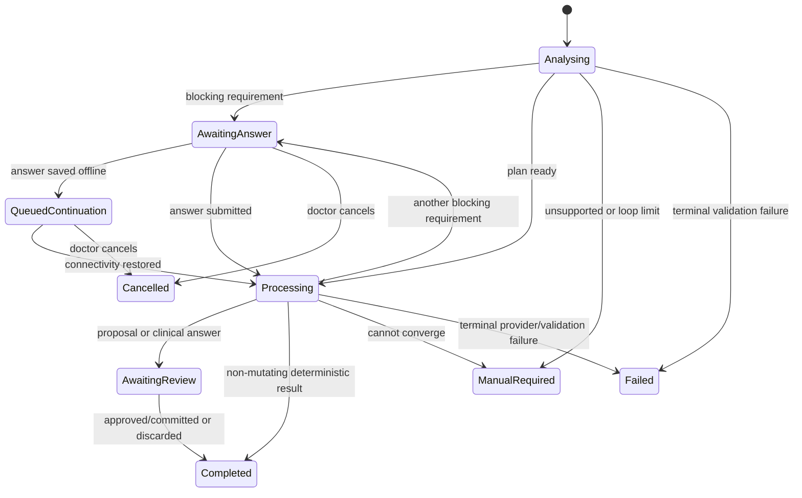

# Clarification, decomposition, and Jev-assisted orchestration

Status: Proposed implementation specification; Android assistant-turn pipeline implemented (CL-01–CL-08)  
Date: 2026-09-23
Related: [Jev decision layer](jev-orchestration.md), [LLM and chat architecture](llm-and-chat-architecture.md), [hybrid architecture](hybrid-architecture.md), [patient data contract](patient-management-data-contract.md), [clarification UI](clarification-ui-system.md)

## 1. Purpose

This specification defines how MedTrack handles an instruction that is ambiguous, incomplete, contains several actions, or needs to be divided into smaller pieces. It covers the backend orchestration state machine, Jev decision stages, clarification sequencing, task decomposition, continuation requests, proposal assembly, and recovery.

The orchestrator owns the workflow. Jev supplies bounded structured decisions. Generative models may extract fields or reason over scoped evidence. Android owns patient identity resolution against local records, durable conversation state, doctor review, and clinical commits.

The design must support statements such as:

- “Stop the antibiotic and check her later.”
- “Move Mr Rao to ICU bed 4, record Dr Shah's advice, stop ceftriaxone, start meropenem, order potassium and remind me in four hours.”
- “The first patient needs a CT, and the other one should stay on the current dose.”
- “This report came in. What does it mean, and what should I follow up?”

## 2. Decisions

1. Clarification is a first-class workflow outcome, not an error or a free-text fallback.
2. The system asks one blocking question at a time by default.
3. Closely coupled fields may use one bounded composite question, such as dose value plus unit, when separating them would create unnecessary turns.
4. Complexity and ambiguity are distinct. A complex but clear request is decomposed without unnecessary questioning. A simple but ambiguous clinical request is clarified.
5. Clinical impact and processing demand are distinct. “Stop insulin” may be computationally simple and clinically consequential.
6. Jev never selects a patient, medication order, bed, person, or other authoritative record by guessing. It may signal that resolution is required.
7. Backend output names an information requirement and candidate-query type. Android obtains authoritative candidates from Room and returns stable IDs and versions.
8. No clinical command executes while a required clarification remains unanswered.
9. Clarification answers bind to the original workflow, account, device, context digest, plan version, and question ID.
10. The clarification loop is bounded. If it cannot converge, the app preserves the draft and offers a manual workflow.

## 3. Current implementation boundary

The current backend can identify some multiple-patient input, request explicit cross-patient purpose, and return unresolved-identity clarification. The workbench can route cases to `CLARIFICATION`. These are foundations only.

The current implementation does not yet provide:

- a durable clarification session;
- a versioned task plan;
- ordered missing-information requirements;
- question-by-question continuation;
- authoritative local candidate queries;
- systematic multi-intent decomposition;
- resumption after app/process/network interruption;
- loop limits and non-convergence handling; or
- final reconciliation of answers into one source-linked proposal.

## 4. Responsibility boundaries

| Component | Responsibility |
| --- | --- |
| Android conversation coordinator | Persist the workflow, capture answers, resolve local candidates, maintain UI state, queue continuation requests, and enforce account/context binding |
| Android clinical repositories | Return authoritative patients, admissions, locations, active medication orders, people, tasks and versions |
| Backend gateway | Authenticate, authorize, validate envelopes, enforce limits, run the orchestration stages and return typed results |
| Jev decision service | Answer versioned bounded questions about intent, ambiguity, multiplicity, statement kind and processing demand |
| Generative extractor | Segment source text and extract explicitly supported fields with source spans and unresolved-field markers |
| Clinical/document reasoner | Explain or reason over an explicitly scoped record or document; produce advice and proposals only |
| Deterministic routing policy | Convert evidence into allowed capabilities, question requirements, model routes and review requirements |
| Proposal validator | Validate schema, operation allowlists, evidence, dependencies and unresolved fields |
| Doctor | Resolve meaningful ambiguity and approve, edit or discard clinical proposals |
| Local command layer | Revalidate current versions and commit approved operations atomically |

DeepSeek Harness, LangGraph or another orchestration library may implement the loop later, but it does not own these policies or data contracts.

## 5. Workflow state model

### 5.1 `ClarificationWorkflow`

This is the durable Android-side workflow root.

| Field | Type | Rules |
| --- | --- | --- |
| `workflowId` | UUID | Generated on device; stable across all turns |
| `ownerAccountId` | UUID | Must match the active local account |
| `conversationId` | UUID | Required |
| `originalInputId` | UUID | Links immutable source text, transcript or document |
| `originalRequestId` | UUID | Initial gateway request |
| `patientId?` | UUID | Locally resolved only |
| `admissionId?` | UUID | Must belong to patient/account |
| `status` | enum | `ANALYSING`, `AWAITING_ANSWER`, `QUEUED_CONTINUATION`, `PROCESSING`, `AWAITING_REVIEW`, `COMPLETED`, `CANCELLED`, `FAILED`, `EXPIRED`, `MANUAL_REQUIRED` |
| `contextDigest` | string | Digest of the supplied record/version manifest |
| `planVersion` | integer | Starts at 1 and increments when the plan materially changes |
| `currentQuestionId?` | UUID | At most one active blocking question |
| `clarificationTurnCount` | integer | Used to enforce loop limits |
| `createdAt`, `updatedAt` | Instant | Device-recorded lifecycle times |
| `expiresAt?` | Instant | Cloud continuation expiry; local draft retention follows local policy |

### 5.2 `TaskPlan`

| Field | Type | Rules |
| --- | --- | --- |
| `planId` | UUID | Stable for one plan version |
| `workflowId` | UUID | Required |
| `version` | integer | Monotonic |
| `sourceDigest` | string | Original input plus accepted clarification answers |
| `status` | enum | `DRAFT`, `BLOCKED`, `READY`, `SUPERSEDED` |
| `steps` | `TaskStep[]` | Maximum interactive-step count is policy controlled |
| `blockingRequirementIds` | UUID[] | Empty before generation/proposal execution |
| `reviewRequirement` | enum | `NONE`, `SUMMARY`, `EXPLICIT_CLINICAL` |

### 5.3 `TaskStep`

| Field | Type | Rules |
| --- | --- | --- |
| `stepId` | UUID | Stable within the plan version |
| `segmentId?` | UUID | Links to the source segment |
| `capability` | enum | Closed route catalogue |
| `targetScope` | enum | `GLOBAL`, `PATIENT`, `ADMISSION`, `DOCUMENT`, `TASK` |
| `targetRefs` | object | IDs supplied or resolved by the app; labels are hints only |
| `dependsOn` | UUID[] | Acyclic references to plan steps |
| `requiredInputs` | string[] | Schema field paths |
| `unresolvedInputs` | string[] | Must correspond to requirements |
| `routeId?` | string | Selected by policy, not by the mobile user or source text |
| `status` | enum | `PENDING`, `BLOCKED`, `READY`, `PROCESSED`, `FAILED`, `SUPERSEDED` |

Initial capability values:

`DETERMINISTIC`, `PATIENT_RESOLUTION`, `ADMINISTRATIVE_EXTRACTION`, `CLINICAL_EXTRACTION`, `DOCUMENT_EXTRACTION`, `CLINICAL_REASONING`, `RECORD_LOOKUP`, `HANDOVER_SUMMARY`, `PROPOSAL_VALIDATION`, `CLARIFICATION`.

### 5.4 `InformationRequirement`

| Field | Type | Rules |
| --- | --- | --- |
| `requirementId` | UUID | Stable while its meaning is unchanged |
| `workflowId`, `planId`, `stepId?` | UUID | Required binding |
| `fieldPath` | string | Versioned schema path, such as `identity.patientId` |
| `kind` | enum | Defined below |
| `reasonCode` | enum | Machine-readable reason |
| `blocking` | boolean | Required questions block execution |
| `clinicalImpact` | enum | `NONE`, `ADMINISTRATIVE`, `CLINICAL` |
| `priority` | integer | Lower number is asked first |
| `candidateQuery?` | object | Instructs Android how to obtain safe candidates |
| `constraints` | object | Allowed values, cardinality, units, temporal constraints |
| `promptKey` | string | Client-localized prompt template key |
| `fallbackPrompt` | string | Safe display when the client lacks that key |
| `sourceEvidenceRefs` | string[] | Why the requirement exists |

Initial requirement kinds:

`PATIENT`, `ADMISSION`, `LOCATION`, `MEDICATION_ORDER`, `MEDICATION_DETAILS`, `PERSON`, `DATE_TIME`, `DURATION`, `SINGLE_CHOICE`, `MULTI_CHOICE`, `QUANTITY_UNIT`, `ATTRIBUTION`, `SHORT_TEXT`, `DOCUMENT_IDENTITY`.

Reason codes include `MISSING`, `AMBIGUOUS`, `CONFLICTING`, `STALE`, `UNSUPPORTED_VALUE`, `MULTIPLE_MATCHES`, `INSUFFICIENT_SOURCE`, and `USER_CONFIRMATION_REQUIRED`.

### 5.5 `ClarificationQuestion`

| Field | Type | Rules |
| --- | --- | --- |
| `questionId` | UUID | Idempotency boundary for an answer |
| `requirementId` | UUID | Exactly one primary requirement |
| `responseType` | enum | Must map to the trusted Android registry |
| `selectionMode` | enum | `SINGLE`, `MULTIPLE`, `COMPOSITE` |
| `candidateQuery?` | object | No raw SQL or arbitrary executable expression |
| `constraints` | object | Versioned and schema validated |
| `promptKey`, `fallbackPrompt` | string | Presentation hint, not executable UI |
| `ordinal`, `knownRemainingCount?` | integer | Progress display only |
| `issuedAt`, `expiresAt?` | Instant | Expired questions cannot be answered silently |
| `questionDigest` | string | Covers the exact question payload |

### 5.6 `ClarificationAnswer`

| Field | Type | Rules |
| --- | --- | --- |
| `answerId` | UUID | Generated on device |
| `questionId`, `questionDigest` | string | Required binding |
| `answerKind` | enum | Must match response type |
| `selectedRefs` | object[] | Stable ID, entity type and observed version |
| `value?` | typed value | Used for time, quantity, choice or text |
| `displaySnapshot` | string | Doctor-visible value at selection time |
| `answeredByPersonId` | UUID | Authenticated local actor |
| `answeredAt` | Instant | Required |
| `contextDigest` | string | Context at answer time |
| `answerDigest` | string | Idempotency and audit binding |

The doctor may answer with `NONE_OF_THESE`, `UNKNOWN`, `FREE_TEXT`, or `CANCEL_WORKFLOW` when the question permits it. These are explicit answers, not null values.

## 6. Orchestration state machine



Every transition is persisted locally before an external request or side effect. A network response cannot directly commit a clinical operation.

## 7. Processing stages

### 7.1 Preflight

Perform deterministic checks before Jev:

- authentication, entitlement, account and device binding;
- supported client, command and clarification schema versions;
- content type, size, attachment and purpose allowlists;
- explicit patient/admission consistency;
- known UI commands that require no language interpretation;
- duplicate request and continuation detection; and
- stale or expired workflow/question rejection.

### 7.2 Intake decision

Jev receives minimized state and independent questions for applicable intents, multiple patients, statement kind, unresolved ambiguity and processing demand. Several intents may be positive. The policy must not compress a mixed request into one exclusive label.

Jev does not see the full census. The state includes only the current message, attachment metadata, explicit selected scope, a bounded relevant dialogue summary, and source category.

### 7.3 Segmentation and extraction

If several actions or patients are present, a structured extractor divides the source into source-linked segments. Each segment retains character spans or document evidence references. Negation, historical statements, reported recommendations, completed care and new requests remain distinct.

Extraction returns explicit values and `unresolvedFields`; it cannot fill missing identifiers from labels alone.

### 7.4 Plan construction

The deterministic planner converts classified segments into a dependency graph. Examples:

- patient resolution precedes patient-scoped actions;
- selecting an existing medication order precedes discontinuation;
- document identity resolution precedes report extraction;
- extraction precedes clinical reasoning;
- a task must exist before a reminder schedule can reference it.

The plan builder rejects cycles, unknown capabilities, unsupported command types and dependencies across unrelated patient groups.

### 7.5 Requirement derivation

Required fields come from versioned command and answer schemas, not from model preference. A requirement is created when a required field is absent, ambiguous, conflicting, stale or unsupported.

Question priority is:

1. patient and admission identity;
2. request scope and multi-patient separation;
3. target record identity, such as medication order or task;
4. clinically material action fields;
5. effective or reminder time;
6. decision-maker, author or performer attribution;
7. non-blocking descriptive detail.

The planner may suppress optional questions and preserve their fields as unknown. It must not suppress required clinical fields.

### 7.6 Question issuance

The backend returns the next question as a typed `ClarificationQuestion`. It may return an ordered preview of remaining requirement IDs, but Android renders only the active question by default.

Candidate queries are declarative and allowlisted, for example:

```json
{
  "queryType": "ACTIVE_MEDICATION_ORDERS_FOR_ADMISSION",
  "admissionId": "admission-9",
  "drugClassHint": "antibiotic",
  "includeStatuses": ["ACTIVE"],
  "maximumResults": 20
}
```

Android validates the scope and performs the query locally. A backend label or candidate hint never grants authority to a record.

### 7.7 Continuation

A clarification answer is sent through the existing inference-job API as a new idempotent request with purpose `CLARIFICATION_RESPONSE`:

```json
{
  "requestId": "req-cont-2",
  "workflowId": "workflow-1",
  "parentRequestId": "req-original",
  "parentJobId": "job-1",
  "purpose": "CLARIFICATION_RESPONSE",
  "planVersion": 2,
  "contextDigest": "sha256:...",
  "questionId": "question-2",
  "questionDigest": "sha256:...",
  "answer": {
    "answerId": "answer-2",
    "answerKind": "MEDICATION_ORDER_SELECTION",
    "selectedRefs": [
      {"entityType": "MedicationOrder", "id": "med-order-7", "observedVersion": 3}
    ],
    "displaySnapshot": "Ceftriaxone 1 g IV BD"
  },
  "answerHistoryDigest": "sha256:..."
}
```

The backend validates the answer against the question, updates the plan, and returns another clarification, a proposal, an informational answer, or a typed failure. Replaying the same request ID and digest returns the same result. Reusing the ID with different content returns a conflict.

The backend may retain temporary workflow state for efficiency, but the continuation must contain enough versioned evidence to detect missing or inconsistent state. A Cloud Run restart cannot authorize guessing or silently restart with a different interpretation.

### 7.8 Final processing and proposal assembly

When no blocking requirements remain, route each ready step to deterministic code or the evaluated model profile. Model outputs are schema validated and reconciled against the accepted clarification answers.

One workflow can produce several atomic proposal groups. Each operation contains source evidence, target IDs, expected versions, dependencies, effective time, attribution, unresolved fields and provenance. Cross-patient groups remain visibly separate and can never be one clinical atomic transaction.

## 8. Jev decision stages

| Stage | When run | Typical questions | Result use |
| --- | --- | --- | --- |
| Intake | Initial input | Intent flags, multiple patients, statement kind, processing demand | Initial capabilities and segmentation need |
| Ambiguity | After structured extraction | Unresolved ambiguity, source/action support | Whether a requirement or safer route is needed |
| Continuation | Only when an answer materially changes interpreted state | Relevant subset of intake/ambiguity questions | Replan affected steps |
| Proposal check | After proposal creation when policy requires it | Source supports action, unresolved ambiguity | Advisory validation before Android review |

Do not call Jev merely because a user tapped a deterministic option. If selecting a patient fully resolves the requirement, update state deterministically and continue at the next necessary stage.

Jev probabilities are advisory. Hard rules determine required fields, clinical review, account ownership, permissible tools, maximum steps and command validity.

## 9. Question grouping rules

A single question may contain more than one field only when all are true:

- the fields form one familiar input unit;
- the same candidate/context scope applies;
- answering one without the others has little value;
- the card has a dedicated validated Android renderer; and
- grouping does not hide a clinically meaningful choice.

Permitted early composites include dose value plus unit, date plus time plus zone display, and medicine details for a new-order draft. Patient plus admission may be combined only when the card clearly displays both and returns both IDs.

Do not combine unrelated items such as patient, medication and reminder time into one dynamic form.

## 10. Loop controls and failure behavior

Initial policy targets:

- maximum five clarification turns for one interactive workflow;
- maximum six planned action steps before converting to an explicit larger job;
- maximum one structured-output repair per inference stage;
- maximum one permitted provider fallback per stage; and
- no repeated question with the same question digest after a valid answer.

These values are evaluated settings, not clinical guarantees.

When the loop limit is reached, the orchestrator returns `MANUAL_REQUIRED` with preserved source input, accepted answers, unresolved requirements and recommended manual destination. It does not discard work or produce a partially inferred clinical command.

Failures distinguish:

- expired question;
- stale context or record version;
- invalid answer type;
- selected entity no longer available;
- unsupported clarification type;
- contradictory answers;
- provider unavailable;
- malformed model result;
- non-converging interpretation; and
- cancelled workflow.

## 11. Concurrency and stale-data handling

- A question is answered against its question digest and context digest.
- Selected clinical entities include observed versions.
- If a patient is discharged, moved, or has a medication order changed while clarification is open, Android marks the answer stale before submission where possible.
- The backend returns a stale-context result when the continuation contradicts its supplied manifest.
- Before commit, Android rereads every target and expected version regardless of earlier clarification success.
- A new answer supersedes a prior answer through an explicit revision; history is retained.
- Two concurrent continuations from the same active question cannot both advance the workflow. Idempotent duplicate answers return the first result; conflicting answers require a visible choice.

## 12. Privacy, retention, and audit

- Android stores the complete clinical conversation under the account's local protection policy.
- Backend clarification state is temporary job data and follows the inference retention limit.
- Routine telemetry records question type, turn count, route, latency, completion outcome and error class without patient names, message text, selected labels or clinical values.
- Provider calls receive the minimum state needed for their stage.
- Every final proposal records question-set, routing-policy, plan, prompt, schema and model versions plus accepted-answer digests.
- Clarification answers become clinical provenance only when an approved command explicitly uses them. Abandoned answers do not become confirmed clinical facts.

## 13. End-to-end result and card synchronization contract

All backend outcomes use one versioned discriminated envelope. The Android app must not infer the card type or permitted action from free-form model prose.

```json
{
  "assistantSchemaVersion": "assistant-turn-v1",
  "clarificationSchemaVersion": "clarification-card-v1",
  "commandSchemaVersion": "care-commands-1",
  "workflowId": "workflow-1",
  "turnId": "turn-4",
  "requestId": "req-4",
  "jobId": "job-4",
  "contextDigest": "sha256:...",
  "planVersion": 3,
  "resultKind": "CLARIFICATION",
  "narrative": {
    "text": "I found two active antibiotics.",
    "derivedFromTypedResult": true
  },
  "cards": [
    {
      "cardId": "card-4",
      "cardKind": "CLARIFICATION",
      "payloadSchema": "medication-order-selection-v1",
      "payload": {},
      "allowedActions": ["SUBMIT_ANSWER", "CANCEL_WORKFLOW"]
    }
  ]
}
```

Allowed `resultKind` values are `CLARIFICATION`, `INFORMATION`, `PROPOSAL`, `TRANSMISSION_PROPOSAL`, `RECEIPT`, `MANUAL_REQUIRED`, and `ERROR`. Each has a closed payload schema and Android renderer.

| Result/card kind | Permitted next mechanism | Prohibited behavior |
| --- | --- | --- |
| `CLARIFICATION` | Save a bound answer and submit a continuation | Clinical commit or external send |
| `INFORMATION` | Acknowledge, inspect evidence, or ask a follow-up | Treat narrative as a recorded clinical fact |
| `PROPOSAL` | Select atomic groups, edit where allowed, approve or discard | Execute an operation absent from the typed bundle |
| `TRANSMISSION_PROPOSAL` | Review exact recipients/content/channel and explicitly approve sending | Send because an LLM suggested it or because a clinical proposal was approved |
| `RECEIPT` | Open the affected record/task/reminder or retry a failed post-commit effect | Claim an effect succeeded without its receipt |
| `MANUAL_REQUIRED` | Open the named manual workflow | Continue an uncontrolled model loop |
| `ERROR` | Retry an idempotent stage, edit input, or use manual entry | Retry validation failures indefinitely |

`narrative.text` explains the typed result. It cannot introduce additional actions, targets or values. For proposals and receipts, the Android app renders the primary summary from typed operations and receipts. A mismatch between narrative and typed content is blocking and is logged as a contract failure.

### 13.1 Capability and schema negotiation

`GET /v1/capabilities` advertises supported assistant-turn, clarification-card, command, proposal and receipt schema versions plus enabled card and command types. Each inference request declares the versions supported by that APK. The backend returns only their intersection.

If no compatible version exists, the backend returns `UNSUPPORTED_SCHEMA`; it does not downgrade to a free-text action. Adding a new card type or command requires its Android renderer/handler and contract tests before the backend enables it for that client version.

### 13.2 Card-to-command binding

The backend produces typed proposal operations. Android maintains a closed command registry:

| Operation | Review renderer | Local command handler | Post-commit mechanism |
| --- | --- | --- | --- |
| `TRANSFER` | Location-change proposal card | Admission transfer command | None unless separately specified |
| `MEDICATION_START` | Medication-start proposal card | Medication-order command | Optional task/reminder only when a separate operation requests it |
| `MEDICATION_STOP` | Medication-stop proposal card | Medication-order command | None |
| `ASSIGN_TASK` | Task/reminder proposal card | Work/task command | Scheduling outbox when a validated due time requests a reminder |
| `RESPOND_TASK` | Task-response proposal card | Task-response command | Cancel/reschedule outbox as required by resulting task state |
| `RECORD_PROBLEM` | Problem proposal card | Clinical-record command | None |
| `RECORD_ENCOUNTER` | Encounter/note proposal card | Clinical-record command | None |
| `RECORD_OBSERVATION` | Observation proposal card | Clinical-record command | None |

Unknown operations fail closed. A generic card cannot approve them.

### 13.3 Approval transaction and side effects

Approving a `PROPOSAL` card initiates this deterministic Android sequence:

1. Bind approval to `proposalId`, payload digest, selected atomic groups, context digest and current actor.
2. Revalidate account, patient/admission relationships, dependencies, required fields and current record versions.
3. Translate each allowlisted operation through the command registry.
4. In one Room transaction per atomic group, save the approval decision, clinical records/events/revisions, audit entries, operation receipts and required outbox entries.
5. Commit the database transaction before any platform or network side effect.
6. Process scheduling, synchronization or transmission outboxes independently.
7. Render a receipt from actual command and outbox results.

The UI distinguishes:

- `Approved and saved locally`;
- `Reminder scheduling pending`;
- `Reminder scheduled`, `inexact`, `blocked`, or `failed`;
- `Transmission queued`, `sent`, or `failed`; and
- per-group validation or commit failure.

An LLM response, card tap, or HTTP success cannot by itself claim that a reminder was scheduled or information was sent.

### 13.4 External transmission boundary

Transmission is a separate reviewed operation family, not an implicit consequence of approving a clinical record card. A future `TransmissionProposal` must include channel, recipient IDs/addresses resolved through an authorized directory, exact content or document references, purpose, sensitivity, expiry and consent/authorization evidence where required.

Approval creates a durable `TransmissionOutboxEntry`; a channel-specific worker sends it and records a delivery attempt/receipt. Failed delivery does not roll back an already committed clinical record, and saving a clinical record does not imply permission to send it.

Automated WhatsApp, email, SMS, EHR or team transmission is not implemented in the first-release command registry. Until a channel is separately specified and enabled, such cards route to `MANUAL_REQUIRED` or a local draft/share preview without claiming delivery.

## 14. Example flows

### 14.1 Ambiguous medication and time

Input: “Stop the antibiotic and check her later.”

1. Intake detects medication change, reminder and unresolved patient reference.
2. The planner creates patient, medication-order and time requirements.
3. Android shows a patient-selection card populated from the active census.
4. After selection, Android shows active antibiotic orders for that admission.
5. After selection, Android shows duration/date-time choices.
6. The backend produces medication-discontinuation and follow-up proposal groups.
7. Android displays the resolved patient, exact medication order and exact reminder instant for review.

### 14.2 Clear multi-action instruction

Input: “For Mrs Rao in ICU bed 4, record that Dr Shah advised stopping ceftriaxone, start meropenem 1 g IV TDS, order potassium and remind me to review the result four hours from now.”

If Mrs Rao resolves uniquely and the active ceftriaxone order is unique, the system decomposes the request without questions. If either has several candidates, it asks only for the ambiguous target. It preserves Dr Shah as reported decision-maker, the logged-in doctor as recorder, and the resolved four-hour instant with its anchor and zone.

### 14.3 Multiple patients

Input: “Rao needs potassium repeated and Sharma can move to ward B.”

The system creates two patient groups. It resolves each patient separately and never offers one approval control that obscures which operation applies to which patient. If either surname is ambiguous, its group remains blocked while the other can continue to a separate reviewable result.

## 15. Evaluation and acceptance

The synthetic evaluation set must include:

- pronouns with no selected patient;
- duplicate patient names;
- current and prior admissions;
- several active antibiotics;
- historical versus requested medication changes;
- vague, relative and cross-midnight times;
- contradictory answers;
- selected records changing mid-dialogue;
- two patients in one sentence;
- a question answered offline and submitted later;
- provider failure after one or more answers;
- repeated taps and duplicate continuation requests;
- app restart on every workflow state; and
- non-converging inputs reaching `MANUAL_REQUIRED`.

Acceptance requires:

1. No required clinical value is guessed when several valid candidates exist.
2. The app asks the highest-priority blocking question first.
3. Valid answers are not requested again unless their source record became stale or the doctor revises them.
4. Clear multi-action instructions are decomposed without unnecessary questions.
5. Every continuation is account-, workflow-, question-, digest- and version-bound.
6. App/backend restart and temporary network loss do not lose the original draft or accepted answers.
7. No clarification or model result directly writes a clinical record.
8. Final proposals remain compatible with local review, atomic grouping, version checks and audit.
9. Every returned card has a compatible renderer and every approvable operation has exactly one allowlisted command binding.
10. Narrative/card/operation disagreement blocks approval rather than selecting one silently.
11. Approval receipts reflect actual local commits and post-commit effect state.
12. No external transmission occurs without a separate typed proposal and explicit approval.

## 16. Explicit exclusions

- Autonomous diagnosis, treatment authorization or emergency triage
- Arbitrary model-generated UI or executable form definitions
- Whole-census upload for patient resolution
- Silent selection of the first patient, bed, medicine or person match
- Infinite agent loops
- Cloud mutation of the first-release clinical record
- Treating model agreement or probability as doctor approval
