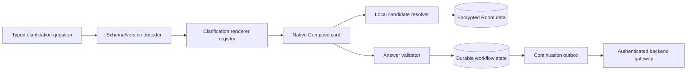

# Android clarification-card UI system

Status: Proposed implementation specification; Android card registries and receipt path implemented (CL-01–CL-08). Compose card screens remain UI follow-up.  
Date: 2026-09-23
Related: [Clarification orchestration](clarification-routing-orchestration.md), [LLM and chat architecture](llm-and-chat-architecture.md), [patient workflows](patient-management-workflows.md), [patient data contract](patient-management-data-contract.md), [record and reminder workflow](patient-record-and-reminder-workflow.md)

## 1. Purpose

This specification defines the Android user-interface system for collecting missing or ambiguous information during chat and AI-assisted workflows. It provides a small registry of trusted native cards for selecting patients, admissions, beds, medicines, people, dates, times, quantities and bounded choices.

The system is server-directed at the level of information requirements, not arbitrary server-driven UI. The backend may request `PATIENT_SELECTION`; Android decides how that card looks, queries authoritative local data, validates the answer and returns stable references.

The same card framework is used in:

- chat-first capture;
- document intake and patient matching;
- conversational patient creation;
- medication and procedure extraction;
- reminder creation and rescheduling;
- nurse/patient/specialist conversation attribution;
- proposal repair; and
- stale-record resolution before commit.

## 2. Experience principles

1. Ask one clear question at a time by default.
2. Prefer tapping a valid local option over typing names or identifiers.
3. Display the context needed to distinguish similar options.
4. Never expose internal IDs as the primary label.
5. Always provide an honest escape route: `None of these`, `I'm not sure`, `Type an answer`, or `Cancel`, when policy permits it.
6. Preserve the doctor's draft and accepted answers through interruption, process death and offline periods.
7. Clearly distinguish selecting an existing record from creating a new one.
8. Show resolved dates/times, units, patient/admission scope and clinical impact before submission.
9. Do not make a card appear to have saved a clinical fact. Clarification, proposal review and clinical commit are separate states.
10. Keep manual workflows available when AI or the network is unavailable.

## 3. Architecture



The renderer never executes code supplied by the backend. Unknown card types, unsupported schema versions or invalid constraints produce a safe unsupported state with a manual route.

## 3.1 Conversation-window experience

The primary experience is a continuously scrolling conversational timeline similar to a familiar messaging application. It is not one reusable box whose contents are replaced by each question.

The screen has four stable regions:

1. **Conversation header** — thread title and current scope, such as `All patients` or `Mrs Anjali Rao · ICU Bed 4`.
2. **Context strip** — optional patient/admission chip, offline/processing state and a clear way to change or remove context.
3. **Chronological timeline** — doctor messages, assistant explanations, clarification cards, answer summaries, proposal groups, processing indicators and receipts.
4. **Persistent bottom composer** — text entry, device dictation, attachment capture and Send. It remains available except while a blocking modal system action is in progress.

Illustrative layout:

```text
┌────────────────────────────────────────┐
│ MedTrack Assistant                  ⋮  │
│ [Mrs Anjali Rao · ICU Bed 4]     [×]  │
├────────────────────────────────────────┤
│                              You       │
│  Stop the antibiotic and check her     │
│  later.                         13:26   │
│                                        │
│  MedTrack                              │
│  I found two active antibiotics.       │
│  ┌──────────────────────────────────┐  │
│  │ Which medicine should be stopped?│  │
│  │ ○ Ceftriaxone · 1 g IV BD        │  │
│  │ ○ Metronidazole · 500 mg IV TDS  │  │
│  │                 [Continue]        │  │
│  └──────────────────────────────────┘  │
│                                        │
│  Earlier answered cards remain above   │
│  as compact summaries.                 │
├────────────────────────────────────────┤
│ ＋  Message MedTrack…       🎙     ➤  │
└────────────────────────────────────────┘
```

### Timeline rules

- New content appends to the timeline; it does not replace earlier turns.
- The app scrolls to the latest new item when the doctor is already near the bottom. It does not pull the doctor away while they are reviewing older content; instead it shows a `New response` affordance.
- A new active clarification card opens expanded. Once answered, it becomes a compact answer bubble showing what was selected, when and for which patient.
- Answered cards remain in history. They do not disappear. `Change` is available until the workflow is finalized, subject to stale/version rules.
- Changing an earlier answer appends a visible revision and invalidates dependent later cards. It does not rewrite the conversation invisibly.
- Proposal cards stay expanded while awaiting review and collapse into receipt summaries after approval or discard.
- Processing nodes remain tied to the originating doctor message and change state in place from queued to processing to result. Their material status transitions are retained in workflow history.
- Error and retry states remain attached to the failed operation so the doctor does not need to reconstruct which message failed.
- A long-running document job does not block typing another note. Its progress appears as a timeline job card.

### Card surfaces

Small choices render directly inline. Large searchable collections use a bottom sheet or full-screen selector launched from the inline card:

- patient search;
- long medication lists;
- hospital location hierarchy;
- people/staff search; and
- document inspection.

After selection, the sheet closes and the answer appears in the same timeline position. The conversation never becomes a stack of unrelated modal dialogs.

### Composer behavior during clarification

The composer remains usable while a clarification is active. Its behavior is explicit:

- Tapping or typing inside a card answers that card.
- Sending from the main composer starts a normal chat turn unless the doctor explicitly chooses `Answer current question`.
- When the typed message appears likely to answer the active question, the app may offer two clear actions: `Use as answer` and `Send as new message`. It does not silently choose.
- A new message may start another workflow, but the header/timeline shows which workflow is waiting for an answer.
- The first release should limit simultaneous actively edited workflows to keep the ward experience understandable; background jobs may continue independently.

### Conversation and patient scope

The default chat entry can be global, but patient context is always visible when selected. Opening chat from a patient hub preselects that patient/admission. Changing the context affects the next request only; it does not relabel earlier messages.

Cross-patient results are grouped under visibly separate patient headers. There is no visually merged approval card covering several patients.

### Empty, offline and resumed states

An empty chat shows a small set of safe starters such as `Add a patient`, `Record an update`, `Review pending work`, and `Attach a report`. These launch normal workflows rather than special untracked paths.

Offline messages appear immediately with `Saved on device` and, when cloud interpretation is needed, `Waiting for connection`. After restart, the app returns to the same thread and active card. It never opens as an apparently empty new conversation while an unanswered clinical workflow exists.

## 4. UI data contract

The card contract is nested inside the versioned `AssistantTurnEnvelope` defined by the orchestration specification. Parsing follows this order:

1. Validate the assistant-turn schema and result discriminator.
2. Validate workflow, request, job, context and plan bindings.
3. Validate every card discriminator and payload schema.
4. Confirm the renderer and all advertised actions are locally supported.
5. Resolve local candidates or proposal targets.
6. Render only after the complete envelope passes structural validation.

A partially valid envelope does not render its valid-looking action cards while ignoring invalid siblings. Informational text may be shown as untrusted fallback only when it contains no actionable claim and the UI clearly reports that structured processing failed.

### 4.1 `ClarificationCardEnvelope`

```json
{
  "schemaVersion": "clarification-card-v1",
  "workflowId": "workflow-1",
  "questionId": "question-2",
  "questionDigest": "sha256:...",
  "responseType": "MEDICATION_ORDER_SELECTION",
  "selectionMode": "SINGLE",
  "promptKey": "clarify.medication.stop.which",
  "fallbackPrompt": "Which medicine should be stopped?",
  "required": true,
  "ordinal": 2,
  "knownRemainingCount": 1,
  "candidateQuery": {
    "queryType": "ACTIVE_MEDICATION_ORDERS_FOR_ADMISSION",
    "admissionId": "admission-9",
    "drugClassHint": "antibiotic"
  },
  "constraints": {
    "minimumSelections": 1,
    "maximumSelections": 1
  },
  "expiresAt": "2026-09-23T18:30:00+05:30"
}
```

Android accepts only fields defined by the supported schema. Presentation fields such as colors, fonts, component classes, URLs, scripts, SQL, regular expressions and arbitrary validation expressions are prohibited.

### 4.2 `CandidateOption`

| Field | Type | Rules |
| --- | --- | --- |
| `candidateId` | local ephemeral string | Unique within the rendered card |
| `entityType` | enum | Allowlisted type |
| `entityId` | UUID | Stable local reference |
| `observedVersion?` | integer | Required for mutable clinical targets |
| `primaryLabel` | string | Human-readable name/title |
| `secondaryLabel?` | string | Ward/bed, dose/route, role or other discriminator |
| `tertiaryLabel?` | string | Date/status/source when useful |
| `status` | enum | `AVAILABLE`, `STALE`, `INACTIVE`, `CONFLICTING` |
| `iconKind?` | enum | Client-owned icon vocabulary |
| `searchTerms` | string[] | Generated locally; never returned in the answer |
| `accessibilityLabel` | string | Complete spoken description |

The option list is generated on device from Room unless the question concerns a cloud-only temporary artifact. Backend candidate hints are filters, not authoritative options.

### 4.3 `CardAnswerDraft`

| Field | Type | Rules |
| --- | --- | --- |
| `workflowId`, `questionId`, `questionDigest` | string | Required binding |
| `selectedCandidateIds` | string[] | UI-local draft selection |
| `typedValues` | object | Card-specific validated values |
| `answerMode` | enum | `SELECTION`, `NONE_OF_THESE`, `UNKNOWN`, `FREE_TEXT`, `CANCEL` |
| `validationState` | enum | `INCOMPLETE`, `VALID`, `INVALID`, `STALE` |
| `validationMessages` | object[] | Localized client messages |
| `savedAt` | Instant | Draft persistence |

Submission converts candidates into stable entity references and display snapshots as defined by the orchestration specification.

## 5. Trusted renderer registry

Android implements a closed mapping:

| Response type | Renderer | Local source |
| --- | --- | --- |
| `PATIENT_SELECTION` | `PatientSelectionCard` | Active census and patient search |
| `ADMISSION_SELECTION` | `AdmissionSelectionCard` | Patient's episodes/admissions |
| `LOCATION_SELECTION` | `LocationSelectionCard` | Hospital/location hierarchy and current assignment |
| `MEDICATION_ORDER_SELECTION` | `MedicationOrderSelectionCard` | Admission's medication orders |
| `MEDICATION_DETAILS` | `MedicationDetailsCard` | Drug concepts plus typed draft values |
| `PERSON_SELECTION` | `PersonSelectionCard` | People, professional roles and care involvement |
| `DATE_TIME` | `DateTimeClarificationCard` | Device clock, hospital zone and native picker |
| `DURATION` | `DurationClarificationCard` | Client quick values and custom duration |
| `SINGLE_CHOICE` | `SingleChoiceCard` | Backend allowlisted labels/values |
| `MULTI_CHOICE` | `MultiChoiceCard` | Backend allowlisted labels/values |
| `QUANTITY_UNIT` | `QuantityUnitCard` | Numeric input and domain unit allowlist |
| `ATTRIBUTION` | `AttributionCard` | People plus participation roles |
| `SHORT_TEXT` | `ShortTextCard` | Typed text or reviewed device transcription |
| `DOCUMENT_IDENTITY` | `DocumentIdentityCard` | Local patients/admissions plus document metadata |

Unknown response types are not rendered generically. The card states that the installed app cannot handle the question, preserves the workflow, and offers update/manual/cancel actions.

### 5.1 Result-card registry

Clarification cards are one part of the assistant timeline. The complete closed registry is:

| Card kind | Examples | Allowed primary actions |
| --- | --- | --- |
| `CLARIFICATION` | Patient, medication, location, time | `SUBMIT_ANSWER` |
| `INFORMATION` | Source-linked answer or explanation | `ACKNOWLEDGE`, `ASK_FOLLOW_UP` |
| `PROPOSAL_GROUP` | Transfer, medication, task, observation | `APPROVE_GROUP`, `EDIT_GROUP`, `DISCARD_GROUP` |
| `TRANSMISSION_PROPOSAL` | Reviewed message/document delivery | `APPROVE_SEND`, `EDIT_SEND`, `DISCARD_SEND` |
| `RECEIPT` | Saved records and effect status | `OPEN_RECORD`, `RETRY_EFFECT` where allowed |
| `MANUAL_REQUIRED` | Unsupported/non-converging workflow | `OPEN_MANUAL_FLOW`, `CANCEL_WORKFLOW` |
| `ERROR` | Retryable or terminal failure | `RETRY`, `EDIT_INPUT`, `OPEN_MANUAL_FLOW` as specified |

Android ignores any action that is not valid for both the card kind and its local policy. The backend cannot create a new behavior by inventing an action string.

## 6. Shared card anatomy

Every card contains:

1. Context header: patient/admission or `Patient not selected`.
2. Plain-language question.
3. Optional reason line when it helps the doctor understand why the question is necessary.
4. Primary input area.
5. Validation or stale-data message.
6. Primary `Continue` action, disabled until locally valid.
7. Applicable escape actions.
8. Progress such as `Question 2 of 3` only when the remaining count is known.
9. A visible `Cancel request` action in the overflow or card footer.

Submitting changes the card to a compact immutable answer bubble. The doctor can select `Change` while the workflow remains uncommitted. Changing an earlier answer invalidates dependent later answers and produces a new plan version.

## 7. Card specifications

### 7.1 Patient selection

Display:

- patient name;
- age or date of birth when available;
- current ward/room/bed;
- hospital identifier suffix when needed to distinguish duplicates;
- admission date/status; and
- an ambiguity or identity warning when present.

Default ordering favors explicitly selected/current-context patient, recent active patients and the current ward. Search covers name and allowed local identifiers. Duplicate names must remain separate rows.

Actions:

- select one patient/admission;
- search all locally available patients;
- `This is a new patient` when the workflow permits creation;
- `None of these`; and
- cancel.

Patient creation opens the versioned patient/admission draft workflow. It does not create a patient merely by selecting that escape action.

### 7.2 Admission selection

Show admission kind, hospital, started date, current department/location and status. Discharged admissions are visually distinct and excluded by default for current inpatient actions. The answer returns both patient and admission IDs.

### 7.3 Location selection

Use hierarchical navigation:

```text
Hospital → Building/Floor → Ward → Room → Bed
```

The card may start at the current hospital and show recent destinations. Each choice includes location kind and full breadcrumb. Bed availability is never inferred solely from a label; occupancy/conflict information comes from local validated records. An unavailable or conflicting bed cannot be silently selected.

### 7.4 Medication-order selection

For an existing order show:

- medication display name;
- dose and unit;
- route;
- regimen;
- active/stopped status;
- start time;
- prescriber/decision-maker when recorded; and
- order version.

Default filters come from the question, such as active antibiotics, but the doctor can reveal all eligible orders. `Start a different medicine` routes to a medication-details draft; it is not represented as an existing order.

### 7.5 Medication details

This dedicated composite card may collect:

- medicine/concept or unresolved source text;
- dose value and unit;
- route;
- regimen/timing;
- start/effective time; and
- stated decision-maker.

Required fields are controlled by the command schema. Unsupported or uncertain regimens remain original text and require review; the UI must not normalize them into a precise schedule without evidence.

### 7.6 Person and attribution

The person card shows name, profession, specialty, hospital/team and relationship to the admission. It distinguishes:

- who said or sent information;
- who made a decision;
- who performed care;
- who recorded it in MedTrack; and
- who approved the proposal.

The logged-in doctor is not automatically assigned to the other roles. `Person not listed` permits a provisional reported label where the data contract allows it.

### 7.7 Date, time and duration

Duration quick choices may include 30 minutes, 1 hour, 2 hours, 4 hours and custom. These are client defaults, not model-generated values.

Before submission, always display the resolved local date, time and zone. A relative answer records:

- original duration;
- anchor instant;
- resolved instant; and
- zone ID.

Past times, daylight/zone anomalies and vague source text receive explicit validation. A reminder card must not imply that notification permission or exact-alarm capability is available; scheduling capability is shown later with the saved task/reminder state.

### 7.8 Choice cards

Use only for a bounded, versioned list supplied in the question. Each option has a stable semantic value and client-rendered label. Do not use positional values. Destructive or clinical meanings need explicit wording and review; a generic `Yes` must not hide the action being confirmed.

### 7.9 Quantity and unit

Provide numeric keyboard, decimal rules, allowable range where clinically defined, and a domain-specific unit list. Preserve the original typed value. Unit conversion, if supported later, must show both source and normalized value and never occur invisibly.

### 7.10 Short text

Use when the information cannot be represented by a safer structured card. Support editable device transcription. Display expected content and reasonable length. Short text never accepts arbitrary commands to bypass the current question; the backend treats it as an answer to the bound requirement only.

## 8. Chat integration

The conversation timeline uses typed nodes:

```text
Doctor message
Assistant acknowledgement
Active clarification card
Doctor answer bubble
Next clarification card, if required
Interpretation/proposal summary
Review cards
Commit receipt
```

Only one card accepts input for a workflow at a time. Older cards are read-only answer summaries. Multiple independent patient groups may each have a blocked card, but the UI presents a clear group selector and never interleaves them without patient labels.

The bottom chat composer remains available for a new message. If the doctor types while a clarification is active, the app asks whether the text answers the current question or starts a new request only when this cannot be inferred safely from the selected UI action. A card-specific text field is preferred for free-text answers.

## 9. Candidate resolution

`LocalCandidateResolver` accepts only allowlisted query types. Initial queries include:

- `ACTIVE_PATIENTS`
- `ADMISSIONS_FOR_PATIENT`
- `CURRENT_OR_AVAILABLE_LOCATIONS`
- `ACTIVE_MEDICATION_ORDERS_FOR_ADMISSION`
- `PEOPLE_INVOLVED_IN_ADMISSION`
- `TASKS_FOR_ADMISSION`
- `DOCUMENT_PATIENT_MATCH_CANDIDATES`

Every query is scoped by `ownerAccountId`; clinical queries additionally enforce patient/admission relationships. Maximum result limits prevent accidental whole-census rendering. Search expansion is an explicit user action.

Candidate-query payloads cannot include SQL, sort expressions, filesystem paths, network URLs or arbitrary predicates. Unknown filters fail closed.

## 10. Validation and submission

Before enabling `Continue`, Android validates:

- supported question/card schema;
- active workflow and exact question digest;
- account and conversation ownership;
- cardinality and required fields;
- selected entity type and ID;
- patient/admission relationship;
- current entity availability and observed version;
- value type, unit and temporal constraints; and
- question expiry.

On submission:

1. Save the answer and answer digest locally.
2. Mark the card as answered/pending continuation.
3. Add an idempotent continuation request to the local outbox.
4. Send immediately when online and authenticated.
5. Replace the pending indicator with the next card or final result.

Repeated taps use the same answer ID and continuation request. They cannot produce duplicate clinical proposals or commits.

## 11. Proposal approval and application effects

Clarification submission and proposal approval are deliberately different controls:

- `Continue` on a clarification card only records an answer and advances interpretation.
- `Approve` on a proposal group invokes the local command pathway after showing the exact effect.
- `Send` on a transmission proposal invokes a separately authorized transmission pathway.

### 11.1 Proposal presentation

Each proposal group displays:

- patient and admission;
- exact operation type;
- current value and proposed value where applicable;
- target record and observed version;
- effective date/time and precision;
- source evidence and attribution;
- unresolved fields or warnings;
- dependent groups; and
- effects that will be queued after save, such as a reminder.

The primary text is constructed locally from typed operations. Model narrative may appear as supporting explanation but cannot alter the displayed approval scope.

### 11.2 Approval mechanics

When the doctor approves, Android:

1. Freezes the selected atomic groups and calculates the approved payload digest.
2. Rechecks target IDs, patient/admission scope, dependencies and record versions.
3. Dispatches each supported operation to its registered local command handler.
4. Atomically saves clinical changes, audit, receipts and outbox entries.
5. Shows `Saved locally` from the commit receipt.
6. Runs post-commit processors and updates their status independently.

Examples:

- An approved `ASSIGN_TASK` with a validated due time creates the patient task, reminder schedule and scheduling-outbox entry in the same transaction. The scheduling processor then configures `AlarmManager`.
- An approved `MEDICATION_STOP` calls the medication-order command with the selected order ID and expected version. It does not create a reminder unless another approved operation requests one.
- An approved transfer calls the admission transfer command. A bed label alone cannot reach this pathway.
- An approved observation or note creates the corresponding source-linked clinical event; merely acknowledging an informational answer does not.

### 11.3 Receipt synchronization

The final timeline card is derived from actual receipts:

```json
{
  "cardKind": "RECEIPT",
  "proposalId": "proposal-1",
  "approvedDigest": "sha256:...",
  "groupResults": [
    {
      "atomicGroupId": "group-task",
      "commitStatus": "SAVED",
      "recordRefs": [{"type": "CareTask", "id": "task-7"}],
      "effects": [
        {"type": "REMINDER_SCHEDULE", "status": "PENDING", "ref": "schedule-3"}
      ]
    }
  ]
}
```

The card updates when the local outbox processor records `SCHEDULED`, `INEXACT`, `BLOCKED` or `FAILED`. It does not rewrite the original approval or clinical receipt.

### 11.4 Transmission cards

Information transmission requires its own proposal card displaying channel, recipients, exact content/attachments, purpose and privacy warnings. `Approve group` on a clinical proposal never doubles as `Send`.

After explicit send approval, the app creates a transmission outbox entry and displays queued/sent/failed status from delivery receipts. Since no external transmission channel is currently implemented, the initial UI supports draft/preview/manual handoff only and must not display `Sent`.

## 12. Offline and recovery behavior

- Candidate cards backed by local data remain usable offline.
- Answers are saved locally before any network call.
- The card shows `Answer saved; interpretation will continue when online`.
- Questions requiring cloud-only temporary information explain that connection is required.
- App/process restart restores the active card, selections, typed values and scroll position where practical.
- Sign-out hides clinical workflows and invalidates submission until the correct account returns.
- Account switching cannot render or submit another account's saved card.
- An expired cloud question is retained as history but refreshed before continuation.

The app may continue deterministic local workflows without the cloud when their existing domain rules allow it. It must not pretend an LLM-dependent interpretation completed offline.

## 13. Stale and conflicting data

If a candidate changes after display:

- mark it stale or unavailable;
- disable submission when its meaning changed materially;
- explain the change in plain language;
- refresh the options; and
- retain the doctor's prior choice as a visible invalidated answer.

Examples include a medication being stopped, a patient moving beds, an admission ending, or a task being completed elsewhere in the app. The doctor must choose again when the old answer no longer identifies a valid target.

Before final commit, the proposal review layer performs its own current-version validation. Successful clarification is not a substitute for commit-time checking.

## 14. Accessibility and mid-tier Android requirements

- Minimum touch targets follow Android accessibility guidance.
- Every selectable row has a complete TalkBack label and selected state.
- Do not encode availability, risk or selection using color alone.
- Support dynamic font scaling without hiding dose, route, bed or time information.
- Search and long lists use lazy rendering and debounced local queries.
- Cards avoid loading large document images into the chat timeline; use thumbnails and a dedicated viewer.
- Primary actions remain reachable with one hand where possible.
- Preserve usable behavior with keyboard, switch access and portrait orientation.
- Animations are brief and respect reduced-motion settings.

Target-device testing uses representative mid-tier Android hardware in English before release.

## 15. Privacy and notification boundaries

- Do not show clarification content in lock-screen notifications.
- A background “answer needed” or “analysis ready” notification uses privacy-safe generic text and deep-links into the authenticated workflow.
- Firebase Analytics and routine crash metadata do not contain question text, answer labels, patient IDs, document contents or clinical values.
- Screenshots and recents-screen handling follow the app's clinical privacy policy.
- Candidate display snapshots are protected local clinical data.

## 16. Visual states

Every card supports:

| State | User-visible behavior |
| --- | --- |
| `LOADING_LOCAL_OPTIONS` | Skeleton/indicator with cancel available |
| `READY` | Inputs enabled |
| `NO_MATCHES` | None/type/search/create routes as permitted |
| `INVALID` | Field-level explanation; continue disabled |
| `ANSWER_SAVED_OFFLINE` | Read-only answer with queued indicator |
| `SUBMITTING` | Inputs locked against duplicate submission |
| `ANSWERED` | Compact answer bubble with optional Change |
| `STALE` | Prior choice shown with refresh/reselect action |
| `EXPIRED` | Refresh question action |
| `UNSUPPORTED` | Preserve workflow; app update/manual/cancel options |
| `FAILED_RETRYABLE` | Retry without losing answer |
| `FAILED_TERMINAL` | Manual workflow and support-safe error code |

## 17. Example card sequence

Input: “Stop the antibiotic and check her later.”

```text
[Patient card]
Which patient do you mean?
  • Mrs Anjali Rao — ICU, Bed 4
  • Mrs Asha Rao — Ward 3B, Bed 12

[Answered]
Mrs Anjali Rao — ICU, Bed 4

[Medication card]
Which antibiotic should be stopped?
  • Ceftriaxone — 1 g IV twice daily
  • Metronidazole — 500 mg IV three times daily

[Answered]
Ceftriaxone — 1 g IV twice daily

[Time card]
When should I remind you?
  [30 min] [1 hour] [2 hours] [4 hours] [Choose]

[Review]
Proposed for Mrs Anjali Rao:
  • Stop active ceftriaxone order
  • Review at 5:30 pm today
```

The review remains distinct from the answers. Tapping `Continue` on the time card does not stop medication or create a clinical event.

## 18. Evaluation and acceptance

UI testing must cover:

- duplicate patient names and similar identifiers;
- no candidates, one candidate and long candidate lists;
- patients moving beds while a card is open;
- medication-order version changes;
- relative time across midnight;
- inaccessible exact alarms or notifications;
- large text and TalkBack;
- screen rotation, backgrounding and process recreation;
- offline answer then reconnect;
- double taps and repeated continuation responses;
- expired and unsupported questions;
- changing an earlier answer with dependent later answers;
- account sign-out/switch during clarification; and
- manual escape from a non-converging workflow.

Acceptance requires:

1. All production cards come from the fixed renderer registry.
2. Patient, admission, medication, location and person selections use locally validated stable references.
3. A doctor can distinguish every candidate without reading internal IDs.
4. Every card has a safe no-match/cancel path appropriate to its policy.
5. Answer drafts and submitted answers survive restart and offline periods.
6. Stale candidates cannot silently advance the workflow.
7. The UI accurately distinguishes answer saved, interpretation pending, awaiting review, locally committed and reminder scheduled.
8. No clarification card directly performs a clinical write.
9. Every approvable proposal operation maps to one supported renderer and one local command handler.
10. Approval, local commit and post-commit effect status are visibly separate.
11. Reminder cards update from scheduling receipts rather than assuming success at approval time.
12. Transmission cannot occur through a clinical approval or free-form narrative action.

## 19. Delivery slices

### Slice 1: Framework and simple cards

Implement envelope decoding, renderer registry, durable card state, single-choice, short-text, duration and date-time cards using synthetic workflows.

### Slice 2: Clinical identity cards

Add patient, admission, medication-order, location and person candidate resolvers with local version validation.

### Slice 3: Chat continuation

Integrate answer bubbles, continuation outbox, one-question sequencing, retry/recovery and plan-version invalidation.

### Slice 4: Composite and document flows

Add medication details, quantity/unit, attribution and document-identity cards, followed by usability evaluation.

### Slice 5: Accessibility and release hardening

Complete mid-tier-device, accessibility, privacy, stale-state, process-death and end-to-end synthetic verification before real clinical use.

## 20. Explicit exclusions

- Arbitrary JSON-to-form rendering
- HTML, JavaScript or remote UI components supplied by a model
- Backend-supplied SQL or executable validation expressions
- Automatic first-match selection
- Hidden patient or medication inference
- Clinical commit from a card submission
- Replacing the existing full manual patient/medication/task workflows
