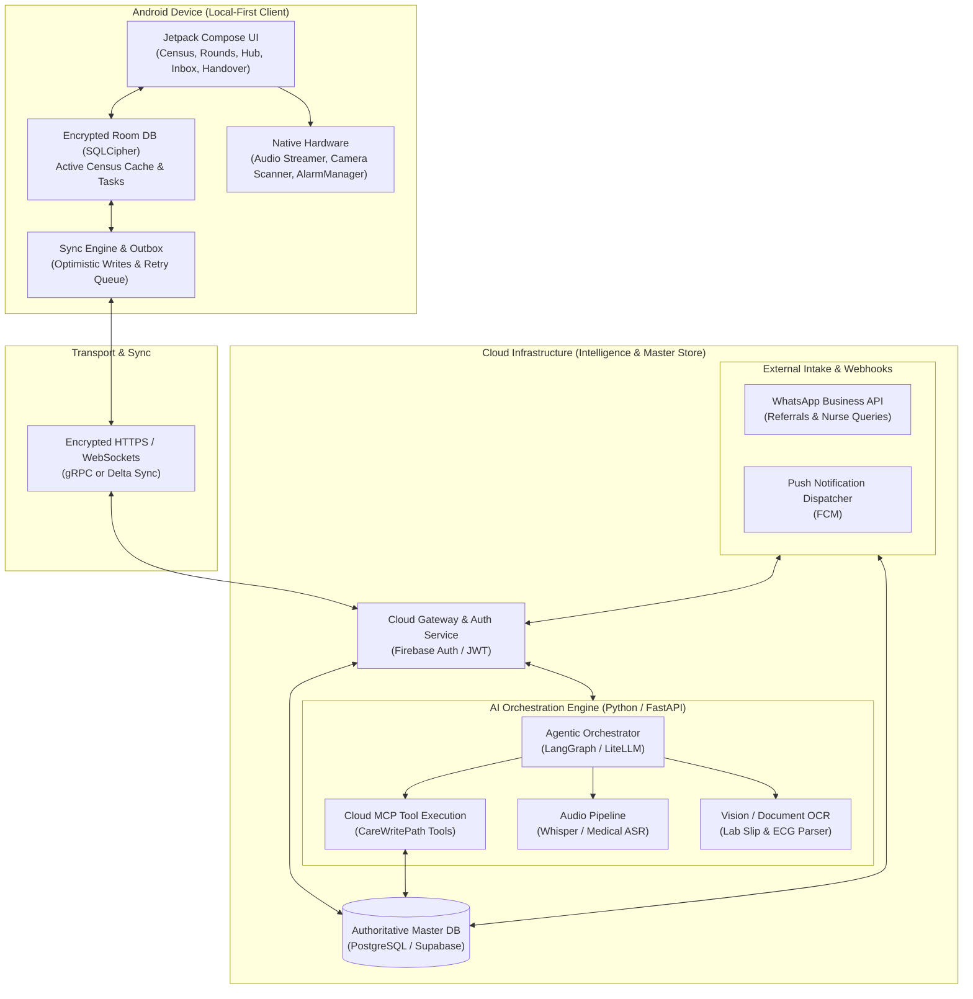
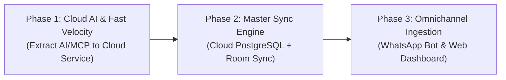

# MedTrack: Local-First, Cloud-Orchestrated Hybrid Architecture Proposal

**Document Status:** Historical proposal; superseded by [Hybrid architecture specification](hybrid-architecture.md)

The revised specification defines Ankita's single-user first release, a backend prepared for isolated additional users, local clinical commits, and separately deferred clinical synchronization. Use it for implementation planning; this original RFC is retained for context.
**Date:** September 20, 2026  
**Primary Platform:** Android (Client) + Cloud Backend (AI Orchestration & Sync)  
**Related Documents:**  
* High-Level Product Specification: [`spec/high-level-spec.md`](file:///e:/01_Coding/14_MedTrack/spec/high-level-spec.md)  
* Patient Information Model: [`spec/patient-information-model.md`](file:///e:/01_Coding/14_MedTrack/spec/patient-information-model.md)  
* Field-Level Data Contract: [`spec/patient-management-data-contract.md`](file:///e:/01_Coding/14_MedTrack/spec/patient-management-data-contract.md)  
* Dr. Ankita Interview Notes: [`spec/Business User Convo/MedTrak.md`](file:///e:/01_Coding/14_MedTrack/spec/Business%20User%20Convo/MedTrak.md)  
* Codebase Review: [`review/codebase_review.md`](file:///e:/01_Coding/14_MedTrack/review/codebase_review.md)  

---

## 1. Executive Summary & Problem Statement

### The Core Dilemma
As MedTrack expands its clinical capabilities, the project faces a classic tension between **rapid developer velocity** and **inpatient bedside reliability**:
1. **The Thick-Client Dilemma (Current State)**: The Android app currently handles everything locally—Room database migrations (v1 to v12), local MCP HTTP server on loopback, direct client-to-OpenRouter API calls, and local business logic. This makes iterative development slow: changing a prompt, adding an MCP tool, or tweaking a workflow requires updating Kotlin code, running schema migrations, and distributing a new APK.
2. **The Thin-Client Fallacy (Dumb Frontend)**: Shifting everything to a pure webview or thin API-dependent client to maximize deployment agility will cause the product to fail clinically. Inpatient ward realities (thick concrete walls, basement ICUs, lead-lined radiology suites) mean intermittent or absent connectivity is the norm, not the exception. A doctor cannot tolerate loading spinners while standing at a patient's bedside during a 3-minute encounter.

### The Solution: Local-First, Cloud-Orchestrated Architecture
MedTrack will adopt a **Local-First, Cloud-Orchestrated** hybrid model:
* **The Device** owns the **offline-first clinical experience**: local encrypted cache (Room/SQLCipher), sub-50ms UI transitions, optimistic local writes, hardware audio capture, and native background alarms.
* **The Cloud** owns the **heavy intelligence & integration layer**: AI orchestration, prompt engineering pipelines, multi-modal ingestion (Whisper, OCR), external communications (WhatsApp bot, nurse triage webhooks), and multi-device data sync.

---

## 2. Inpatient Operational Constraints (Why Pure Cloud Fails)

Clinical observations from Dr. Ankita’s daily rounding routine establish non-negotiable boundaries:

```
+-----------------------------------------------------------------------------------------+
|                              INPATIENT REALITY BOUNDARIES                               |
+-----------------------------------------------------------------------------------------+
|  1. Zero-Connectivity Zones                                                             |
|     Basement ICUs, radiology suites, and elevator shafts drop 4G/5G and Wi-Fi.          |
|     => The app MUST allow viewing patients, beds, meds, and tasks 100% offline.         |
+-----------------------------------------------------------------------------------------+
|  2. Sub-50ms Bedside Speed                                                              |
|     A doctor has 3-5 minutes per patient across a 20+ patient census.                   |
|     => Checkbox toggles and floor transitions must be instant with optimistic UI updates.|
+-----------------------------------------------------------------------------------------+
|  3. Offline-Reliable Alarms                                                             |
|     Critical medication reviews (e.g. "Re-check potassium in 2h") cannot rely on        |
|     remote push notifications if the device loses reception or enters airplane mode.    |
|     => Reminders must bind to the native Android AlarmManager locally.                   |
+-----------------------------------------------------------------------------------------+
|  4. Clinical Privacy & Provenance (DISHA / HIPAA)                                       |
|     Patient Health Information (PHI) stored on device must be strongly encrypted at     |
|     rest (SQLCipher) and protected by biometric authentication.                          |
+-----------------------------------------------------------------------------------------+
```

---

## 3. High-Level Architecture Topology



---

## 4. Component Responsibility Matrix

| Feature / Responsibility | Location | Technical Rationale |
| :--- | :--- | :--- |
| **Active Census & Dossier View** | **Device** | Sub-50ms rendering; zero-latency browsing during bedside rounds even without network coverage. |
| **Task Completion & Floor Rounds** | **Device** | Optimistic local updates; checkboxes toggle immediately and append to the local sync outbox. |
| **Time-Critical Alarms** | **Device** | Local `AlarmManager` triggers alarms regardless of network connectivity or battery-saver background network restrictions. |
| **Audio Dictation Recording** | **Device** | Native audio streaming with low latency and local cache in case transmission fails mid-recording. |
| **Biometric & At-Rest Encryption** | **Device** | Hardware-backed keystore + SQLCipher database prevents unauthorized local device inspection. |
| **AI Orchestrator & LLM Integration** | **Cloud** | Instant iteration: modify prompts, change model providers (OpenRouter, Claude, GPT-4o, Gemini), and tune safety filters without app updates. |
| **MCP Tool Execution** | **Cloud** | Tools execute against the authoritative cloud database; eliminates mobile loopback sockets and Android-side JSON parsing overhead. |
| **Staging Gate Diff Generation** | **Cloud** | Computes proposed operations, clinical entities to create/update, and structured diffs before sending them to the app for clinician sign-off. |
| **WhatsApp / Referral Ingestion** | **Cloud** | Webhooks receive incoming photos, voice notes, and messages from referring physicians and route them to the triage inbox. |
| **Document OCR & Lab Slip Parsing** | **Cloud** | High-compute vision models extract structured lab values from camera snapshots of physical paper reports. |
| **Shift Handover Synthesis** | **Cloud** | Heavy background aggregation of lab trends, clinical events, and notes across all 20+ patients into concise handover summaries. |
| **Authoritative Master Data** | **Cloud** | Single source of truth for clinical records, audit logs, and multi-device access (e.g. mobile app + nursing station web dashboard). |

---

## 5. Detailed Component Specifications

### 5.1 Cloud AI Orchestration Layer
Currently, the mobile app connects to OpenRouter directly and runs a local loopback server (`LocalMcpHttpServer.kt`). In the hybrid architecture, this entire loop is transferred to the cloud:
1. **The Request**: The mobile app captures clinician dictation (or text) and sends a single request:
   `POST /api/v1/ai/quick-capture` with `{ admissionId, audioBlobOrText }`.
2. **The Cloud Processing**:
   * Runs speech-to-text (e.g., Whisper) if audio was submitted.
   * Invokes the agentic orchestrator with medical-domain system prompts and active patient context loaded from the cloud database.
   * The LLM emits tool calls matching the Care Model (e.g. `RecordTransfer`, `ChangeMedicationOrder`, `AssignTask`).
   * The orchestrator **does not commit** immediately. It computes a **Staged Proposal Bundle**:
     ```json
     {
       "proposalId": "prop_98124",
       "summary": "Transfer to ICU Bed 04, discontinue Ceftriaxone, start Meropenem 1g IV TDS, order stat potassium",
       "operations": [
         { "type": "RECORD_TRANSFER", "details": { "locationLabel": "ICU Bed 04" } },
         { "type": "DISCONTINUE_MEDICATION", "details": { "medication": "Ceftriaxone" } },
         { "type": "ORDER_MEDICATION", "details": { "name": "Meropenem", "dose": "1g", "route": "IV", "regimen": "TDS" } },
         { "type": "CREATE_TASK", "details": { "title": "Check serum potassium", "dueInHours": 4 } }
       ]
     }
     ```
3. **The Staging Gate on Device**:
   * The app receives this structured bundle and displays it in [`AiGateScreen.kt`](../apps/android/src/main/java/com/medtrack/app/ui/aigate/AiGateScreen.kt).
   * **Discard**: Drops the proposal bundle locally; nothing touches the database.
   * **Confirm**: The doctor taps "Confirm & Commit"; the app sends `POST /api/v1/ai/commit-proposal` with `{ proposalId }`. The cloud commits the operations transactionally via `CareWritePath` and syncs the updated records back to the app.

### 5.2 Offline Synchronization Engine
To prevent data loss and support seamless offline ward work:
1. **Optimistic Local Mutations**:
   * When Dr. Ankita marks a task complete or transfers a bed while offline, the local Room database updates immediately, providing instant UI feedback.
   * An operation record is inserted into a local `care_sync_outbox` table containing:
     * `operationId` (UUID)
     * `timestamp`
     * `commandType` and serialized request payload
     * `status` (`PENDING`, `IN_FLIGHT`, `FAILED`)
2. **Delta Sync Protocol**:
   * When network connectivity is restored, the `SyncManager` flushes the outbox to `POST /api/v1/sync/mutate`.
   * The cloud applies the operations idempotently using the unique `operationId`.
   * The device then pulls down all cloud revisions newer than its local `lastSyncedRevisionSequence`.
3. **Conflict Resolution Policy**:
   * **Tasks / Statuses**: Last-Write-Wins (LWW) based on clinician timestamp.
   * **Clinical Timeline & Notes**: Append-only (clinical events and notes are never overwritten; revisions create new versions linked to the previous revision ID).
   * **Bed Assignments**: Server-validated (if another user moved the patient concurrently, the server flags a conflict notification to the triage inbox).

---

## 6. Migration & Delivery Roadmap



### Phase 1: Extract AI & MCP to Cloud Backend (Immediate 10x Velocity Gain)
* **Goal**: Free mobile development from prompt engineering, tool routing, and loopback server security issues.
* **Actions**:
  1. Build a lightweight Python/FastAPI microservice deploying on Google Cloud Run or AWS.
  2. Move OpenRouter client and MCP tool handling from Android to this microservice.
  3. Update `AiAssistantOrchestrator` on Android to be a thin client calling the cloud endpoint.
  4. Fix the AI Staging Gate so that operations are only committed upon explicit clinician confirmation.
  5. Remove `LocalMcpHttpServer.kt` loopback server from the Android build, eliminating the P0 loopback origin bypass security vulnerability.

### Phase 2: Bi-Directional Master Sync Engine
* **Goal**: Establish cloud persistence, automated backup, and multi-device continuity.
* **Actions**:
  1. Stand up authoritative PostgreSQL database matching the 71-entity Care Model.
  2. Implement `care_sync_outbox` in Android Room database.
  3. Deploy sync endpoints (`/api/v1/sync/push` and `/api/v1/sync/pull`).
  4. Complete `MT-012`: Enforce Google Sign-In with Firebase Auth to bind the device sync session to the doctor's verified identity.

### Phase 3: Omnichannel Intake & Nursing Station Web Dashboard
* **Goal**: Complete Dr. Ankita's entire communication ecosystem.
* **Actions**:
  1. Connect WhatsApp Business API webhook to the cloud ingestion pipeline; route informal patient referrals directly into the `InboxScreen`.
  2. Build a responsive desktop web dashboard (Next.js/React) for the nursing station, allowing complex lab review and multi-patient discharge summaries on desktop monitors while retaining mobile for rounds.
