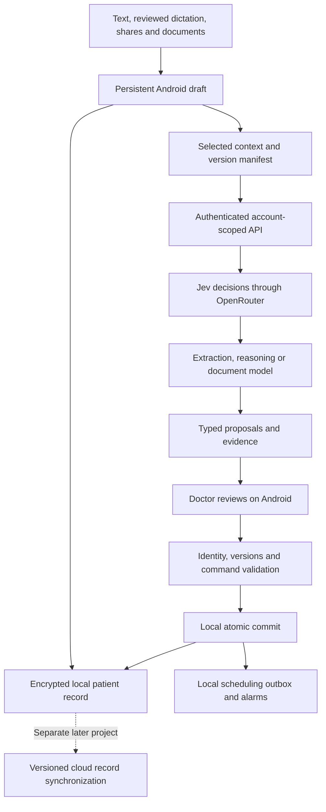

# MedTrack hybrid architecture: local clinical records and cloud AI

Status: Implementation specification; not a claim of implemented functionality  
Date: 2026-09-20  
First release: Ankita, one authenticated user, one active Android device  
Future readiness: Multiple independently authenticated users with isolated data

This specification supersedes the deployment, write-authority, synchronization and rollout choices in the [original hybrid proposal](hybrid-architecture-proposal.md). It retains local bedside operation and cloud AI orchestration, while deferring synchronized cloud clinical storage and shared clinical workspaces.

Design order remains [information model](patient-information-model.md) → [data contract](patient-management-data-contract.md) → [patient workflows](patient-management-workflows.md) → deployment. Related contracts: [chat and LLM architecture](llm-and-chat-architecture.md), [Jev through OpenRouter](jev-orchestration.md), [production backend and CI/CD](production-backend-and-cicd.md), [local speech](on-device-ai-and-voice.md), [records and reminders](patient-record-and-reminder-workflow.md).

## 1. Scope and decisions

Cloud account scope now includes an editable [user profile and subscription/access record](user-profile-and-subscription.md). Profile bootstrap for a verified identity does not itself grant product provisioning or clinical access. This is profile synchronization only; patient-record synchronization remains deferred.

Ankita is the first-release user. Nurses, consultants and other clinicians in her records are clinical people, not automatically application users. The backend must nevertheless authenticate and isolate every request as if more users already existed. No shared global patient context, hard-coded Ankita identity, common conversation history or single-user authorization shortcut is permitted.

| Capability | First release | Later expansion |
| --- | --- | --- |
| App access | Ankita's provisioned account; one active device | Provision additional accounts without changing the API contract |
| Clinical record authority | Encrypted database on the active Android device | Separately designed cloud record service and synchronization |
| Backend persistence | Identity, authorization, jobs, configuration and minimal operational metadata | Optional synchronized clinical records under an explicit migration |
| AI | Backend Jev decisions and generative models through OpenRouter | More evaluated model routes without changing clinical authority |
| Voice | Optional device transcription, editable transcript | Explicitly opted-in cloud transcription if separately enabled |
| Shared patient/team access | Not available | Organization/workspace membership, access policies and attribution |
| WhatsApp | Explicit share/paste/upload into the app | Separately authorized business integration |
| Reminders | Local schedules and local responses | Defined cross-device ownership/deduplication before expansion |

“Multiple users ready” means the backend can serve isolated personal accounts. It does not mean shared patient charts, synchronized devices, a nurse dashboard or permission to use any other doctor's records.

## 2. Responsibility and authority

### Android

- Own the authoritative clinical record, reusable master data, source material, drafts, history and audit for this release.
- Resolve patient/admission identity and record versions; enforce clinical relationships and allowed transitions.
- Commit manual entries, approved AI proposals and notification responses through the same local command layer.
- Persist clinical changes, provenance, audit and operation receipts atomically.
- Schedule and reconcile reminders locally, independently of cloud AI.
- Preserve capture and manual workflows offline after the device has been authorized and local access requirements met.
- Display local save, inference processing and reminder scheduling as separate states.

### Backend

- Validate identity and authorization on every protected operation.
- Hold provider credentials and enforce route/provider policy, per-account limits and input size limits.
- Run Jev routing and generative extraction, reasoning, document analysis and summary generation.
- Return typed, source-linked proposals against the context/version supplied by the device.
- Keep minimal account-scoped job state, support bounded retries/cancellation and expire temporary inputs/results.
- Never directly mutate the device's clinical record or maintain an implicitly authoritative copy of it.

The backend can use read-only context tools over the supplied snapshot. Mutating tool calls are proposed commands only. A cloud agent does not receive a clinical database write credential. Removing an optional local MCP HTTP transport is independent of retaining local CareWritePath/domain commands.

## 3. Identity model and future user isolation

Backend control-plane objects are separate from the clinical data model:

| Object | Required fields | Rules |
| --- | --- | --- |
| UserIdentity | `userId`, `authIssuer`, `authSubject`, `status`, `createdAt` | Unique issuer/subject. Verified identity token establishes identity; never trust a body-supplied userId. |
| PersonalAccount | `accountId`, `ownerUserId`, `status`, `createdAt` | One personal account per user initially. Clinical `ownerAccountId` maps to this stable accountId. |
| AccountMembership | `accountId`, `userId`, `role`, `status`, `createdAt` | First release permits only its owner's OWNER membership. Schema can represent future memberships, but shared access remains disabled. |
| DeviceRegistration | `deviceId`, `accountId`, `userId`, `status`, `registeredAt`, `lastSeenAt?` | Device identifier is not a credential. One active device per account initially; replacement is explicit. |
| AccountPolicy | `accountId`, `enabledRoutes`, `inputLimits`, `usageLimits`, `policyVersion` | Server-controlled. No clinical history in this object. |
| InferenceJob | `jobId`, `accountId`, `requestedByUserId`, `deviceId`, `requestId`, `inputDigest`, `contextDigest`, `status`, `createdAt`, `expiresAt`, `routeVersion`, `resultRef?`, `errorCode?` | Job access requires active membership, policy and matching account. Every storage lookup is scoped. |
| TemporaryArtifact | `artifactId`, `accountId`, `jobId?`, `purpose`, `mimeType`, `size`, `digest`, `storageKey`, `expiresAt`, `state` | Private storage; signed access, if used, is narrowly scoped and short-lived. Object name is not authorization. |
| UsageRecord | `accountId`, `jobId`, `provider`, `model`, `units`, `recordedAt` | Minimal accounting; no source text or clinical prompt in routine usage logs. |

Status enums: user/account/membership ACTIVE or DISABLED; device ACTIVE or REVOKED; job QUEUED, RUNNING, SUCCEEDED, FAILED, CANCELLED or EXPIRED. Terminal processing success does not mean a clinical action was committed.

Google/Firebase sign-in remains the selected first-release identity mechanism. The backend verifies tokens and derives user/account access. Use Ankita's verified subject in provisioning/configuration, not a name or email comparison scattered through code. Other valid sign-ins remain unprovisioned until enabled. Server policy is authoritative even if the client hides features.

For future independent users, provision a new UserIdentity, PersonalAccount, owner membership and device. Their master data, inputs, jobs, artifacts and logs remain isolated. Two users recording the same hospital or patient do not automatically share or merge records. Shared organizational data needs its own explicit membership/ownership migration.

## 4. First-release storage and retention

The Android encrypted database is a durable record, not an expendable cache. Store original attachments in protected local storage. Do not evict clinical history because an AI job finished, an admission ended, or the network disappeared.

The backend's durable database is a small control plane for the objects above. It does not initially mirror all clinical tables. Temporary clinical context is allowed only for the requested job and bounded retrieval/retry period. Proposed initial retention: purge input/output artifacts within 24 hours of terminal job state and never later than 48 hours after creation; terminate jobs exceeding that maximum. These are product targets to implement and verify, not provider-retention guarantees. Apply deletion to application-controlled payloads and define separate minimal metadata retention before deployment. Provider handling must satisfy the configured route policy.

Routine logs contain IDs, timings, error classes, route versions and usage, not transcripts, document contents, patient names or tokens. Debugging clinical payloads must not become a default logging path. Temporary-object cleanup and account isolation must include caches, job queues, error telemetry and exports.

Cloud AI is not backup. Before real clinical use, define and verify encrypted export/recovery of the local database and attachments, key recovery requirements, integrity checking and schema compatibility. First-release recovery may be a doctor-initiated encrypted backup/restore; automatic cloud backup and continuous sync remain separate features. Reinstalling and signing in alone must not be described as restoring records.

## 5. Versioned inference API

Initial API surface is HTTPS JSON with bounded attachment uploads. Streaming or WebSockets are optional presentation features, not a prerequisite. Do not introduce several competing transports before requirements justify them.

| Endpoint | Purpose |
| --- | --- |
| `GET /v1/capabilities` | Authorized routes, schema versions, limits and account feature flags |
| `POST /v1/artifacts` | Upload authorized temporary input with type/size/digest validation |
| `POST /v1/inference-jobs` | Submit account-scoped context and a capture/reasoning request |
| `GET /v1/inference-jobs/{jobId}` | Retrieve owned job state or typed result |
| `POST /v1/inference-jobs/{jobId}/cancel` | Request cancellation and suppress result use |
| `DELETE /v1/artifacts/{artifactId}` | Request deletion of owned temporary input when no longer needed |

There is no cloud `commit-proposal` endpoint in this release. Approval and commit happen on the device.

Every inference request includes `requestId`, `deviceId`, `clientVersion`, `commandSchemaVersion`, `purpose`, `contextDigest`, `contextManifest`, input source references and optional attachment references. Account identity is resolved server-side. Patient-scoped operations include stable patient/admission IDs. A global/new-patient capture can omit them but must remain unresolved until local identity validation.

The context manifest includes supplied record IDs/versions, source capture times, snapshot creation time and explicitly missing context. Send only relevant approved context; do not upload the entire census for a single-patient question. Local modifications after capture make the snapshot potentially stale. The backend has no hidden fresher patient record to substitute.

Idempotency is scoped by account/requestId: same ID and digest returns the same job; same ID with a different digest returns a conflict. Requests/jobs and clinical command operation IDs are separate identifiers. Retrying inference must never execute care commands.

Error outcomes distinguish unauthenticated, unauthorized, unprovisioned, unsupported schema, oversized input, quota exceeded, transient provider failure, cancelled and expired. Do not reveal whether an inaccessible account's job or artifact exists.

## 6. Proposal and local commit contract

A proposal bundle contains:

- `proposalId`, job/request IDs, supported command schema version and context digest.
- Patient/admission targets or explicit unresolved identity state.
- Typed operations with stable target IDs, expected record versions, evidence references and missing required fields.
- Exact proposed field values, units, deciding/reporting people where known, and effective times with precision.
- Dependencies between operations, an atomic group identifier where required, and a plain-language summary derived from the operations.
- Model/route/prompt versions for provenance; no model confidence field grants write authority.

Examples of valid targets: `locationId` for transfer, `medicationOrderId` plus expected version for discontinuation, and a resolved timestamp/time zone for a reminder. A bed label or drug name is a matching hint, not sufficient authority to mutate an existing record. A relative duration requires an explicit anchor and a doctor-visible resolved time; it cannot be recalculated silently at delayed commit.

Commit sequence:

1. Persist the returned proposal locally as uncommitted.
2. Resolve identities, references, required fields and discrepancies between the summary and operations.
3. Display the actual changes and source evidence. Doctor may edit, accept a valid subset or discard.
4. Revalidate expected versions and dependencies against the latest local record. If changed, show a revised diff and request renewed review; never silently rebase clinical changes.
5. Execute approved operations through the same CareWritePath used by manual actions. Validate clinical invariants regardless of model output.
6. Atomically save records, events, revisions, audit, operation receipts and scheduling-outbox entries. Atomic groups either fully succeed or leave no clinical changes. Independent groups have explicit per-group results.
7. Schedule/reconcile alarms after the database commit. Report saved versus scheduled status accurately.

Once a proposal is downloaded, local review and commit can work without a network. Source context and account/device binding must still be valid. A cloud job failure, cancellation or proposal discard cannot mutate clinical records. An edited proposal has a new local payload digest; approval binds to that exact payload.

## 7. Offline behaviour and device access

Offline capabilities: view locally stored patients/history/documents; add notes and structured records; transfer patients; complete or annotate tasks; resolve locally available identity; respond to notifications; and review downloaded proposals. Optional local speech can populate an editable draft where supported.

New cloud interpretation waits for connection. Persist the draft and job intent, expose queued/failed state and offer manual entry. Do not silently send previously unapproved audio or broaden the context when reconnecting.

Local access uses the established encrypted-storage and app-unlock policy. Online API access independently requires valid server authorization. Account revocation cannot instantly erase or lock an already offline device; document that boundary rather than promising remote enforcement without connectivity. Account switching, sign-out, device replacement and restoration must prevent another account opening the wrong database or notification.

The initial one-device constraint concerns active use and reminder ownership; it is not a sync implementation. Device replacement revokes the old backend registration and uses an explicit backup/restore process. It cannot remotely guarantee old offline alarms stop. Show this limitation during replacement and require reconciliation before treating the replacement as the sole reminder device.

## 8. Reminder and background-work authority

Reminders remain native and local. AI suggests a schedule; the command layer validates and persists it; the scheduler reconciles it. Notification completion or notes save locally without inference or cloud permission checks for every tap, subject to local authentication.

Follow the existing exact/inexact availability, missed-reminder recovery, notification privacy and versioned action rules. Do not promise delivery under every device condition. Future push messages may signal new remote work, but cannot substitute for locally scheduled bedside reminders.

First release has an inference-job outbox and a reminder-scheduling outbox. Neither is a cloud clinical synchronization queue. Local event/operation IDs are retained so a later sync design can use them without implying sync is available now.

## 9. Future clinical synchronization contract

Add a cloud clinical record service only when multi-device continuity or shared records is an approved requirement. It is separate from the model gateway, even if initially deployed in the same service. Models still call proposal interfaces rather than write tables directly.

Before implementation, specify:

- Account versus organizational workspace ownership and who may read, propose, approve or perform each action.
- Device registration, operation IDs, command schema compatibility and version-checked server transactions.
- Server-issued change sequence/cursors, durable acknowledgements, retries and recoverable reconciliation.
- Local pending/accepted/rejected/conflict states; a locally saved change must not be silently erased after server rejection.
- Attachment upload/download, encryption, tombstones, corrections, audit retention and restore rules.
- Reminder ownership across devices, transfer of ownership and duplicate/missed notification handling.
- Reauthentication, access revocation, offline access boundaries and account/workspace switching.

Conflict policy is semantic. Never use device-clock last-write-wins for task completion, medication states, bed assignment or clinical decisions. Append independent notes/events with attribution; retain conflicts between competing revisions for explicit resolution. A completion and a stale reschedule do not cancel one another by timestamp. Bed occupancy is validated against the chosen authoritative scope, without claiming a personal database knows the entire hospital.

Cloud authority is a deliberate migration: upload/reconcile local records, verify IDs/versions and attachments, establish a server baseline, then enable the new mode. Do not switch by merely relabelling Room as a cache or duplicating 71 tables on the server. Encrypted backup alone also does not establish multi-device sync.

## 10. Backend implementation boundaries

Use one small authenticated Python service initially, with separate internal modules for identity/policy, artifact handling, job coordination, Jev decisions, generative model adapters and result validation. A separate job worker can be introduced for work that outlives a request. Keep deployment modular without requiring a fleet of microservices.

Use the existing OpenRouter credential decision: backend-held credentials, separate Jev decision and generative interfaces, verified provider contracts and pinned evaluated configurations. No direct TypeSafe account or local LLM is required. Orchestration libraries are implementation choices, not substitutes for command schemas, bounded execution or isolation.

Maintain versioned API/command contracts. Prompts, thresholds and compatible model selection can change server-side after evaluation. New command types, clinical entities or incompatible proposal fields require client capability negotiation and an app update where needed. Unsupported commands fail explicitly; they do not fall back to free-text execution.

## 11. Delivery sequence

1. Confirm implemented clinical model and current local command boundaries against the information model. Preserve existing records and migrations.
2. Implement backend identity, account provisioning, isolation, capabilities, usage limits and synthetic job contracts. Provision only Ankita for the initial release.
3. Implement Jev/generative adapters, bounded jobs and ephemeral artifact handling; use synthetic inputs for integration evaluation.
4. Replace direct device-to-provider calls with the versioned gateway. Keep local review, commits, notifications and clinical authority.
5. Verify offline/manual flows, stale proposals, atomic writes, account isolation and backup/restore. Remove/disable optional local HTTP transport only after confirming callers no longer need it.
6. Pilot with Ankita after existing clinical-use prerequisites pass. Measure capture/review speed, correction rates, local-save reliability, reminder behaviour, model cost and recovery.
7. Onboard additional isolated accounts using the same contracts when required. Shared care and synchronization require the separate design in section 9.

This specification does not reset task status or assume previously reported code defects remain unfixed. Review the current implementation before creating remediation tasks. No application code, backend deployment, keys or live model calls are part of this specification work.

## 12. Acceptance criteria

- Ankita can sign in, access her local records and use supported manual workflows offline after authorization.
- A second synthetic user can exercise the backend in tests without reading or altering Ankita's jobs, artifacts, policies, caches or usage data; guessed IDs and forged body account IDs fail.
- Unprovisioned identities cannot use inference even with otherwise valid authentication.
- Changing a compatible prompt/model route requires no APK update; an unsupported command schema is rejected clearly.
- AI processing and read-only tools cause no clinical mutation before local approval.
- A downloaded valid proposal commits offline; a stale proposal requires renewed review; duplicate operation IDs do not duplicate care events.
- A rejected atomic group creates no partial clinical changes; a failed OS scheduling attempt leaves the saved task visible with accurate scheduling state.
- Cloud outage, quota failure and provider timeout preserve capture and local patient management.
- A completed task cannot be undone by a retried older proposal or notification action.
- No routine backend logs contain clinical payloads or secrets; artifact expiry/deletion is tested, including failed/cancelled jobs.
- Backup/restore recovers records, attachments and audit and reconciles reminders without blindly duplicating them.
- First-release UI does not advertise shared charts, cloud-restored records, WhatsApp monitoring or multi-device synchronization.

Performance targets must be measured on the chosen mid-tier Android device using representative patient/report counts. Define local interaction latency, save latency and cloud response latency separately; no unmeasured “10× speed” or universal “sub-50ms” claim is part of acceptance.
