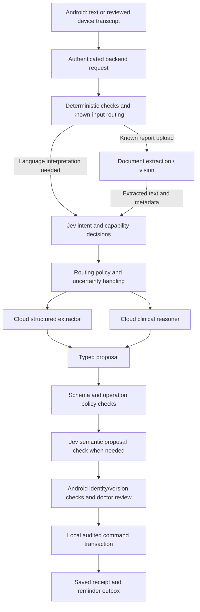

# Jev decision layer for MedTrack

Status: Proposed architecture; no integration code or live requests  
Supersedes: optional local LLM routing and generic LLM-first classification  
Related: [Main architecture](llm-and-chat-architecture.md), [production backend and CI/CD](production-backend-and-cicd.md), [clarification orchestration](clarification-routing-orchestration.md), [clarification UI](clarification-ui-system.md), [workflow backlog](../task/02-chat-clinical-workflows.md)

Implementation checklist: [Jev through OpenRouter tasks](../task/03-jev-openrouter-integration.md).

## 1. Confirmed architecture decisions

- No embedded or device-provided LLM is assumed or planned in this workflow.
- English on-device speech recognition remains optional input capture on supported mid-tier Android phones. It is separate from LLM inference.
- Jev is the selected cloud decision component for the backend harness, subject to domain evaluation and provider approval before real patient data.
- OpenRouter is the selected access path for Jev and cloud generative models. One backend OpenRouter credential can serve both; a separate direct TypeSafe key is not required.
- Cloud generative models handle open-ended extraction, explanations, document understanding and clinical reasoning.
- The phone remains authoritative for clinical records, review and atomic command execution. Notification timing and response notes never depend on Jev or a cloud LLM.

The [user-supplied LangChain article](https://www.langchain.com/blog/building-a-harness-with-jev) presents Jev as a structured decision model rather than a text generator. MedTrack adopts that division of responsibilities; published vendor speed/cost comparisons are not MedTrack performance guarantees.

## 2. Jev's scope

Use Jev to answer bounded questions about an input or proposal, not to invent extracted values or directly execute tools.

| Need | Component |
| --- | --- |
| Does this message request a medication change? | Jev classification |
| Which workflow/model capability should handle this input? | Jev evidence plus deterministic routing policy |
| What exact medicine, dose and effective time were stated? | Generative structured extraction plus source/field validation |
| Is this proposed action consistent with the user's stated request? | Jev advisory semantic check plus hard authorization rules |
| Which patient/admission does the ID belong to? | Local database and explicit identity resolution |
| What does this report mean clinically? | Capable cloud model with selected sources and doctor review |
| Read a JPEG or transcribe speech | Document/vision processor or speech engine, not Jev |
| Save a note, complete a task, trigger a reminder | Deterministic Android domain operations |

TypeSafe's [state documentation](https://docs.typesafe.ai/concepts/state) supports text/structured-text context, not raw images or audio. Therefore speech is transcribed first and reports are processed into text/fields before any content classification by Jev. Filename/attachment metadata can identify a document-processing route, but cannot establish the report's clinical meaning.

## 3. Harness placement and framework choice

Implement the cloud harness as a Python backend with a MedTrack `DecisionService` adapter calling Jev through OpenRouter. Expose that adapter to LangChain orchestration where useful. It owns input minimization, question versions, schema validation, timeouts and result normalization. The Android app never embeds the OpenRouter key or invokes providers directly.

OpenRouter's [TypeSafe listing](https://openrouter.ai/typesafe) confirms OpenRouter-key access, and its [Jev 1.13 page](https://openrouter.ai/typesafe/jev-1.13) lists `typesafe/jev-1.13`; the [latest alias](https://openrouter.ai/~typesafe/jev-latest) is `~typesafe/jev-latest`. Prefer an evaluated versioned ID. The Jev feature is also surfaced in [OpenRouter Labs](https://openrouter.ai/labs), whose experiments may change. Before implementation, verify the decisions endpoint, request/response contract and supported policy fields against the current official integration surface using synthetic contract tests. Model availability does not imply compatibility with ordinary chat completions.

LangChain's [TypeSafe integration](https://docs.langchain.com/oss/python/integrations/providers/typesafe) provides `langchain-typesafe`. Its sample model-routing middleware selects a model from the latest human message for an entire run. Its experimental tool-risk middleware blocks calls, but does not implement human approval. Those defaults do not match MedTrack's multi-step clinical workflow: use custom orchestration around the classifier and the existing proposal-review contract. Pin evaluated package versions; avoid depending on experimental middleware as the sole policy layer.

That direct-provider integration is a reference, not a required transport. Do not assume setting its base URL to OpenRouter makes endpoint paths and payloads compatible. Use a tested OpenRouter decisions adapter unless SDK compatibility is explicitly verified. Direct TypeSafe integration is outside the selected plan.

Proposed execution:

These are bounded stages, not an unrestricted agent loop. Backend tools may request scoped read context through explicit app job contracts; the backend cannot infer local write success. Larger workflows can use durable graph orchestration later, but graph checkpoints must obey the same retention and authorization rules.

## 4. State supplied to Jev

Build one minimized state per decision stage:

- Latest user message or approved transcript, with a short relevant clarification history.
- Input kind and attachment availability, not binary contents.
- App-provided patient context resolution state: selected, absent, ambiguous, or mismatch.
- Pseudonymous target references and operation type; include clinical fields only when required for the question.
- Source trust category: direct doctor statement, imported report, pasted nurse communication, or model proposal.
- For post-extraction checks: original source spans, proposed actions, missing-field flags, and expected review requirements.

Do not send the entire patient census or full record to classify a request. Removing names does not guarantee anonymization: messages can still contain patient information. The backend must apply an approved OpenRouter/upstream-provider data policy before sending them.

Questions are application configuration. Imported text cannot add questions, weaken criteria, grant authorization, or choose tools.

## 5. Question design

TypeSafe's [quickstart](https://docs.typesafe.ai/introduction/quickstart) documents the state-plus-questions decision semantics. The harness uses Noul for yes/no probability, Choice for enumerated alternatives, and Score for an ordered scale. MedTrack maps these concepts to OpenRouter's verified decisions contract; it does not use the direct TypeSafe endpoint or require its credential.

Proposed MedTrack question set, to evaluate before enabling routing:

| Stage / question ID | Type | Proposed interpretation |
| --- | --- | --- |
| Intent / `requests_record_lookup` | Noul | Is the user asking to retrieve stored information? |
| Intent / `requests_patient_creation` | Noul | Is a new patient/admission being described for registration? |
| Intent / `requests_location_change` | Noul | Is a transfer/location update requested? |
| Intent / `requests_task_or_reminder` | Noul | Is work to be scheduled, completed, cancelled or rescheduled? |
| Intent / `reports_clinical_event` | Noul | Is this a report of clinical care/observation? |
| Intent / `requests_clinical_reasoning` | Noul | Is interpretation or clinical advice requested? |
| Intent / `contains_medication_change` | Noul | Does this include a proposed or reported medication change? |
| Intent / `contains_multiple_patient_contexts` | Noul | Does the source appear to refer to multiple patients? |
| Interpretation / `statement_kind` | Choice | Observation, completed care, recommendation, question, mixed, or unclear |
| Routing / `processing_demand` | Score | Straightforward, contextual, or complex interpretation demand |
| Proposal / `source_supports_action` | Noul | Does the supplied source support this proposed action? |
| Proposal / `unresolved_ambiguity` | Noul | Does this proposal still depend on ambiguous intent or attribution? |

Independent intent probabilities allow several intents to be true. Do not force a mixed transfer/medication/reminder message into a single mutually exclusive category. A single statement-kind Choice is applied to a segment, or returns mixed and triggers decomposition.

Questions in one request see the same pre-existing state; do not write a question that relies on another question's answer from that same call. If extraction creates new evidence, evaluate a second stage using the new state.

Clinical urgency is not delegated to a generic urgency score. Jev is not an autonomous triage or deterioration detector in this design. Explicitly requested task priority is preserved; inferred urgency is a labelled suggestion requiring the defined review process.

## 6. Decision policy and confidence

Normalize the response into `DecisionEnvelope`: request/input/stage IDs, question-set version, resolved model ID, answers by type, probability distributions, available confidence, latency/usage, state digest, and policy version. Never treat this as a committed clinical event.

TypeSafe explains that Choice/Score confidence is derived from the answer distribution; Noul has a probability but no separate confidence. These values are not interchangeable, and thresholds must be evaluated for the domain. See [confidence guidance](https://docs.typesafe.ai/confidence).

MedTrack rules:

1. Reject malformed/missing answers or unknown labels. An unavailable answer is not false.
2. Apply deterministic capability and permission restrictions first; account ownership, valid IDs, review requirements and record versions cannot be relaxed by a probability.
3. Maintain per-question thresholds and an abstention interval, evaluated on labelled clinical-workflow inputs. Do not borrow example thresholds as release settings.
4. Clinical/medication routes are conservative: positive or uncertain signals get clinical-capable processing/review, never silent downgrading for cost.
5. Low-confidence identity/intent questions produce clarification or drafts. A more capable model may resolve language interpretation but cannot establish missing patient identity by guessing.
6. High confidence can select a permitted workflow; it cannot approve a diagnosis, authorize a clinical write, or prove a source is correct.
7. Route each stage with current evidence. A request initially classified as lookup may require escalation after a tool result exposes clinical interpretation needs.
8. Only rerun a decision if relevant state changes. Cache within the job using input digest, context version, question set, model and policy version; avoid cross-account clinical caches.

For extracted medication/procedure actions, app policy still requires explicit clinical review even when Jev says the source supports the action. An unsupported proposal can be edited or rejected without losing the original note.

## 7. Example: one mixed update

“Ravi moved to ward B bed 12. Dr Shah stopped the antibiotic at 3 pm. Remind me to review him at 5:30 pm.”

1. Jev signals location, clinical/medication event, and reminder intents; it does not supply the medication name or patient ID.
2. The app resolves the patient/admission; the cloud extractor creates proposed fields and source spans.
3. Missing antibiotic identity is clarified against actual orders. “Dr Shah” is attributed as reported decision-maker, while the logged-in doctor remains recorder. The date/zone for 15:00 and 17:30 is validated.
4. The proposal-stage decision can flag unsupported or ambiguous extraction. Domain validation and clinical review decide whether the medication event may commit.
5. Accepted updates commit locally with separate occurrence and entry timestamps, plus reminder scheduling through the outbox.
6. At 17:30, Android posts the reminder without Jev. Add note/Complete writes directly through the authenticated task-response command.

## 8. Failure, privacy and credentials

- Live Jev and generative-model integration uses a backend **OpenRouter API key**. No separate TypeSafe key is required for the selected route. Live tests must verify account access; no authenticated inference has been performed during specification work.
- Evaluate retention, processing location and contractual terms across OpenRouter and the upstream provider. A shared credential does not make all model routes have identical data policies. Verify which policy controls the decisions endpoint supports rather than assuming chat-completion controls transfer unchanged.
- Disable raw clinical prompt/response tracing by default in LangChain/LangSmith and any HTTP/SDK logs. Operational metrics use job references without patient content. Test instrumentation paths as well as custom logs.
- Validate OpenRouter decision responses, bound payloads and retries, and use a circuit breaker. One constrained retry for a transient failure is the initial proposed limit; measure and tune it.
- If Jev is unavailable: deterministic/manual commands still work; known document intake may proceed on its explicit route; language-driven work either uses an approved cloud classifier fallback with equivalent controls or remains queued. Do not auto-approve actions because the classifier timed out.
- When all cloud access is unavailable, typed notes, available device transcription, manual forms and notifications still function. Semantic automation waits for network access.
- Keep pinned/evaluated model versions and record returned versions. TypeSafe documents moving aliases in its [model reference](https://docs.typesafe.ai/models); an alias change must not silently invalidate calibrated thresholds.

## 9. Evaluation and rollout

Build labelled English cases from the workflow backlog: duplicate names, omitted identities, quoted specialist recommendations, negation, multiple patients, stale beds, report revisions, ambiguous times, and adversarial document instructions. Use synthetic inputs initially and clinician review for clinical interpretation labels.

Measure per-question precision/recall, critical false negatives, probability calibration, abstention rate, wrong-route rate, end-to-end latency and total inference cost. Evaluate probability and confidence separately. Compare against deterministic rules and a cloud generative classifier baseline.

Deploy in stages:

1. Mock responses and contract/failure tests.
2. Synthetic evaluation with a pinned model/question set.
3. Shadow decisions that do not control actions, under approved data handling.
4. Routing enabled behind a feature flag; clinical approval unchanged.
5. Advisory proposal checks enabled after their own evaluation.

Provider/model/question-policy changes rerun relevant tests. Include outage, malformed response, unexpected labels, audit replay, and rejected/stale approval cases. Restore the previous policy/model configuration if evaluation regresses.

## 10. Implementation acceptance

- No local LLM dependency, download or device-model requirement remains in the active plan.
- All Jev calls go through the authenticated backend and configured data policy.
- Jev and generative-model calls use the configured OpenRouter credential; the decision adapter is contract-tested separately from the chat adapter and does not require a direct TypeSafe account/key.
- Mixed intents are retained; Jev never fabricates free-form record fields.
- Record identity, clinical review, and write authorization are enforced independently of classifier output.
- JPEGs/audio reach the proper preprocessing stage before content classification.
- Timer delivery and notification response write-back work with Jev disabled and network unavailable.
- Calibration, versioning, bounded failures, trace minimization and rollback are verified before live routing.
