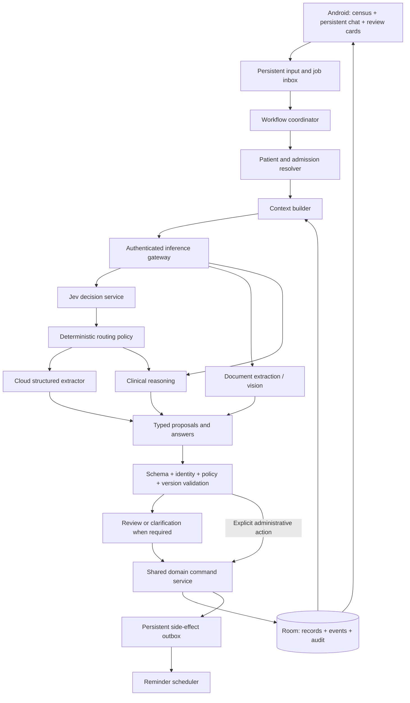

# MedTrack: LLM architecture and chat-first experience

Status: Proposed architecture, not implemented  
Date: 2026-09-19  
Parent: [High-level product specification](high-level-spec.md)

Deployment, account isolation and first-release authority are specified in the [hybrid architecture](hybrid-architecture.md): Ankita initially, additional isolated users supported by backend design, and local clinical commits. Cloud clinical synchronization is a separate later design.

Detailed clinical entities and notification response contract: [Patient record and reminders](patient-record-and-reminder-workflow.md). Clarification and decomposition: [routing orchestration](clarification-routing-orchestration.md) and [Android clarification UI](clarification-ui-system.md). Delivery backlog: [Chat and clinical workflows](../task/02-chat-clinical-workflows.md).

Device input: [On-device voice](on-device-ai-and-voice.md). No local LLM is planned. Cloud decisions use the [Jev harness design](jev-orchestration.md); local speech recognition remains an independent optional capability.

## 1. Product decisions

Chat becomes the primary way to capture information and request actions. The doctor can open the app and immediately describe a patient, record an update, ask a question, or attach a report. Manual Add Patient and structured editing remain available.

The home screen remains a useful patient census and work summary, with a persistent bottom chat composer. Chat does not replace the patient record: it creates traceable proposals and commands against that record.

Use Jev in the backend for structured intent/capability decisions, a fast cloud generative model for extraction, and a capable cloud multimodal model for document/clinical reasoning. A role does not require a different generative model deployment. There is no embedded or device-provided LLM in this design.

Access Jev and the selected generative models through OpenRouter using a backend-held OpenRouter credential. Separate decision and chat adapters preserve their different contracts; a direct TypeSafe key is not required.

The Android app owns the local record, validation, review, and committed actions. A small authenticated backend gateway owns model credentials, provider policy, and inference requests. The initial backend is not a second clinical database and has no direct write access to the phone's records.

These are design choices for implementation. Specific model IDs, hosting region, inference budget, and clinical release criteria require evaluation before selection.

## 2. Chat-first interface

### Home

```text
MedTrack                         Add patient
20 patients        3 reviews due

[Patients]   [Work queue]   [History]

Patient cards / pending actions
...

-------------------------------------------
[+]  Tell MedTrack about a patient... [Send]
     All patients / select patient
-------------------------------------------
```

- The bottom composer is present on the census, work queue, and patient workspace.
- Tapping it focuses input immediately and opens an expanded conversation surface. No intermediate assistant menu or patient-creation form is required.
- On small screens, expanded chat uses the full screen and retains the bottom composer. Back returns to the previous patient/work view and preserves the draft.
- The initial empty state offers two clear actions: describe your first patient or Add Patient manually.
- The plus button offers camera, image upload, and PDF upload. JPEG is a first-class report input. Voice is a later capability; do not show a working microphone action before it exists.
- The keyboard must not hide Send, the patient context, or the latest clarification/action card.
- Avoid nested bottom bars in existing screen Scaffolds: introduce one application shell that owns composer placement, insets, and chat presentation.
- Make the visible UI describe care and records, not providers, model names, or internal tools. Processing details can live in a secondary diagnostics view.

### Patient scope

The composer has an explicit context chip: All patients, New patient draft, or a selected patient and admission. A selected-patient header includes identifying details and current ward/bed.

- Global chat can search across the census, ask about due work, or create a patient draft.
- Patient chat retrieves only the selected admission by default; previous admissions are included when explicitly relevant and labelled historical.
- Changing patient context starts or resumes that patient's thread and cannot silently carry uncommitted changes from another thread.
- If a message names another patient, show the mismatch and resolve the target before any write.
- “He”, “she”, “this patient”, and a bed reference are interpreted using visible thread context, not an invisible global last-patient variable.
- Bed occupancy changes over time; a bed reference alone cannot establish stable identity for a historical update.
- Multi-patient messages are split into patient-labelled groups. Resolve each group before executing its actions.

### Conversation components

Use persisted, typed UI items rather than plain text alone:

| Item | What the doctor sees |
| --- | --- |
| User message | Original text, attachments, and captured time |
| Clarification | One concise question and selectable patient/field options |
| New patient draft | Extracted identity, admission, location, and clinical details with missing fields |
| Proposed update | Patient, old/new values, source, effective time, and Save/Edit/Discard |
| Saved receipt | Exactly what was committed, when, and a link to the record |
| Report result | Original document, extracted values, uncertainty, and interpretation |
| Clinical answer | Answer, record sources, missing information, and proposed next steps |
| Processing state | Waiting for connection, reading document, awaiting review, failed, or cancelled |

Do not stream “saved” or “reminder set” before the app has committed the operation and established its scheduling status. Narrative answers may stream; action receipts come from actual tool results.

### Conversational patient creation

Example: “New patient Ravi, 58, male, admitted in ward B, bed 12 with fever. Repeat the blood test tomorrow morning.”

1. Extract a draft, search for likely existing identities, and offer a match or New patient when needed.
2. Preserve the description immediately as a local draft; incomplete input is not lost.
3. Ask only for essential missing information. Phone number and address are optional. Unknown demographics remain unknown rather than fabricated.
4. Treat “tomorrow morning” as an unresolved time unless the doctor has an explicit saved preference; show the proposed absolute time before scheduling.
5. Show one grouped card for patient/admission creation and proposed linked actions. Obtain patient-creation confirmation to avoid accidental duplicate identities.
6. Save the accepted records atomically, then display a receipt and switch context to the new admission.

The existing age/sex/contact validation must be revised to support explicit unknowns and minimal inpatient registration before this flow is enabled.

## 3. Logical architecture



Manual forms call the same domain command service. Neither a model response nor an MCP transport bypasses it. The public/local MCP HTTP server is unnecessary for in-app chat; the existing in-process adapter can remain as a compatibility layer.

### Android responsibilities

- Compose application shell, conversation views, attachment capture, and review controls.
- Room repositories for clinical state, conversations, jobs, proposals, and operation receipts.
- Workflow coordinator and patient resolution using local records.
- Deterministic validation, atomic commits, version checks, and retry protection.
- Document storage and optional local text extraction/OCR.
- Durable job/outbox recovery and reminder scheduling.

### Gateway responsibilities

- Authenticate the app/user and authorize inference requests; client checks alone are insufficient.
- Store provider credentials outside the APK.
- Validate input size, job type, model role, allowed providers, and usage limits.
- Call providers through adapters, enforce timeouts, return structured responses and source references.
- Apply approved retention and region policy on every fallback; fail explicitly if no compliant route exists.
- Keep job/result retention bounded and documented. Any temporary document upload has access controls and expiry, including cleanup of abandoned requests.
- Record content-free operational metrics by default. Existing Firebase Analytics must never receive chat text, patient IDs, attachments, or clinical content.

The gateway may reject a request or propose an action, but cannot claim that a local database write succeeded. Future multi-device synchronization would need a separate conflict/authority design.

## 4. Model roles and selection

| Role | Inputs | Outputs | Permissions |
| --- | --- | --- | --- |
| Jev decision service | Current message, attachment metadata, explicit context, small recent dialogue window | Typed intent/capability decisions and probabilities | No writes or free-form field extraction; no whole-census clinical dump |
| Routine extractor | Selected note/conversation and resolved context | Attributed observations and proposed administrative/clinical events | Proposals only |
| Document processor | JPEG/PNG, PDF text/pages, document identity metadata | Page-linked text, tables, document type, extraction uncertainties | No treatment or diagnosis writes |
| Clinical reasoner | Scoped verified record plus source-linked extracted report | Clinical explanation, hypotheses, limitations, suggested actions | Read-only reasoning; proposals require review |
| Summarizer | Relevant recorded events and approved facts | Concise source-linked patient or handover summary | No writes to confirmed clinical facts |
| Deterministic executor | Validated typed command | Committed result or explicit error | Authorized operations through app repositories |

The executor is ordinary application code, not an LLM. A second model may critique difficult extraction or reasoning, but agreement between models is not proof and does not replace source validation or doctor review.

### Selection strategy

- Keep role-to-model mappings in versioned configuration rather than hardcoding a single global fallback list.
- Begin with an evaluated Jev question/policy configuration plus fast cloud extraction and stronger multimodal clinical/document support. Use local PDF text extraction where reliable before requesting vision.
- Choose models based on tested structured-output validity, negation/temporality handling, extraction accuracy, patient-context discipline, latency, cost, and provider policy.
- A routine lookup or button action may bypass the router entirely.
- A known report upload can go directly to the document pipeline. The router does not need to inspect a complete image merely to decide that document processing is required.
- Escalate when the task requires clinical reasoning, source quality is poor, the request contains interacting clinical changes, or a validated extraction cannot be produced.
- Ask for a clearer image or missing fact when information is absent. Repeatedly using larger models cannot recover unreadable evidence reliably.
- Clinical requests always take the clinical route even if phrased briefly. The small model's self-reported confidence cannot downgrade them to administrative actions.
- Initial execution limits: one structured-output repair attempt, one allowed fallback per inference step, and at most six planned action steps per interactive turn. Larger batches become explicit reviewable jobs. Tune these limits using evaluation.
- No automatic fallback from a clinical-capable or document-capable model to an arbitrary text model because it is free or available.

Jev is selected as the decision service; pin its evaluated version and question set. Generative model IDs remain to be selected using benchmarks, provider arrangements, and operating budget. Jev probabilities are advisory inputs to policy, never clinical write authorization.

## 5. Routing and workflow contracts

Separate intent classification, extraction, permission decisions, and execution. A route is not permission to mutate records.

Illustrative route envelope:

```json
{
  "schemaVersion": 1,
  "inputId": "input-123",
  "intents": ["location_update", "medication_change", "review_reminder"],
  "patientMentions": [{"text": "Ravi", "contextPatientId": "patient-42"}],
  "requiredCapabilities": ["structured_text"],
  "missingFields": [],
  "requiresClinicalReasoning": false
}
```

The app resolves IDs and enforces review policy. A model-supplied ID must match permitted local candidates. Never execute arbitrary SQL, arbitrary file access, or provider-generated tool names outside the versioned allowlist.

Illustrative normalized proposal after app-side validation:

```json
{
  "proposalId": "proposal-123",
  "sourceInputId": "input-123",
  "patientId": "patient-42",
  "admissionId": "admission-9",
  "expectedRecordVersion": 17,
  "actions": [
    {"type": "transfer", "newLocation": {"ward": "B", "bed": "12"}},
    {"type": "stop_medication", "orderId": "order-7", "reason": "Doctor-reported change"},
    {"type": "create_review_task", "dueAt": "2026-09-19T18:00:00+05:30"}
  ],
  "reviewState": "awaiting_doctor",
  "sourceSpans": [{"messageId": "message-8", "start": 0, "end": 95}]
}
```

Times above are illustrative. Production commands require an effective time policy and must preserve distinctions between when care occurred, when the doctor reported it, and when it was saved.

### Review policy

| Action | Default behaviour |
| --- | --- |
| Read/search/summarize selected records | Execute read and show evidence |
| Explicit unambiguous location change or task completion | Validate and apply; visible receipt and correction path |
| Reminder with explicit absolute time | Validate and apply; show resolved time and scheduling status |
| Natural-language relative or vague reminder | Preview resolved date/time; clarify vague meaning before saving |
| New patient/admission | Review grouped identity and admission card before creation |
| Doctor-reported clinical note, medication change, or diagnosis | Review concise structured extraction before committing |
| Model-generated clinical recommendation | Clearly labelled proposal; explicit clinical approval required |
| Content from nurse/patient/report/specialist | Save attributed source; derived clinical changes require review |
| Ambiguous identity, contradictory record, stale proposal | Clarify or refresh before writing |

This policy avoids reconfirming routine explicit administrative actions while keeping clinical interpretation reviewable. Approval applies only to the displayed proposal version, not future changed content.

## 6. Durable workflow state and recovery

Each input and attachment is saved locally before inference begins. Jobs progress through:

```text
captured -> resolving -> extracting/reasoning -> validating
         -> needs_clarification | awaiting_review | ready_to_commit
         -> committing -> applied
         -> failed | cancelled | superseded
```

- A proposal carries record versions, source versions, model/prompt version, and accepted/rejected action IDs.
- The app rereads current records at commit. If another manual edit changed the relevant facts, refresh the card rather than applying stale instructions.
- Use a stable operation ID plus payload digest. Same ID/same payload returns the stored receipt; same ID/different payload is rejected.
- Related accepted changes commit in one Room transaction with audit history. External effects are registered in a persistent outbox in that transaction.
- Reminder scheduling is retried independently. “Task saved; reminder scheduling pending” is distinct from “reminder scheduled.”
- A lost model response cannot cause a record write: inference and execution are separate. A lost commit acknowledgement is recovered through the operation receipt.
- Cancel prevents uncommitted work. Already committed changes require a compensating correction event rather than deleting history.
- For a mixed-patient batch, each group has its own status. Do not claim overall success if only some groups applied.
- Retry bounded transient failures; do not repeatedly retry validation failures or rejected proposals.

Use WorkManager for durable deferrable processing such as pending document jobs and outbox reconciliation, not as the promise of an exact bedside reminder time. Keep notification scheduling in the dedicated reminder component.

## 7. Context and memory

Persist conversations, but do not send every message or every patient's record to each model.

Build a purpose-specific context packet with:

1. Explicit patient/admission identity and permitted operation scope.
2. Current verified state relevant to the question: problems, allergies, medication orders, observations, and tasks as applicable.
3. Recent relevant events with timestamps and source IDs.
4. Referenced reports/conversations and unresolved contradictions.
5. A small recent dialogue window plus an explicitly non-authoritative conversation summary.
6. Captured current time/time zone for interpreting time expressions.

Retrieval begins with relational queries and full-text search. Approximately 20 active patients does not itself justify a vector database. Add semantic indexing only if measured retrieval gaps warrant it; always filter by patient/admission before retrieval and preserve source references.

Clinical facts come from records and original sources. Generated summaries carry the source record version and become stale when relevant records change. Never use a summary to overwrite a more recent record.

Global work-queue questions should query tasks deterministically. Cross-patient summaries are explicitly requested, separately labelled, and kept out of later patient-specific context.

## 8. Report pipeline: JPEG, scanned PDF, and text PDF

1. Capture/import; copy into private storage; persist hash, MIME type, size, page count when known, upload time, and intended patient/admission.
2. Validate file content and size limits; inspect image quality. Preserve the original and create processing derivatives separately.
3. Extract text from text-bearing PDFs where possible. For scans/JPEGs, use OCR and/or a vision-capable model, retaining page/region provenance.
4. Extract report identity, collection/report times, document category, and candidate patient identifiers. A mismatch with the selected patient blocks filing of derived results until resolved.
5. Extract structured observations with original labels, values, units, ranges, flags, and page references. Preserve textual values such as “negative” or “not detected”; do not force everything into a number.
6. Validate units, decimal transcription, duplicated pages, impossible formats, and missing fields. Missing and unreadable values remain explicit.
7. Present extraction for review where uncertain. User-approved corrections create extraction revisions.
8. Clinical interpretation receives relevant patient context and the source-linked extraction; it can inspect source pages when needed.
9. Return findings, uncertainties, questions, and proposed tasks. Original reports and extracted observations remain distinct from AI interpretations.

For longitudinal lab comparisons, match analyte, units, collection time, and compatible methods/reference context; avoid silently comparing incompatible results. Do not infer a critical threshold without a defined source/policy. Initial AI outputs are not an autonomous urgent-alert system.

A written radiology report follows this pipeline. Diagnosing raw CT/MRI/X-ray images is outside the initial scope and must not be silently routed as ordinary document interpretation.

Duplicate hashes help detect reuploads, but identical documents may still require explicit linkage decisions. Revised reports retain their relation to earlier versions rather than overwriting originals.

## 9. Conversations and clinical reasoning

Conversation extraction retains speaker, role, time, exact source span, and whether each statement is an observation, question, recommendation, order, or report of completed care.

Negation and temporality are essential: “consider starting”, “did not give”, “stopped yesterday”, and “nurse asks whether to stop” represent different facts and actions. Uncertain speaker attribution stays uncertain.

Clinical reasoning receives a read-only packet and returns:

- A concise answer to the doctor's actual question.
- Supporting record/document references that the app validates exist and belong to this patient.
- Missing or conflicting information that affects the answer.
- Explicitly labelled hypotheses or possible explanations, not automatic diagnoses.
- Suggested follow-up questions, investigations, or plan changes as reviewable proposals.

For general clinical knowledge or guideline claims, add a separately governed retrieval source with provenance and currency; patient records alone are not a guideline reference. This knowledge service is not required for administrative chat and must not be simulated with invented citations.

## 10. Storage additions

| Record | Key contents |
| --- | --- |
| ConversationThread | Scope, patient/admission when selected, title, timestamps |
| ConversationMessage | Original text, speaker/source, attachments, captured time, reply links |
| InputJob | Input ID, state, attempt count, cancellation, idempotency, error details |
| DocumentExtraction | File hash/version, pages/regions, extracted fields, corrections, review state |
| Proposal | Target IDs, typed actions, evidence, expected versions, approvals |
| OperationReceipt | Operation ID, payload digest, committed record IDs, actual result |
| InferenceRun | Role, model/provider, prompt/schema versions, timing, token/cost metadata |
| OutboxEntry | Required side effect, retry policy, next attempt, outcome |

These extend the admission/event/audit model from the product spec. Retention policies cover chats and rejected proposals as well as clinical records; attachments and source references must survive normal corrections and discharge.

## 11. Performance, cost, and evaluation

Proposed UX targets, to be measured on representative devices/networks:

- Composer opens and accepts input without waiting for the network.
- Capture acknowledgement is local and immediate; inference progress remains visible.
- Aim for routine administrative responses within 3 seconds median and 8 seconds at the 95th percentile under the agreed test network.
- Longer document/clinical jobs are resumable and do not block continued note capture.

Track per-workflow latency, total inference tokens/cost, escalation rate, clarification rate, corrections after approval, failed operations, and retry duplication. Keep clinical text out of telemetry. Avoid redundant narration-model calls after simple commands; render receipts from templates.

Build a synthetic evaluation set before selecting final models. It must include duplicate names, changed bed occupancy, readmission, multiple patients in one message, negated treatment, uncertain diagnosis, specialist recommendations, blurry JPEGs, misleading document instructions, report identity mismatch, unknown units, relative times across midnight, stale approvals, offline retries, and partial failure.

Measure separately:

- Routing and extraction correctness, including unnecessary escalation.
- Wrong-patient writes and unauthorized clinical mutations: zero allowed in the release evaluation suite.
- Schema validity, source attribution, unsupported claims, and recovery behaviour.
- OCR/table field accuracy and the rate of uncertain fields incorrectly accepted.
- Clinical answer quality with clinician-reviewed cases; passing software tests alone does not establish clinical validity.

Each model/prompt/provider-policy change reruns its relevant evaluation suite. Do not switch models globally based only on a general benchmark score.

## 12. Incremental implementation

### Slice A: Chat-first shell and durable capture

Move chat access to the bottom application shell, keep Add Patient, preserve drafts and threads, pass explicit context, and introduce typed message cards. No new clinical automation is implied. This can be built before the complete admission model; unsupported actions remain drafts until their domain operations exist.

### Slice B: Structured administrative conversation

Add routing contracts, identity resolution, patient/admission drafts, validated commands, proposal review, and receipts. Implement conversational patient creation, lookup, transfers, and review reminders as the supporting admission/location/task milestones land.

### Slice C: Document intake and extraction

Add JPEG/PDF ingestion jobs, patient identity matching, source-linked extraction, correction UI, and capability-aware model routing. First deliver reliable extraction, then interpretation.

### Slice D: Clinical support and conversation understanding

Add scoped clinical context, strong-model reasoning, nurse-question/specialist-advice extraction, citation validation, and reviewed clinical proposals. Evaluate before enabling real clinical use.

### Slice E: Voice and optimization

Add device-first short dictation and transcript correction as specified in the on-device design. This can follow the chat shell independently of later clinical reasoning stages. Optimize Jev/cloud routing, optional local OCR, caching and latency/cost based on measurement. No local LLM evaluation or deployment is included. Spoken transcripts are reviewed as inputs; background ambient recording is not assumed.

### Current-code migration map

| Existing component | Planned change |
| --- | --- |
| `MainActivity` / `AppNavGraph` / screen Scaffolds | Shared shell, persistent composer, explicit patient context |
| `DashboardScreen` top AI button | Bottom chat entry; retain manual Add Patient |
| `AssistantScreen` / `AssistantViewModel` | Durable threads, drafts, typed cards, independent input/job state |
| `AiAssistantOrchestrator` keyword heuristics | Typed coordinator plus backend Jev decisions, multi-intent routing, bounded workflows |
| Global OpenRouter fallback list | Role/capability/provider-policy registry behind gateway |
| Direct chat-triggered MCP writes | Shared validated command service with review and audit |
| Visit-based current-process lookup | Admission-scoped context builder with source versions |
| Image/PDF attachments | Persistent extraction jobs and source-linked results |

## 13. Reference constraints checked during design

- Android's [offline-first architecture guidance](https://developer.android.com/topic/architecture/data-layer/offline-first) supports a local source of truth and persistent queued work. The local-record and recovery design above follows that pattern.
- OpenRouter's [structured-output documentation](https://github.com/OpenRouterTeam/docs/blob/main/guides/features/structured-outputs.mdx) describes schema-constrained responses for supporting models. MedTrack must still validate semantic correctness and authorization itself.
- OpenRouter describes provider allowlists and retention controls in its [routing policy explanation](https://openrouter.ai/blog/insights/ai-data-residency/). These controls must be checked for the selected account, providers, and deployment region; a router setting alone does not establish an end-to-end clinical data policy.

## 14. Decisions still open

- Clinical reviewer and representative evaluation cases.
- Hosting region, permitted providers, and temporary inference-data retention.
- Target monthly usage/cost and expected document volume per patient.
- Supported report languages, handwriting quality, and voice languages.
- Which optional demographic fields can remain unknown in the first patient-creation flow.
- Whether the doctor needs multiple hospitals in the first deployment.

These do not block the chat shell, durable capture, typed contracts, or synthetic evaluation scaffolding.
