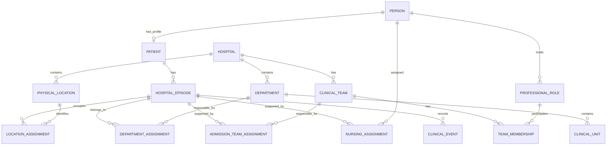

# Patient information model

Status: Proposed foundational model; specification only  
Date: 2026-09-19

Design order: **information model → detailed object contracts → application workflows → implementation tasks**. This document is the starting point. The [field-level data contract](patient-management-data-contract.md) expands it. [Ankita's workflow](patient-management-workflows.md) is downstream of this model, rather than the source of screen-specific copies of patient information.

## 1. Fundamental separation

Organize information into four layers:

| Layer | Purpose | Examples |
| --- | --- | --- |
| Reusable master records | Identify things independently of a patient encounter | Person, Patient, Hospital, Department, ClinicalTeam, Room, Bed, MedicationDefinition |
| Dated relationships | Describe who is connected to whom or where, for a period | Admission, bed assignment, nursing assignment, team membership, consultant responsibility |
| Clinical and coordination records | Describe what was observed, decided, requested, performed or remains pending | Encounter, diagnosis, order, administration, report, referral, task |
| Evidence and history | Explain where information came from and how it changed | SourceItem, ClinicalEvent, EventParticipant, RecordRevision, AuditEntry |

Every entry about a named doctor, nurse, department or bed should reference the reusable object's ID. Repeating a display name inside narrative text is allowed, but that text is not the relationship. Snapshots for exported documents preserve historical presentation and do not become a second editable master record.

## 2. People, patients and professional roles

`Person` identifies a human. `Patient` is that person's patient profile. `ProfessionalRole` describes a professional capacity such as doctor, nurse or physician assistant. A person may have both a patient profile and professional roles; neither their account nor profession defines their identity.

| Object | Required fields | Optional fields and constraints |
| --- | --- | --- |
| Person | `id`, `displayName`, `identityState: PROVISIONAL/REPORTED/CONFIRMED` | Structured name components if known; display name is not unique. Common ownership/audit fields apply. |
| Patient | `id`, `personId` | Birth date or reported age with reference date, recorded sex concept, other patient demographics. Unique personId within owner workspace. No copied person name as editable source of truth. |
| ProfessionalRole | `id`, `personId`, `professionCode`, `validFrom: ClinicalTime` | `validTo`, specialtyConceptId, registrationIssuer, registrationNumber. Multiple roles per person allowed. |
| PersonContact | `id`, `personId`, `kind: PHONE/EMAIL/OTHER`, `value`, `status: ACTIVE/INACTIVE` | Label, verifiedAt. A phone is not a unique identity key and can be shared. |
| HospitalAffiliation | `id`, `professionalRoleId`, `hospitalId`, `validFrom: ClinicalTime` | validTo, departmentId, localStaffIdentifier. Registration ID and hospital staff ID are different identifiers. |
| Account | `id`, `authSubject`, `clinicianPersonId` | Login identity and data ownership only; most recorded people have no app account. |

Doctor and Nurse are typed views of Person + ProfessionalRole, not competing tables with duplicated demographics. A nurse acting as ward in-charge is an assignment/role at a time, not a different person. “Senior”, “consultant”, “recorder” and “decision-maker” describe different relationships; do not compress them into one profession string.

## 3. Hospital organization and physical space

The organizational structure and physical structure are separate graphs.

| Object | Required fields | Constraints |
| --- | --- | --- |
| Hospital | `id`, `code`, `name`, `timeZoneId`, `status` | Code unique within owner; hospital identity does not change with a renamed label. |
| Department | `id`, `hospitalId`, `code`, `name`, `status` | Optional parentDepartmentId, specialtyConceptId. Parent same hospital, no cycles. Examples: Medicine, Surgery. |
| ClinicalUnit | `id`, `departmentId`, `code`, `name`, `status` | Organizational subdivision, e.g. Medicine Unit A. It is not a bed location. |
| ClinicalTeam | `id`, `hospitalId`, `code`, `name`, `status` | Optional departmentId, clinicalUnitId. Unit must agree with department. A cross-department team may omit both. |
| TeamMembership | `id`, `teamId`, `professionalRoleId`, `roleCode`, `validFrom` | Optional validTo. Consultant/lead/junior/assistant roles use a controlled catalogue. |
| PhysicalLocation | `id`, `hospitalId`, `kind`, `code`, `label`, `status` | Optional parentLocationId; same-hospital acyclic containment. Kinds: BUILDING, FLOOR, WARD, NURSING_STATION, ROOM, BED. |
| StationCoverage | `id`, `stationLocationId`, `coveredLocationId`, `validFrom` | Optional validTo; relates nursing service area to rooms/beds. |
| DepartmentLocationUse | `id`, `departmentId`, `locationId`, `validFrom` | Optional validTo, purpose. Many-to-many; a ward can serve several departments. It does not assign every occupant to those departments. |

Building, Floor, Ward, NursingStation, Room and Bed are typed views of PhysicalLocation. Reference their stable IDs, never a concatenated string such as “7/Medicine/717”. The kind of a referenced object must be validated. A “unit” named ICU is a physical ward/location when describing a place; an organizational clinical unit is a separate object. The app must ask which meaning is intended when ambiguous.

Containment rules:

- BUILDING can have Hospital as its root; FLOOR can sit under BUILDING or directly under Hospital.
- WARD can sit under FLOOR/BUILDING or directly under Hospital when detail is unknown.
- ROOM can sit under WARD/FLOOR; BED can sit under ROOM/WARD for an open ward. Missing ancestry may temporarily leave a location at hospital root with `structureState: INCOMPLETE`.
- NURSING_STATION can sit under WARD/FLOOR; coverage is represented by StationCoverage rather than by making beds children of the station.
- A BED cannot contain any location. A location cannot contain itself or descendants.
- Codes are unique among siblings of the same kind. Hospital-root codes require the equivalent root uniqueness rule. Bed 12 in two wards is valid; its UUID remains unambiguous.
- A retired bed is retained for old assignments. Operational status is ACTIVE/INACTIVE; it does not mean occupied/free. Known occupancy is derived from active assignments in this workspace and is not a claim of complete hospital occupancy.

## 4. The patient is the centre of care relationships

The diagram shows core cardinalities, not every optional foreign key. A station-only nursing assignment may have no named nurse.

| Relationship object | Required target relationships | Time and cardinality rules |
| --- | --- | --- |
| HospitalEpisode | Patient → Hospital | ER or inpatient; one active inpatient episode per patient for initial scope; many historical episodes. |
| PatientIdentifier | Patient → Hospital/identifier issuer | Multiple current/previous identifiers; scoped uniqueness and explicit conflict handling. |
| DepartmentAssignment | Admission → Department | PRIMARY or CONSULTING; one current primary, many consulting; dated history. |
| AdmissionTeamAssignment | Admission → ClinicalTeam, optional consultant Person | One current primary team; many consulting teams; compatible with primary department or explicit conflict resolution. |
| CareInvolvement | Admission → Person, optional Team | PRIMARY_TEAM, REFERRAL or ON_CALL; multiple involvements may overlap. This defines “my patients”. |
| LocationAssignment | Admission → PhysicalLocation, optional NursingStation | One current location. A confirmed bed assignment is exclusive among known active patients. Partial ward-only location is allowed. |
| NursingAssignment | Admission → Nurse professional role/person or NursingStation | Multiple support roles may coexist; bounded shift/assignment intervals; unknown nurse may remain station-only. |

All dated assignments use an effective start, optional effective end, recorded time, source and verification. Known intervals are half-open `[start, end)`, so a transfer can close one assignment and start another at the same instant. Unknown dates remain explicitly unknown; a current assertion and its recorded time can be stored without inventing an effective start. Conflicting assertions require resolution before both can be confirmed current.

Transfers of bed, department, team and nurse are independent changes. If several change together, one command can commit all affected relationships atomically. Historical messages resolve against the assignment at the source time where known, not today's bed occupant.

## 5. Standardized reference values

Create `ReferenceConcept(id, domain, system, code, display, version?, active)` with unique domain/system/code/version. Controlled domains include specialty, profession, team role, recorded sex, medication route, dose unit, specimen type, procedure type, test type, observation type and modality. Internal lifecycle enums remain closed application enums.

Create `ConceptAlias(id, conceptId, alias, normalizedAlias, language)` for common abbreviations and spelling variants. Aliases generate match candidates; ambiguous aliases must not auto-resolve. Keep original source text beside the selected concept. Unrecognized source values remain unresolved text, not a new shared catalogue entry created silently by an LLM.

Required distinctions:

- IDs identify records; codes identify catalogue concepts; names are display labels.
- Missing, unknown, not asked, and explicitly absent are different data states where clinically relevant. No allergy rows does not mean no known allergies.
- Values retain units. Numeric values use decimal representations; no unrecorded unit conversion.
- Date-only, exact time, recorded time and actual care time are separate.
- Approved catalogue edits deactivate or alias obsolete entries rather than breaking old references.
- Local codes are acceptable initially. External coding-system mappings require a deliberate mapping/versioning decision; this spec does not claim compliance with an external clinical standard.

Master-data seeding includes only generic roles/statuses; hospitals, people, rooms and wards can be entered incrementally. Selecting an existing entity is preferred to recreating it. An unrecognized name creates a reviewable candidate, not an automatically trusted duplicate.

## 6. Clinical information anchored to the patient

Use the [detailed object contract](patient-management-data-contract.md) for these entity groups:

| Group | Distinct objects |
| --- | --- |
| Assessment | Encounter, ClinicalNote, Problem, Allergy, AllergyAssessment, Observation |
| Decisions | ClinicalDecision, CarePlanRevision, EventParticipant |
| Medicines | MedicationDefinition, MedicationHistoryItem, MedicationOrder, MedicationOrderEvent, MedicationAdministration |
| Procedures | ProcedureOrder, ProcedureEvent |
| Tests and scans | InvestigationOrder, Specimen, ImagingStudy, DiagnosticReport, ReportReview, Document |
| Coordination | Referral, ReferralMilestone, ConsultationAdvice, ClinicalQuestion, QuestionResponse, CommunicationEvent |
| Follow-through | CareTask, TaskAssignment, TaskDependency, TaskResponse, ReminderSchedule, NotificationAttempt |
| Evidence | SourceItem, EventEvidence, ClinicalEvent, RecordRevision, AuditEntry |

Patient-level history survives across admissions. Admission-specific care belongs to the correct episode. Clinicians/nurses appear through Person references and event roles, not repeated unstructured “doctor” fields. Medication ordered, communicated and administered are different facts. A task does not stand in for a clinical order or outcome.

## 7. Standardization rules for every write path

1. Resolve reusable identities or keep an explicit unresolved draft.
2. Resolve patient and episode; reject mismatched child relationships.
3. Resolve catalogue concepts while retaining original wording and uncertainty.
4. Validate relationship type, same-hospital/owner boundaries and effective dates.
5. Record author, reporter, decision-maker and performer separately where known.
6. Save data, provenance, revision and audit atomically with an idempotent operation ID.
7. Derive census, current team, bed occupancy, pending work and timeline from these records.

Manual forms, chat, voice transcripts, shared messages and document extraction must all call these same rules. None gets a separate weaker schema.

Entity reconciliation is explicit: `EntityMergeDecision(id, entityType, sourceId, survivingId, reason, reviewerPersonId, reviewedAt, operationId)`. Allowlisted entity types, same-owner/hospital rules and conflict checks apply. Preserve original references through a redirect/provenance record; do not silently rewrite historical snapshots. Names alone never authorize a merge.

## 8. Model validation before application design

Use synthetic records to demonstrate that the model can represent:

- One patient, two admissions, one persistent hospital ID and an old identifier alias.
- Two doctors with the same name and distinct identities; a doctor who is also a patient.
- Two wards with a bed labelled 12, without collisions.
- One ward serving Medicine and Surgery while primary department remains explicit for each patient.
- A nurse caring for patients from multiple departments, then another nurse taking the next shift.
- A patient moving rooms without changing consultant; a consultant change without a bed move.
- A primary-team patient also receiving specialist care, without duplicate patient/admission records.
- Unknown bed or nurse without invented placeholder master records.
- Late-entered transfer information and amendments without loss of earlier recorded history.
- All entry methods producing the same object graph for the same confirmed facts.

The next design checkpoint is agreement on entities, terminology, cardinalities, required fields, reference catalogues and temporal rules. Screen flows and use cases follow this checkpoint. No application implementation is part of this work.
