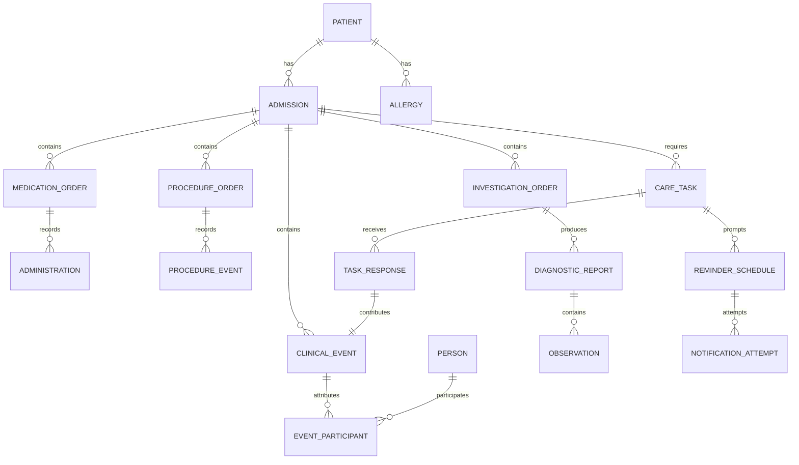

# Patient medical record and actionable reminders

Status: Proposed design; implementation tasks remain open  
Related: [Product spec](high-level-spec.md), [LLM and chat architecture](llm-and-chat-architecture.md), [workflow backlog](../task/02-chat-clinical-workflows.md)

## 1. Current implementation versus required record

Source inspection shows a Room version 5 database with six entities: Patient, Visit, Medicine, Task, Report, and FollowUp. There are patient/visit relationships and some timestamps, but no complete longitudinal clinical record model yet.

| Area | Existing implementation | Required extension |
| --- | --- | --- |
| Patient | Demographics, text history, discharge flag | Stable identity, owner, admissions, allergies, longitudinal record |
| Visit | Date/time, room, symptoms, text diagnosis and notes | Attributed clinical encounter within an admission |
| Medicine | Visit, name, dose text, duration, notes | Drug identity, prescription/order lifecycle, administration events |
| Task | Visit, assignee text, role, instructions, pending/done | Due time, responsible people, outcomes, notes, audit history |
| Report | Visit, filename/path, image/PDF type, upload time | Test/study linkage, clinical times, original report versions, structured results |
| Follow-up | Date/time, reason, notified/completed fields | Separate task, reminder schedule, notification attempt, and response events |
| Notification | Alarm scheduling, Done and Reschedule actions | Add Note / Complete with Note, stable clinical linkage, authenticated writes |

The scheduler attempts an exact alarm when allowed and otherwise uses an inexact alarm. The receiver currently marks a follow-up notified before attempting to post, and Done changes the follow-up row. There is no notification-note entity or attributed clinical completion event. These are existing foundations to extend, not proof of a completed reminder workflow.

## 2. What constitutes the patient medical record

The [patient-management data contract](patient-management-data-contract.md) refines this conceptual model into explicit objects and fields, including referrals, nursing assignments, source provenance and handover. [Ankita's workflow spec](patient-management-workflows.md) defines their user-facing behaviour. Use that detailed contract when finalizing the schema; this document remains the reminder and record-integrity foundation.

Define `PatientMedicalRecord` as a domain aggregate and query contract over typed, linked tables. It is not one large free-text field or one JSON blob containing all history. `patientId` is its root identity; admission IDs separate inpatient episodes. An overview/timeline is a derived view of the underlying records.

Reports imported without a known order retain an optional order relationship. Ad hoc procedures may have no prior order. Do not invent an order to satisfy a diagram. Every clinical payload links to a common clinical event/version and valid patient/admission context; the diagram omits some links for readability.

### Core entities

| Entity | Key fields and meaning |
| --- | --- |
| Patient | Stable ID, account ownership, hospital identifiers, name, optional demographics; distinguish unknown from absent |
| Admission | Patient, admitted/discharged times, status, responsible clinician, location history |
| Encounter | Admission, review/consultation type, actual encounter time, related notes |
| Person / CareTeamMembership | Name, role, specialty, optional authenticated user ID, membership interval; external clinicians need no login |
| ClinicalEvent | Patient/admission, event type, effective time, recorded time, source, status, version, related payload |
| EventParticipant | Event, person, role such as decision-maker, author, performer, approver, consultant, reporter |
| ClinicalDecision | Decision text/type, rationale, decision-maker(s), made-at time, related problems and resulting orders/plan revisions |
| Problem / Diagnosis | Description/code if available, suspected/confirmed/resolved status, onset and assessment times, supporting evidence |
| Allergy | Substance, reaction, severity if known, source and verification state; unknown is separate from no known allergies |
| CarePlanRevision | Goals/instructions, related problems, effective interval, deciding/approving clinicians, predecessor |
| MedicationDefinition | Drug name, ingredient/strength/form when known, optional terminology code; reference concept rather than proof of treatment |
| MedicationOrder | Patient/admission, drug definition, dose/unit, route, frequency, start/end intent, prescriber and order time |
| MedicationOrderEvent | Started/changed/held/resumed/stopped, effective time, reason, deciding clinician, prior version |
| MedicationAdministration | Order if known, drug, actual dose/route/time, given/omitted/refused status, performer and recorder; corrections retained |
| ProcedureOrder / ProcedureEvent | Intended procedure and requestor separately from performed procedure, actual time, performers, findings and outcome |
| InvestigationOrder | Lab or imaging type, test/study name, body site/modality when relevant, requested time, ordering clinician, status |
| ImagingStudy | Investigation link, modality, body site, accession if known, performed time, performing facility/person if known |
| DiagnosticReport | Lab/radiology category, optional order/study, collection/acquisition/report times, issuer, preliminary/final/amended status, prior version |
| Observation | Analyte/measurement, numeric or text value, unit, reference range, specimen/time, source report/page, verification state |
| Document | Original JPEG/image/PDF, hash, MIME type, import time, version, file reference; extracted text and AI analyses are separate |
| Consultation / Question | Attributed advice or question, participants, source message, time, open/resolved status and response |
| CareTask | Required action, patient/admission, owner/assignee, due time, priority, state, related decision/order |
| TaskResponse | Completion, note, reschedule or cancellation, note text, actor, performed-at and recorded-at, linked clinical event |
| ReminderSchedule | Task, intended trigger, zone, schedule revision, enabled state and precision availability |
| NotificationAttempt | Schedule revision, alarm-fired time, post attempted/accepted/blocked/error state and optional interaction time |
| AuditEntry | Operation, actor, source, target version, recorded time, reason and prior/new references |

Use a shared clinical-event envelope with typed payloads. Business invariants live in a shared domain command layer, not in unrelated UI or AI code paths.

## 3. Time and attribution rules

- `occurredAt` / `effectiveAt`: when care, a decision, or change actually happened.
- `recordedAt`: when the app persisted it, set by the app and not overwritten with a supplied clinical time.
- `authoredAt`, `approvedAt`, `orderedAt`, `performedAt`, `collectedAt`, and `reportedAt`: separate fields where meaningful, not interchangeable aliases.
- Store instants consistently with original zone/offset and supplied precision. A date-only report remains date-only; do not fabricate midnight or a reporting time.
- Retain original source date/time strings and migration uncertainty. Old local times without offsets cannot be assumed to have reliable UTC instants.
- Record date/time ambiguity and clarify impossible or conflicting times. A late entry can legitimately describe earlier care.
- Model timestamps such as AI processing completion are operational metadata, not the time a patient received care.

The authenticated doctor is the recorder, not automatically the decision-maker or performer. Example: a doctor records at 18:00 that a specialist decided at 16:00 to stop a medication and a nurse administered the previous dose at 15:00. Preserve all three people/roles and times.

AI is recorded as a processing source with model/prompt version, never as a physician. An unknown external person's identity remains unverified. Do not infer that a logged-in person witnessed or performed something merely because they entered it.

## 4. Record integrity and lifecycle

- Enforce patient/admission ownership and foreign-key consistency for every payload, source, task, and proposal.
- Store clinical updates and their audit/events in one transaction; use expected versions to reject stale writes.
- Corrections create linked revisions or entered-in-error status. Preserve original records and explain the correction.
- Medication discontinuation, discharge, task cancellation, and report amendment are state transitions, not deletion.
- Completing a generic task does not imply that medication was administered or a procedure performed. Those require their own typed details.
- If a completion includes a typed clinical event, save the event and task result atomically. Do not derive a completed scan from a mere reminder dismissal.
- Keep reported information, verified clinical facts, AI interpretations, and approved clinical decisions distinguishable in queries and UI.
- Readmission creates a new episode. Do not silently carry active orders or reminders from a previous admission.
- Existing records migrate with known source fields intact and unknown attribution/times explicitly unknown; migration must not invent clinical history.

## 5. Timed notification contract

Example: “Review Ravi today at 5:30 pm.” Resolve this to an explicit date, 17:30, hospital time zone, patient, admission, task, and schedule. If 17:30 has already passed, clarify whether the doctor means overdue today or tomorrow; never silently roll forward.

- Reminder triggering and note/completion storage are local and deterministic. They must work without an LLM or internet after the authorized doctor has signed in.
- Use Android AlarmManager for requested bedside reminder timing. Use persistent background work for reconciliation/retries, not as a substitute for an exact alarm.
- Show whether notifications and exact-alarm access are available. If exact access is unavailable, label scheduling as inexact and provide a route to settings; never claim a guaranteed 17:30 notification after silently choosing an inexact fallback.
- Sound/vibration depend on channel, user, and device settings. A powered-off or force-stopped app/device cannot be promised uninterrupted reminders; recover due work on the next eligible launch/start and show missed/overdue work.
- Reconcile schedules after reboot, app update, relevant time/zone changes, permission changes, and app startup. Absolute deadlines keep their intended instant; relative durations must not restart after reboot. Recurring reminders are deferred until separately specified.
- At trigger time, read current task status and location. Suppress stale schedule revisions and cancelled/completed tasks.
- Use task/schedule/action identity for PendingIntents; a reused bed or duplicate patient name cannot redirect an old action.
- Persist scheduling work with the clinical transaction and retry side effects through an outbox. Posting success means handed to Android, not proof the doctor saw it.

Android documents permission-dependent exact alarms and the difference from inexact delivery in its [alarm scheduling guide](https://developer.android.com/develop/background-work/services/alarms). This is a platform constraint to test and expose, not a reason to omit precise reminders.

## 6. Notification actions and clinical record write-back

Primary notification actions: **Complete**, **Add note**, **Reschedule**. Tapping the notification body opens the exact patient/admission task. Complete can offer **Complete with note** in the task sheet.

### Complete

1. Resolve account, task, admission, and schedule revision from stable IDs.
2. If the device/app is locked or signed out, open the authenticated task sheet; do not perform a clinical write from an unauthenticated lock-screen tap.
3. For a generic review task, record completion time and actor; typed treatment tasks open required outcome fields before completion.
4. Commit task status, response, clinical timeline event, and audit entry atomically.
5. Cancel pending schedules/update the notification only after commit. Duplicate taps return the existing receipt rather than adding duplicate events.

### Add note

- First release: open a lightweight authenticated sheet directly from the notification, already scoped to its task/patient/admission. The doctor can type immediately after any required unlock.
- Fields: note text, actual care time (defaults to now and is editable), reported decision-maker/performer when relevant, and an explicit Complete task toggle (off by default).
- Saving a note alone does not complete or dismiss the outstanding work permanently. Add Note and Complete with Note are distinct intents.
- Store the original text as an attributed clinical note with `source=notification_response`, `taskId`, `notificationAttemptId` if available, patient/admission, actor, and times.
- If the doctor wants structured medication/procedure changes from the note, offer a separate reviewable proposal; the note itself is already saved and does not wait for inference.
- Optional later enhancement: Android inline reply with RemoteInput. It must enforce the same account/unlock, validation, durability and audit rules. It is not necessary for the first notification-note workflow.

### Reschedule and recovery

- Preserve prior due time, new due time, actor and reason; cancel only the old schedule revision.
- Reject or clarify actions from a stale notification after completion, discharge, account change, or conflicting reschedule.
- On write failure, retain note draft and show retry; never show “saved” or mark complete if the transaction failed.
- Logout clears displayed clinical notifications and invalidates action access for that account. Pending task records remain protected; reconcile after authorized sign-in according to account policy.
- With encrypted data locked after reboot, use a non-clinical unlock prompt where feasible; do not expose clinical text or claim a blocked action was recorded. Device tests must cover encryption/key availability together with alarms.

“Sync into the patient record” means an immediate local database transaction observed by patient screens. Cloud or cross-device synchronization is separate, not assumed by this feature. A future sync service must preserve the same event IDs and avoid duplicate completion/notes.

Android supports notification action buttons and direct reply as described in its [notification guide](https://developer.android.com/develop/ui/compose/notifications/create-notification). The authenticated note sheet above is the selected first-release interaction.

## 7. Worked example

At 14:00, the doctor creates “Review Ravi at 17:30.” The app saves a care task and schedule with explicit date/zone and a verified patient/admission link.

At 17:30, the notification displays the patient's current ward/bed. The doctor taps Add note at 17:38, enters “Reviewed at 17:35; discussed with Dr Shah; repeat blood count tomorrow,” attributes Dr Shah's involvement, and selects Complete task.

The record receives:

- A review note effective at 17:35 and recorded at 17:38, attributed to the authenticated recorder with Dr Shah's stated role.
- A completed task with actual completion time and recorded time, linked to that note and reminder interaction.
- An audit entry and cancelled outstanding reminder schedules.
- A proposed new blood-count task if extraction is requested; no automatic test order or invented time for “tomorrow.”

The patient timeline, task queue, and chat receipt read the same committed records and agree without an additional cloud synchronization step.

## 8. Release acceptance scenarios

- A 17:30 reminder fires on a supported device with permissions enabled while the app is backgrounded, including an idle-state test; record scheduled versus actual trigger/post times and timing deviation.
- Timing acceptance target for the supported-device test matrix: no early trigger and no more than 60 seconds late under the documented enabled-permission, powered-on conditions. This is a test target, not an unconditional Android guarantee. Failures require investigation before claiming precise timing support.
- Denied notification/exact-alarm access produces an accurate capability state and no false delivery/completion record.
- Complete, Add note, and Complete with note update the correct patient record offline and survive process death.
- A note about earlier care preserves both occurrence and entry times and distinct participant roles.
- Transfer, duplicate names, readmission, old notifications, and account switching cannot cause cross-patient writes.
- Repeated taps, duplicate receiver delivery, and retry after interrupted acknowledgement cannot duplicate clinical events.
- Locked device, logout, reboot with unavailable encryption keys, permission revocation, time-zone changes, cancellation, and rescheduling have tested recovery behaviour.
- Medication administration, procedure completion, lab observations, and imaging reports remain typed records with sources rather than unsupported inferences from task completion.
