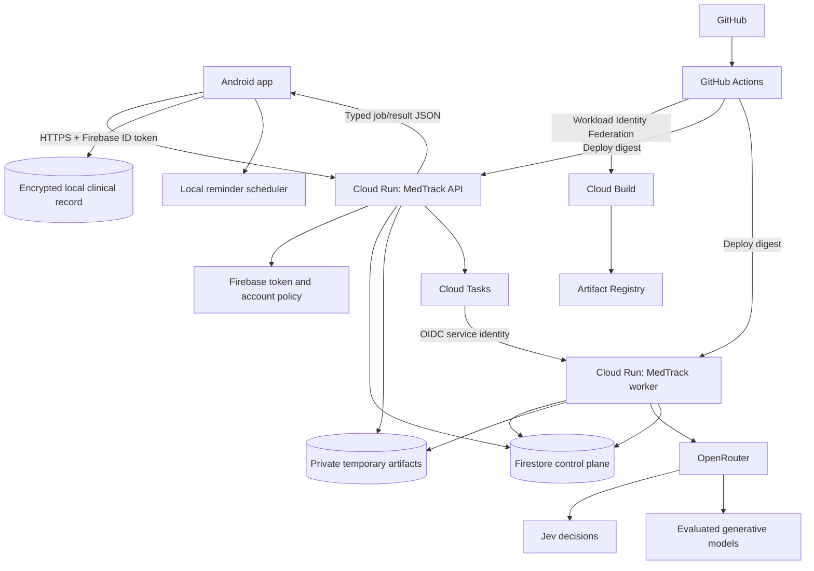

# Production backend and CI/CD specification

Status: Proposed implementation specification; no infrastructure or application code changed
Date: 2026-09-23
Initial staging project: `medtrack-6497f`
Primary region: `asia-south1`
Related: [Hybrid architecture](hybrid-architecture.md), [LLM and chat architecture](llm-and-chat-architecture.md), [Jev orchestration](jev-orchestration.md), [clarification orchestration](clarification-routing-orchestration.md), [clarification UI](clarification-ui-system.md)

## 1. Purpose

This specification defines the production-ready cloud backend for MedTrack and the delivery system used to test, build, deploy, promote and roll back changes. It covers the authenticated gateway, orchestration runtime, background workers, persistence, temporary artifacts, model-provider access, data boundaries, reliability, observability and CI/CD.

The backend produces typed answers and proposals. It does not directly commit the first-release clinical record. Android remains authoritative for patient records, doctor approval, local command execution and reminder scheduling.

The AI Testing Workbench remains a development and evaluation surface. It imports the same production orchestration package but is never deployed as the patient-facing backend.

## 2. Confirmed decisions

1. Keep Android, backend, workbench, contracts, specs and tasks in one Git repository.
2. Build the backend as a separate container artifact and deploy it independently from the APK.
3. Use Google Cloud Run for the API and worker runtime.
4. Use Firebase Authentication for clinician identity; verify Firebase ID tokens in the gateway.
5. Use Firestore for account/control-plane and durable inference-job state.
6. Use private Cloud Storage for temporary document artifacts.
7. Use Secret Manager for the OpenRouter credential and future provider secrets.
8. Use Cloud Tasks for work that must survive the API request, beginning with document and longer clinical-reasoning jobs.
9. Access Jev and evaluated generative models through server-side OpenRouter adapters.
10. Use a deterministic MedTrack policy after Jev; models do not grant permissions or select arbitrary tools.
11. Use GitHub Actions for CI/CD orchestration because the repository is hosted on GitHub.
12. Authenticate GitHub Actions to Google Cloud with Workload Identity Federation. Do not create or store a downloadable service-account JSON key.
13. Automatically deploy validated changes to synthetic staging after merge to the protected main branch.
14. Promote the exact tested container digest and configuration version to production through an approved release workflow. Do not rebuild for production.
15. Deploy orchestrator prompts, question sets, model routes and thresholds as versioned repository configuration through the same pipeline as code.

## 3. Current implementation assessment

The current repository already contains:

- a Python/FastAPI gateway;
- a backend Dockerfile;
- `/health`, capability, profile, artifact and inference-job endpoints;
- Firebase RS256 token verification;
- a mock decision service;
- OpenRouter Jev and generation adapter classes;
- proposal schemas and validation;
- Android HTTP gateway integration; and
- local Android proposal commit and reminder scheduling.

The following prevent the current container from being production-ready:

| Area | Current implementation | Required production state |
| --- | --- | --- |
| Orchestrator construction | Default mock decision service and no generation service | Dependency-injected live Jev, routing, generation and validation pipeline |
| Job persistence | Process-memory dictionaries | Firestore-backed jobs, claims, idempotency and usage |
| Artifact persistence | Payload held in process memory | Private Cloud Storage objects plus Firestore metadata |
| Profile/device persistence | Local SQLite | Firestore repositories and transactions |
| Worker execution | Runs inside the create-job request | Durable Cloud Tasks execution for long jobs |
| Clarification | Partial fixtures/heuristics | Versioned clarification sessions and assistant-turn contracts |
| Model registry | Environment-wide single generation model | Versioned route-specific registry with provider policy |
| Deployment | Dockerfile only | Reproducible build, image publication, staged rollout and rollback |
| CI/CD | None | Required PR checks and environment deployment workflows |
| Operational endpoints | User-authenticated cleanup/route controls | Separate internal/admin authorization |

## 4. Environment model

### 4.1 Local development

- Backend binds to loopback.
- Workbench permits mock and explicit live-synthetic modes.
- Development identity tokens may be enabled only on loopback.
- Local SQLite/in-memory adapters may remain for tests and developer use.
- No real patient data is accepted.

### 4.2 Synthetic staging

Initial target:

```text
Google Cloud project: medtrack-6497f
Region: asia-south1
API service: medtrack-gateway-staging
Worker service: medtrack-worker-staging
Artifact repository: medtrack-backend
Data classification: SYNTHETIC only until release gates pass
```

Staging uses real Firebase verification, Firestore, Cloud Storage, Cloud Tasks, Secret Manager, Jev and selected models. Development bearer tokens are disabled on every network-accessible revision.

### 4.3 Production

Production uses a separate Google Cloud project, Firebase project or explicitly governed tenant configuration, service accounts, secrets, buckets, Firestore database, task queues, alert channels and budgets. Staging identities, data and credentials cannot access production.

The production project ID and resource names are selected during environment provisioning; they are not hard-coded in application logic.

## 5. Production topology



## 6. Deployable services

### 6.1 `medtrack-gateway`

Responsibilities:

- health and readiness;
- Firebase authentication and MedTrack authorization;
- profile, entitlement, device and capability APIs;
- request validation and idempotent job creation;
- artifact-upload authorization;
- retrieval/cancellation of owned jobs;
- short deterministic responses where appropriate; and
- enqueueing durable processing.

It does not hold clinical database credentials and does not expose a clinical commit endpoint.

### 6.2 `medtrack-worker`

Responsibilities:

- authenticate Cloud Tasks delivery;
- claim one job idempotently;
- load the minimum authorized input/context;
- run preflight, Jev decisions, deterministic routing and selected model stages;
- validate typed results;
- store a terminal result or typed failure;
- record content-free usage metrics; and
- delete or schedule deletion of temporary material.

The worker is not publicly callable by ordinary clients. Cloud Tasks invokes it using a dedicated service identity and audience. The worker and API use the same image and Python package initially, with different entry points/configuration.

### 6.3 Cleanup and reconciliation

Cloud Scheduler invokes an authenticated internal cleanup operation that:

- expires abandoned/running jobs exceeding policy;
- removes expired artifact objects and metadata;
- reconciles orphaned objects;
- releases expired worker claims;
- records cleanup failures without payloads; and
- emits an alert when deletion objectives are missed.

Cleanup endpoints are unavailable to normal Firebase users.

## 7. Backend source organization

Target organization:

```text
backend/
  Dockerfile
  pyproject.toml
  medtrack_gateway/
    api/
    auth/
    accounts/
    artifacts/
    jobs/
    orchestration/
      coordinator.py
      preflight.py
      jev_decisions.py
      segmentation.py
      task_planner.py
      clarification.py
      routing_policy.py
      model_registry.py
      generation.py
      proposal_builder.py
      validation.py
    persistence/
      interfaces.py
      firestore.py
      local.py
    providers/
      openrouter_decisions.py
      openrouter_generation.py
    telemetry/
    settings.py
contracts/
  v1/
AI Testing workbench/
  imports production orchestration package
```

Domain interfaces must allow local/mock and Google Cloud implementations without conditional behavior scattered through endpoint code.

## 8. Configuration and versioning

Every deployed revision records one immutable release manifest:

```json
{
  "sourceCommit": "git-sha",
  "imageDigest": "sha256:...",
  "backendVersion": "...",
  "assistantSchemaVersions": ["assistant-turn-v1"],
  "clarificationSchemaVersions": ["clarification-card-v1"],
  "commandSchemaVersions": ["care-commands-1"],
  "questionSetVersion": "intent-v1",
  "routingPolicyVersion": "routing-v1",
  "modelRegistryVersion": "models-v1",
  "promptVersions": {},
  "environment": "staging"
}
```

Configuration categories:

| Category | Storage | Change method |
| --- | --- | --- |
| Non-secret versioned orchestration config | Repository | Pull request and deployment |
| Environment resource names and limits | IaC/environment config | Reviewed environment deployment |
| Provider credentials | Secret Manager | Controlled secret rotation |
| Emergency route disable | Firestore policy/control plane | Authorized audited operation |
| User profile/subscription state | Firestore | Authenticated/admin business operations |

Production prompts, thresholds and model mappings are never edited only in the Cloud Run console. Emergency changes are either an audited kill switch or followed immediately by a repository reconciliation change.

## 9. Identity and authorization

### 9.1 End-user requests

The Android app sends a Firebase ID token. The gateway verifies:

- RS256 signature and current Google signing key;
- issuer and audience for the configured Firebase project;
- expiration, issued-at and subject;
- provisioned/bootstrapped MedTrack identity;
- active user, account and membership;
- active registered device where required;
- subscription/entitlement and enabled route; and
- account-scoped resource ownership.

Client-supplied `accountId`, role, subscription or ownership fields never establish access.

Cloud Run may accept unauthenticated transport so Firebase-bearing mobile clients can reach FastAPI. In that mode every endpoint is denied by default unless explicitly public. Only liveness/health and deliberately selected bootstrap metadata may be public; protected endpoints always run application authentication.

### 9.2 Service identities

Use separate identities:

| Identity | Purpose |
| --- | --- |
| Runtime API service account | Firestore API/control-plane operations, task enqueueing and necessary secret access |
| Runtime worker service account | Firestore jobs, artifact objects, OpenRouter secret and operational metrics |
| Cloud Tasks invoker account | Invoke only the worker service |
| Cleanup scheduler account | Invoke only cleanup/reconciliation |
| CI build account | Submit builds and write images |
| CI deploy account | Deploy revisions and act as runtime service accounts, without reading patient payloads or provider secrets |

The existing `medtrack-backend-sa` may serve as the staging runtime identity initially. CI receives a separate identity; it must not reuse the runtime account.

### 9.3 CI authentication

GitHub Actions uses OpenID Connect and Google Workload Identity Federation. The provider condition restricts at minimum:

- repository owner;
- exact repository;
- allowed branch/tag or GitHub environment; and
- production workflow/environment for production permissions.

No `GOOGLE_APPLICATION_CREDENTIALS` JSON secret is stored in GitHub.

Google documents Workload Identity Federation for GitHub and recommends attribute conditions because GitHub uses a shared issuer across organizations: [Workload Identity Federation for deployment pipelines](https://docs.cloud.google.com/iam/docs/workload-identity-federation-with-deployment-pipelines).

## 10. Firestore model

Recommended account-scoped collections:

```text
users/{userId}
accounts/{accountId}
accounts/{accountId}/memberships/{userId}
accounts/{accountId}/profiles/{profileId}
accounts/{accountId}/devices/{deviceId}
accounts/{accountId}/policies/current
accounts/{accountId}/jobs/{jobId}
accounts/{accountId}/requestKeys/{requestId}
accounts/{accountId}/artifacts/{artifactId}
accounts/{accountId}/usage/{usageId}
accounts/{accountId}/audit/{auditId}
```

Rules:

- Repository methods require an authenticated account scope rather than optional account filtering.
- Job lookup by public ID still resolves within the caller's account path.
- Request idempotency is transactional: same request ID/digest returns the existing job; different digest conflicts.
- Worker claims use a transaction with lease owner and expiry.
- Terminal status cannot transition back to running.
- Cancellation and terminal completion races have a defined transaction outcome.
- Firestore document IDs contain opaque IDs, not patient names, hospital IDs, emails or clinical descriptions.
- Clinical source text and model prompts are not duplicated into general audit/usage documents.
- Firestore TTL may assist cleanup, but application cleanup and monitoring remain necessary because expiry is not an immediate deletion guarantee.

## 11. Temporary artifact storage

Use a private, region-aligned bucket with:

- public access prevention;
- uniform bucket-level access;
- default encryption and a documented key decision;
- lifecycle deletion as a backstop;
- account/job-scoped opaque object names;
- MIME, magic-byte, extension, size and digest validation;
- bounded signed access only when needed; and
- no public or permanent object URL in a clinical record.

Object path pattern:

```text
accounts/{opaqueAccountId}/jobs/{jobId}/artifacts/{artifactId}
```

Application policy targets deletion within 24 hours of terminal job state and no later than 48 hours after creation. Metadata and object deletion are reconciled and observable.

The existing `us-central1` bucket is suitable only for temporary synthetic experimentation while the selected backend/data region is `asia-south1`. Create a region-aligned bucket before real patient documents.

## 12. API contract

Required external API:

| Endpoint | Purpose |
| --- | --- |
| `GET /health` | Process liveness only |
| `GET /ready` | Dependency/configuration readiness without provider inference |
| `GET /v1/capabilities` | Compatible schemas, routes, limits and access state |
| `POST /v1/me/bootstrap` | Idempotent authenticated user/account/profile bootstrap |
| `GET/PATCH /v1/me/profile` | Owned profile operations |
| `GET /v1/me/access` | Subscription and entitlement display |
| `POST /v1/devices` | Device registration/replacement |
| `POST /v1/artifacts` | Initiate or perform bounded temporary upload |
| `DELETE /v1/artifacts/{artifactId}` | Owned deletion request |
| `POST /v1/inference-jobs` | Idempotent initial or clarification-continuation job |
| `GET /v1/inference-jobs/{jobId}` | Retrieve owned status/result |
| `POST /v1/inference-jobs/{jobId}/cancel` | Idempotent cancellation request |

Internal worker/cleanup endpoints use service authentication and are not part of the mobile API.

All responses use a stable error envelope with request correlation ID and safe error code. They never return internal traces, upstream response bodies, secrets or another account's existence.

The assistant-turn, clarification-card, proposal, command and receipt contracts follow the clarification specifications. The API performs capability negotiation before returning actionable cards.

## 13. Job execution

### 13.1 State machine

```text
RECEIVED → QUEUED → CLAIMED → RUNNING
                         ├→ SUCCEEDED
                         ├→ NEEDS_CLARIFICATION
                         ├→ FAILED_RETRYABLE → QUEUED
                         ├→ FAILED_TERMINAL
                         ├→ CANCELLED
                         └→ EXPIRED
```

`SUCCEEDED` means the backend produced a validated typed result. It never means Android committed a clinical record.

### 13.2 Execution limits

Each job enforces:

- maximum input and artifact sizes;
- maximum context records and characters;
- maximum model steps;
- maximum clarification turns;
- one structured-output repair attempt per stage;
- one approved provider fallback per stage;
- per-call and total job timeouts;
- per-account concurrent/rate/cost limits; and
- output size limits.

### 13.3 Idempotency and retries

- API retries use account plus `requestId` plus input digest.
- Cloud Tasks delivery is at-least-once; worker claims and writes are idempotent.
- A provider request retry retains a stage attempt ID and never produces a clinical write.
- Terminal results are immutable; a corrected/retried interpretation is a new job linked to the previous one.
- Cancellation prevents publication of a later model result when the cancellation transaction wins.

## 14. Orchestration runtime

Production assembly:

```text
Validated request
→ deterministic preflight
→ minimized Jev decision state
→ Jev decision adapter
→ deterministic routing policy
→ task plan / clarification requirement
→ route-specific model adapter where required
→ structured response validation
→ source/evidence and semantic checks
→ AssistantTurnEnvelope
```

The runtime loads an immutable configuration snapshot per job. A deployment or emergency policy update cannot change the meaning halfway through a running job. The result records the exact snapshot versions.

Model-provider requirements:

- pinned evaluated model IDs for production routes;
- permitted provider list and data policy per route;
- explicit fallback list with equal capability/privacy requirements;
- no automatic downgrade of clinical/document work to an arbitrary model;
- normalized usage, cost and latency;
- bounded upstream error text; and
- HTTP connection pooling, cancellation and timeouts.

## 15. Security and privacy controls

- Secrets are injected from Secret Manager and never written to images, source, APKs or logs.
- For environment-variable secret injection, pin a secret version; rotation deploys a new revision. Google describes the alternatives and version behavior in [Cloud Run secret configuration](https://docs.cloud.google.com/run/docs/configuring/services/secrets).
- Disable development tokens outside loopback.
- Reject unknown content types and remote-fetch URLs; the backend does not fetch arbitrary model/user URLs.
- Enforce payload limits before buffering large bodies.
- Keep API documentation disabled publicly unless separately authenticated.
- Native Android clients do not need permissive browser CORS.
- Logs, traces, analytics and alerts omit tokens, prompts, documents, patient names, patient IDs and model responses by default.
- Error messages expose stable support codes rather than upstream payloads.
- Account isolation applies to Firestore, object names, caches, task payloads, cancellation, cleanup and metrics labels.
- Provider data handling, retention and region eligibility are explicit route policy inputs.
- Real patient use requires completion of privacy, security and provider-governance release gates.

## 16. Reliability and scaling

Initial settings are measured in staging and adjusted from evidence:

| Concern | Starting policy |
| --- | --- |
| API instances | Min 0 staging; production min chosen from latency/cost target |
| API concurrency | Bounded; no dependency on process-local state |
| Worker concurrency | Low per instance for predictable provider/job behavior |
| API timeout | Short enough to return durable job state rather than hold document work |
| Worker timeout | Sized for bounded document jobs and below task deadline |
| Max instances | Protect Firestore, providers and budget |
| Retries | Exponential backoff only for classified transient failures |
| Health | `/health` for liveness, `/ready` for dependencies/config |

Cloud Run revisions are immutable. Health checks use HTTP endpoints that accurately report readiness; see [Cloud Run health checks](https://docs.cloud.google.com/run/docs/configuring/healthchecks).

No correctness depends on sticky sessions. API and worker instances can restart between every request.

## 17. Observability and operational controls

Record content-free structured events for:

- request accepted/rejected by code;
- job state transitions;
- route and configuration versions;
- provider/model identity;
- stage latency and total latency;
- token/cost units;
- clarification count;
- schema/validation failures;
- retry/fallback count;
- artifact cleanup age;
- account-scoped quota use using opaque account references; and
- deployment revision/image digest.

Do not use patient or clinical values as log fields, trace attributes, metric labels or exception messages.

Alerts:

- elevated authentication or authorization failures;
- job failure/timeout rate;
- stuck jobs or expired claims;
- artifact deletion backlog;
- OpenRouter error/rate-limit rate;
- Firestore/Cloud Storage failures;
- cost or request budget threshold;
- health/readiness failure; and
- production revision rollback trigger.

An audited route kill switch can disable one model capability without disabling manual Android functionality.

## 18. CI/CD system

### 18.1 Selected arrangement

```text
GitHub pull request
    → GitHub Actions offline CI
Merge to protected main
    → GitHub Actions OIDC/WIF
    → Cloud Build builds container
    → Artifact Registry stores digest
    → Deploy digest to staging
    → Synthetic smoke and contract checks
Release workflow with production approval
    → Promote same digest/config
    → Deploy production revision without traffic
    → Smoke test
    → Gradual traffic migration
    → Observe or roll back
```

Cloud Build's GitHub integration can also implement triggers, but the first release uses one CI/CD control plane—GitHub Actions—to avoid duplicate triggers and unclear deployment ownership. Cloud Build remains the container builder. Google supports GitHub-connected triggers if this choice changes later: [Cloud Build GitHub repositories](https://docs.cloud.google.com/build/docs/automating-builds/github/build-repos-from-github).

### 18.2 Pull-request workflow

Runs without cloud/provider secrets:

1. Checkout with pinned action versions.
2. Install pinned Python dependencies.
3. Run formatting/lint/type checks selected for the backend.
4. Run backend unit, contract, authorization and isolation tests.
5. Validate every JSON schema and configuration file.
6. Run workbench mock cases and routing-policy golden tests.
7. Run Android contract-model tests when shared contracts change.
8. Build the Docker image locally to prove the Dockerfile and build context.
9. Scan committed files for secrets.
10. Publish a concise test summary; upload no clinical payload fixture containing real data.

Required status checks block merge. Forked/untrusted pull requests never receive staging, Google Cloud or OpenRouter credentials.

Suggested path filters still force shared checks when any of these change:

```text
backend/**
contracts/**
AI Testing workbench/config/**
app/**/hybrid/contract/**
spec/production-backend-and-cicd.md
```

### 18.3 Staging deployment workflow

Triggered by a merge to protected `main` affecting the backend/contracts/configuration, or by an authorized manual dispatch.

Steps:

1. Repeat required deterministic tests on the exact merge commit.
2. Authenticate with WIF using the staging CI identity.
3. Build once with Cloud Build.
4. Tag with commit SHA and release identifier.
5. Push to Artifact Registry and capture the immutable digest.
6. Check vulnerability/secret scan policy.
7. Deploy API and worker staging revisions using that digest.
8. Run health, auth-negative, Firestore, artifact, task and synthetic model smoke tests.
9. Run bounded live-synthetic orchestration cases when explicitly enabled.
10. Record the release manifest and results.
11. Route staging traffic only after required smoke checks pass.

Artifact Analysis can scan images pushed to Artifact Registry and continuously update findings; see [container scanning](https://docs.cloud.google.com/artifact-analysis/docs/container-scanning-overview).

### 18.4 Production promotion workflow

Triggered manually by selecting a staging release manifest. The GitHub `production` environment requires an authorized reviewer.

Rules:

- Promote the same image digest; do not rebuild.
- Use a production-specific WIF identity and configuration.
- Verify required staging evidence and compatible Android version.
- Confirm database/index/config migrations are backward compatible.
- Deploy with no traffic.
- Run non-clinical health and authenticated synthetic smoke tests.
- Move traffic gradually according to the release risk and observed health.
- Stop or roll back automatically/manual on defined error, latency or validation thresholds.

Cloud Run supports revision traffic percentages and rollback to a previous revision: [Cloud Run rollouts and rollbacks](https://cloud.google.com/run/docs/rollouts-rollbacks-traffic-migration).

### 18.5 Scheduled evaluation workflow

Run nightly or on demand against synthetic cases:

- route classification quality;
- clarification quality and turn count;
- proposal schema validity;
- source-support and unsupported-claim checks;
- model latency/cost;
- baseline regression; and
- provider/model availability.

This workflow may use the staging OpenRouter secret and is never triggered with secrets for an untrusted pull request. Evaluation failure opens evidence for review and can block model/config promotion without taking a currently healthy production route offline.

## 19. Change and release policy

| Change | Minimum pipeline |
| --- | --- |
| Internal refactor | PR CI → staging smoke |
| Prompt/question threshold | PR golden eval → staging live-synthetic eval → controlled promotion |
| Model ID/provider/fallback | Capability/privacy review → benchmark → staging → controlled promotion |
| Additive response field | Contract validation → Android compatibility tests → staging |
| New card or command type | Backend schema + Android renderer/handler in compatible releases before enablement |
| Breaking schema change | New version with compatibility window; no in-place replacement |
| Firestore/index change | Staging migration rehearsal and rollback/forward plan |
| Secret rotation | Add version → deploy revision pinned to it → validate → disable old version later |
| Emergency route disable | Audited kill switch followed by repository reconciliation |

The backend supports at least the current and immediately previous compatible mobile contract during rollout. Removing support requires evidence that unsupported clients are no longer active or an explicit forced-upgrade policy.

## 20. Rollback and recovery

Rollback unit:

- API Cloud Run revision;
- worker Cloud Run revision;
- image digest;
- orchestration configuration versions; and
- compatible database/index state.

Procedure:

1. Stop traffic migration.
2. Route API traffic to the last known-good revision.
3. Pause affected task queue if the worker contract is incompatible.
4. Route/redeploy the known-good worker digest.
5. Preserve failed jobs and attempts for content-free diagnosis; do not replay blindly.
6. Verify health, authentication, job retrieval and a synthetic inference.
7. Record incident and release-manifest linkage.

Schema/data changes must be forward-compatible because rolling back code cannot safely undo destructive data migrations. Use expand/migrate/contract phases.

## 21. One-time cloud and repository setup

1. Create a separate CI build/deploy service account for staging.
2. Create GitHub Workload Identity Pool and provider restricted to `ThendralarasanKt/MedTrack` and permitted branches/environments.
3. Grant build, Artifact Registry and Cloud Run deployment permissions narrowly.
4. Grant `iam.serviceAccountUser` only for the intended runtime identities.
5. Enable Cloud Build, Cloud Tasks, Cloud Scheduler, Artifact Registry/Analysis, Firestore, Storage, Secret Manager, Logging and Monitoring APIs as required.
6. Create region-aligned staging artifact bucket and Cloud Tasks queue.
7. Grant runtime service accounts only required Firestore, bucket, queue and secret permissions.
8. Configure GitHub protected `main`, required checks, staging and protected production environments.
9. Add repository workflow files and Cloud Build configuration.
10. Add environment configuration and release-manifest generation.
11. Configure budgets, quotas, dashboards and alert destinations.
12. Create the separate production project and repeat through reviewed infrastructure configuration before production promotion is enabled.

## 22. Delivery sequence

### Phase 1: Cloud-capable service

- Extract persistence interfaces.
- Implement Firestore and Cloud Storage adapters.
- Wire live orchestration through dependency injection.
- Add `/ready` and startup configuration validation.
- Disable development auth for cloud environments.
- Run all tests locally and in the workbench.

### Phase 2: Durable processing

- Add Cloud Tasks enqueue/worker authentication.
- Implement transactional worker claims, cancellation, retry and expiry.
- Add cleanup/reconciliation and monitoring.
- Add Android job polling/recovery.

### Phase 3: CI and synthetic staging

- Configure WIF and CI identities.
- Add PR and staging-deploy workflows.
- Build/push the first digest.
- Deploy synthetic staging and execute end-to-end tests.

### Phase 4: Orchestration/card integration

- Implement assistant-turn and clarification contracts.
- Connect route-specific model registry.
- Verify Android card rendering, proposal approval, local commit and reminder receipts.
- Run workbench and cloud synthetic evaluation gates.

### Phase 5: Production readiness

- Create isolated production project/resources.
- Complete security/privacy/provider review.
- Configure protected production promotion and rollback.
- Rehearse release, rollback, secret rotation, cleanup and recovery.
- Enable a controlled synthetic production rehearsal before any real patient pilot.

## 23. Acceptance criteria

The backend is deployable to synthetic staging when:

1. No cloud environment permits unsigned development tokens.
2. Jobs, profiles, devices, idempotency and artifacts survive instance replacement and multiple instances.
3. The deployed orchestrator uses explicitly configured live or mock modes and never silently defaults to mock in live staging.
4. Every protected resource lookup is account scoped and negative isolation tests pass.
5. OpenRouter credentials exist only in Secret Manager/runtime memory.
6. The workbench and staging backend use the same production orchestration implementation.
7. API and worker retries are idempotent.
8. Logs and metrics contain no clinical payloads or credentials.
9. Android can submit, resume and retrieve a synthetic job through the deployed URL.
10. A returned proposal commits only through Android's local review and command layer.

The CI/CD system is accepted when:

1. Pull requests cannot deploy and receive no cloud/provider secrets.
2. Required tests and contract checks block merging.
3. GitHub authenticates through WIF without a service-account key.
4. A main-branch change builds one immutable image and automatically deploys it to staging.
5. Production promotion uses the exact staging-tested image digest.
6. Production requires environment approval and uses a distinct identity.
7. Release manifests make code, image, model, prompt, question, policy and schema versions traceable.
8. A failed smoke/canary stops promotion.
9. The previous Cloud Run revision can be restored through a rehearsed rollback.
10. Model/prompt-only changes follow evaluation and deployment controls rather than untracked console edits.

Real-patient readiness additionally requires all clinical, privacy, security, recovery, provider and device release gates in the related specifications.

## 24. Explicit exclusions

- Cloud-authoritative clinical records or multi-device clinical synchronization
- Direct provider calls or credentials in Android
- Production deployment of the AI Testing Workbench
- Unsigned development-token access to a network service
- Long-lived Google service-account keys in GitHub
- Automatic production deployment directly from an unreviewed pull request
- Rebuilding an image during production promotion
- Hot-editing prompts/models in production without version and release evidence
- Treating a backend inference result as a completed clinical write

